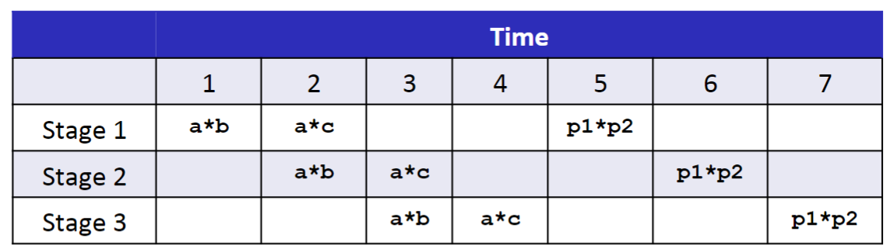
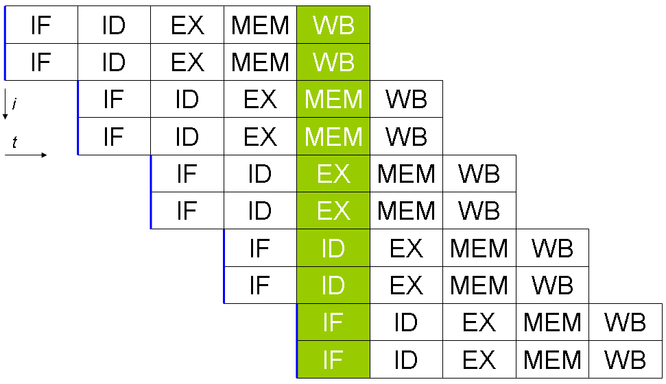

### Lecture 10 程序优化
为了减少程序的运行时间，在大多数情况下我们都会在算法层面进行考虑，但是我们也可以在代码层面进行考虑，写出对编译器友好的代码，使得编译器将其转换为更高效的可执行文件源码。本讲我们即考虑如何在代码层面进行改进使得程序更加高效

#### 编译器优化的局限性
一般而言，编译器在编译时会对源码进行优化，如之前所提过的乘以常数时乘法的优化，但是编译器只会对程序使用**安全的优化**，即编译器需要保证在任何可能的情况下，优化后的程序和未优化的版本有相同的行为，这使得编译器会舍弃所有可能会改变程序行为的优化。比如下面两种情况

##### 内存别名使用
如下面两个过程
```C
void twiddle1(long *xp, long *yp) {
    *xp += *yp;
    *xp += *yp;
}

void twiddle2(long *xp, long *yp) {
    *xp += 2 * *yp;
}
```
在绝大多数情况下，这两个过程的有相同的行为。另外 `twiddle2` 效率更高，只需要 3 次内存引用（读 `*xp`、读 `*yp`、写 `*xp`），而 `twiddle1` 则需要 6 次内存引用。大部分的程序员会希望编译器将 `twiddle1` 优化为 `twiddle2`，但是编译器不会优化

考虑 `xp` 等于 `yp` 的情况，显然，`twiddle1` 会将 `*xp` 的值增加 4 倍，而 `twiddle2` 会将 `*xp` 的值增加 3 倍。出于这个原因，编译器不会优化 `twiddle1` 为 `twiddle2`。这种两个指针可能指向同一个内存位置的情况称为**内存别名使用**

##### 函数调用的副作用
当一个函数有副作用时，对函数的调用就不能优化。如下面两个过程
```C
int f();

int func1() {
    return f() + f() + f() + f();
}

int func2() {
    return 4 * f();
}
```
如果函数 `f` 没有副作用，则上面两个过程有相同的结果，且 `func2` 的效率更高，程序员会期望编译器优化 `func1` 为 `func2`。不过假如 `f` 为
```C
int f() {
    printf("hello\n");
    return 2;
}
```
此时 `func1` 和 `func2` 的行为不同

#### 一般的优化措施
##### 代码移动
**代码移动（Code motion）** 即为识别要执行多次（例如在循环内）但是计算结果不会改变的计算，因而可以将计算移动到代码前面不会被多次求值的部分。如下面的过程
```C
void set_row(double *a, double *b, long i, long n) { 
    long j; 
    for (j = 0; j < n; j++) 
        a[n*i+j] = b[j]; 
}
```
由于 `n*i` 是定值，但是在循环内每次都要计算，因此可以改进为
```C
    long j; 
    long ni = n * i;
    for (j = 0; j < n; j++) 
        a[ni+j] = b[j]; 
```

另一个示例如下所示
```C
up    = val[(i-1)*n + j  ]; 
down  = val[(i+1)*n + j  ]; 
left  = val[i*n     + j-1]; 
right = val[i*n     + j+1]; 
sum = up + down + left + right;
```
如果把冗余的计算 `i*n + j` 提取出来，改进代码如下所示
```C
long inj = i*n + j;
up    = val[inj - n]; 
down  = val[inj + n]; 
left  = val[inj - 1]; 
right = val[inj + 1]; 
sum = up + down + left + right;
```
改进后可以减少 3 次乘法计算

##### 关于过程调用
前面的代码移动，大部分的编译器都能实现自动优化，因为都是安全的优化。但是对于有关过程调用的代码，编译器并不会对其采用激进的优化

如前面所提及，对于 C 的源文件，GCC 是分别对单个文件进行编译之后再链接的，因此 GCC 不能假设其他函数的内容（其他函数不一定在这个文件内），因此 GCC 不能假设该函数没有副作用。这是对于用户定义的函数，但即使对于库函数编译器也不能对其进行假设，因为程序员可以根据自己的需要来替换被链接的库

一个实例如下所示
```C
void lower(char *s)  { 
    size_t i; 
    for (i = 0; i < strlen(s); i++) 
        if (s[i] >= 'A' && s[i] <= 'Z') 
            s[i] -= ('A' - 'a'); 
}
```
可以看到，如果直接翻译，则 `strlen` 函数每次循环都会被调用，但是编译器并不会针对这一点进行优化。因为循环体内对字符串 `s` 进行了更改，且程序员可能并不使用标准库内的 `strlen` 函数，而是使用自己定义的函数。因此编译器并不能假设函数 `strlen` 所返回的值一定不变，所以编译器并不会对上述函数进行优化

适当的优化如下所示
```C
void lower(char *s)  { 
    size_t i, s_len; 
    s_len = strlen(s);
    for (i = 0; i < s_len; i++) 
        if (s[i] >= 'A' && s[i] <= 'Z') 
            s[i] -= ('A' - 'a'); 
}
```

##### 关于内存引用
和过程调用类似，编译器并不会对有关内存引用的代码进行激进的优化，原因之一就是之前提过的**内存别名使用**

一个实例如下所示
```C
void sum_rows1(double *a, double *b, long n) { 
    long i, j; 
    for (i = 0; i < n; i++) { 
        b[i] = 0; 
        for (j = 0; j < n; j++) 
            b[i] += a[i*n + j]; 
    } 
} 
```
可以看到，如果直接翻译，在内部循环，计算 `b[i]` 每次都需要 2 次内存引用。一个改进的方法是在计算 `b[i]` 后不将其放入内存，而是暂存在寄存器，从而下一次也不必从内存读出。但是编译器并不会应用这个优化策略，考虑 `a` `b` 相等的情形

因此对于可能出现内存别名的地方，编译器都会小心地将数据读出或写入，并不会对其进行优化

适当的优化如下所示
```C
void sum_rows1(double *a, double *b, long n) { 
    long i, j; 
    for (i = 0; i < n; i++) { 
        double val = 0;
        for (j = 0; j < n; j++) 
            val += a[i*n + j]; 
        b[i] = val;
    } 
} 
```

> P.S. 当程序的不同部分指向内存中的相同位置时，这称为别名

#### 现代处理器原理
现代处理器使用超标量流水线架构来提高处理器的利用率和程序的效率

##### 超标量架构
超标量 CPU 架构是指在一颗处理器内核中实行了指令级并发的一类并发运算。处理器的内核中一般有多个执行单元（或称功能单元），未实现超标量体系结构时，CPU 在每个时钟周期仅执行单条指令，因此仅有一个执行单元在工作，其它执行单元空闲。超标量体系结构的CPU在一个时钟周期可以同时分派（dispatching）多条指令在不同的执行单元中被执行，这就实现了指令级的并行

指令的并行需要这两条指令无关，如下面的例子
```C
a = b + c;          (1)
f = a + d;          (2)
```
`(2)` 的计算需要 `(1)` 的结果，因此这两条指令不能并行

##### 流水线架构
**流水线（pipeline）** 是指将计算机指令处理过程拆分为多个步骤，并通过多个硬件处理单元并行执行来加快指令执行速度。其具体执行过程类似工厂中的流水线

对于如下所示程序
```C
long mult_eg(long a, long b, long c) { 
    long p1 = a * b; 
    long p2 = a * c; 
    long p3 = p1 * p2; 
    return p3; 
} 
```
其流水线执行过程如下图所示（假设整数乘流水线分为 3 个步骤）


综合两个架构，得到超标量流水线架构，其流水线示意如下图所示


#### 循环展开
循环展开是一种牺牲程序的大小来加快程序执行速度的优化方法。循环展开最常用来降低循环开销，为具有多个功能单元的处理器提供指令级并行，也有利于指令流水线的调度。

> P.S. 有关循环展开可以参照教材或 PPT，此处略过。教材首先是根据程序的时序图对程序进行循环展开改进；然后还可以根据浮点数提供的矢量指令对其进行进一步优化

#### 分支预测
如之前所述，流水线架构的 CPU 会对分支跳转进行预判，并预读取和处理对应指令，假如预判错误，则会导致 CPU 浪费几十个周期的时间
