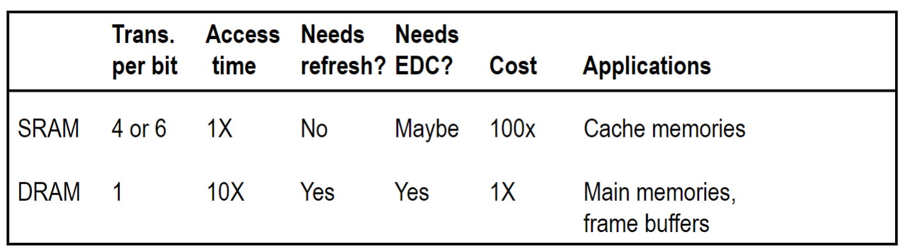
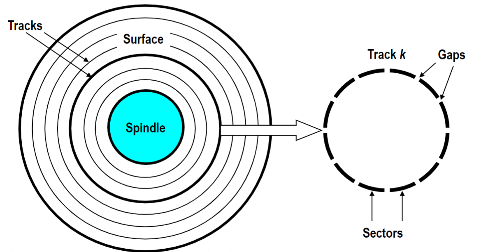
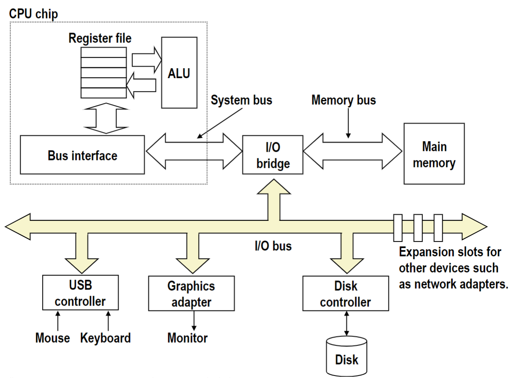
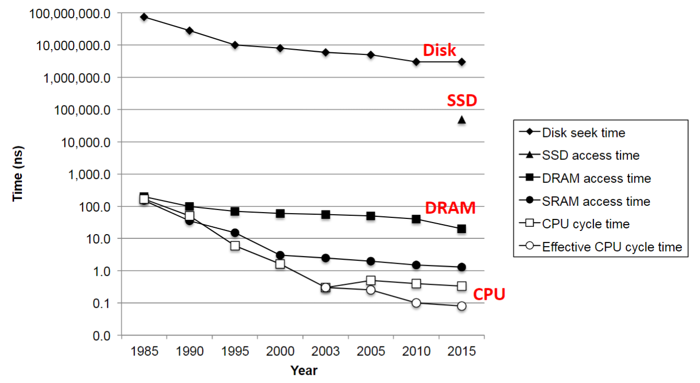
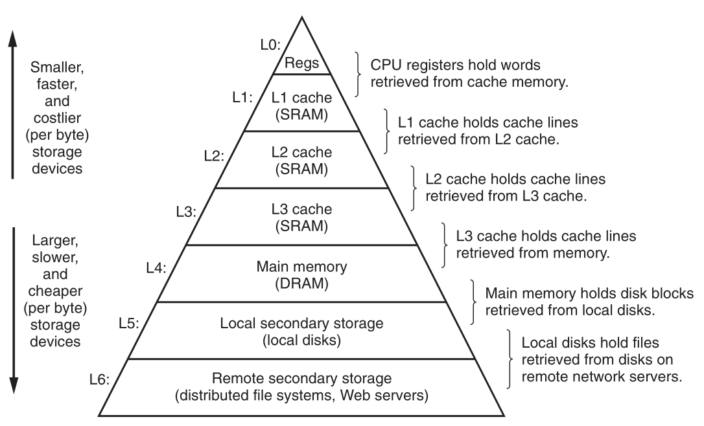

### Lecture 11 存储器层次结构

#### 存储技术
##### RAM
**RAM(Random-Access Memory)** 即为随机访问存储器，分为 **SRAM(Static RAM)** 和 **DRAM(Dynamic RAM)**，其中 SRAM 主要作为高速缓存，DRAM 主要用作主存和 GPU 的帧缓冲区

SRAM 和 DRAM 的对比如下所示


其中，SRAM 的造价更高，但是其读取速度更快，且无需定期更新值，并且它一般也不会有数据损失，所以也不太需要错误检测和纠正

> P.S. 关于 SRAM 和 DRAM 的结构可以参考《编码的奥秘》，其中 DRAM 是由电容实现的，但是电容会漏电，所以需要周期性地刷新 DRAM

> P.P.S SRAM 的访问时间数量级为 `1 ns`，DRAM 的访问时间数量级为 `10 ns`

##### ROM
因为 RAM 需要接电才能存储数据，所以 RAM 是易失性存储器。另一方面，非易失性存储器即使是在断电后仍然保存着信息，现在主要的非易失性存储器即为 **ROM(Read Only Memory)**

现在主要的 ROM 即为 **闪存（flash memory）**，主要用作固态硬盘（Solid State Disk, SSD）或 U 盘，它能提供相对于传统旋转磁盘的更快的选择

> P.S. 关于 ROM 的发展历史可以参考教材

##### 磁盘
磁盘是由盘片构成的，每个盘片有两个表面，每个表面是由一组称为磁道的同心圆组成的，每个磁道被划分为一组扇区。每个扇区包含数量相同的数据位（通常为 512 byte），扇区之间由一些间隙隔开，这些间隙不存储数据位，间隙存储用来标识扇区的格式化位


在最初，每个磁道的扇区数目相同，但是后来为了充分利用空间，磁盘的边缘部分的扇区数目更多，此时磁盘被分为若干个 **记录区（recording zone）**，每个记录区包含若干个磁道，但是每个记录区内的磁道内的扇区数目相同

###### 磁盘容量计算
```
磁盘容量 = 每个扇区内的字节数 x 每个磁道的平均扇区数 x 每个表面的磁道数 x 表面数
```

###### 扇区的访问时间
扇区的访问时间分别由三个部分构成，分别为 **寻道时间**、**旋转时间**、**传输时间**
**寻道时间（seek time）**：当需要读取某个磁道内的扇区时，需要先将读写头移动到指定的磁道，这个时间即为寻道时间
**旋转时间（rotational latency）**：当读写头移动到对应磁道后，还要等待磁盘将对应的扇区旋转到读写头下，这个时间即为旋转时间
**传输时间（transfer time）**：当扇区旋转到读写头下后，读写完所需数据所用时间即为传输时间

> P.S. 磁盘的访问时间数量级为 `1 ms ~ 10 ms`

###### 磁盘对于 CPU 的抽象
磁盘对于 CPU 而言，是一个连续的标号的逻辑块（从 0 开始标记），其中每个逻辑块的大小是扇区大小的整数倍

##### 总线
总线从逻辑上可以分为三种，分别为数据总线、地址总线、控制总线（参考《汇编语言》）。但是从物理上来讲，如下所示


可以看到，CPU 并不直接和主存、IO设备相连，而是通过 **IO桥** 和他们相连。其中 CPU 读写主存的过程可以参考《汇编语言》。

CPU 读磁盘的过程为
1. CPU 向磁盘发送指令 `read d_addr, m_addr`，指示磁盘中 `d_addr` 位置的数据复制到内存的 `m_addr` 位置
2. 磁盘将 `d_addr` 位置的数据复制到内存的 `m_addr` 位置
3. 磁盘向 CPU 发送中断信号，提示 CPU 磁盘的数据已复制到内存中

采用这种方式的原因是因为磁盘访问所需的时间过长，CPU 此时不必等待，而是先执行其他的工作

> P.S. 中断机制会在后续课程中讲到

> P.P.S. 上述过程可参考 PPT

值得一提的是，上图中的 IO总线在以前时采用的 PCI 架构，即使用广播的方式传播数据，现在改用点对点的方式传播数据

##### SSD
对于 CPU 而言，SSD 和磁盘为其提供的接口是相同的。除此以外，SSD 的访问实现显著小于磁盘，且传输速度更快，且更不易损坏

> P.S. 关于 SSD 的详细内容可以参考 PPT


#### 局部性
主存、磁盘、SSD 等介质的访问时间如下所示


可以看到，不同介质之间的访问时间差了好几个数量级。特别是 CPU 和 DRAM 之间，由于 CPU 访问主存时必须进行等待，所以 DRAM 的访问时间显著小于 CPU 会导致 CPU 性能的低下。解决这个问题可以依赖程序的一个特性 —— 局部性

**局部性（locality）** 即为
> 一个编写风格良好的程序倾向于在引用一个数据项后，引用该数据项附近的数据项，或是该数据项本身

局部性有两种不同的形式，分别为**时间局部性**和**空间局部性**。时间局部性即为最近被引用的数据在不久的将来再次被引用；空间局部性即为引用之前被引用过的数据的附近的数据

示例如下
```C
sum = 0;
for (int i = 0; i < n, i += 1)
    sum += a[i];
```
其中变量 `sum` 和 `i` 有时间局部性，而 `a[i]` 有空间局部性
且**指令也有局部性**，如上面 `for` 循环中的指令同时具有时间局部性和空间局部性

#### 存储器层次结构
综上所示，三个如下的事实决定了目前的存储器层次结构
1. 访问速度越快的介质价格越高
2. CPU 和主存之间的速度差距很大
3. 编写风格良好的程序具有局部性

这使得目前的存储器层次结构内，在 CPU 和主存间添加了高速缓存，如下所示


如图所示，可以把上一层看作下一层的缓存

**缓存（cache）** 即为一个更小的、更快的（相对）存储设备，它是一个更大、更慢的设备中的数据的缓冲区域

由于程序具有局部性，使得上述的存储器层次结构给 CPU 提供了一个抽象，即空间等于最底层介质的大小，但是访问速度却约等于最顶层介质的速度的介质

对于主存和 CPU 之间的缓存，是以块为单位进行管理的。比如将 `L3 Cache` 内部划分为若干个大小相等的块，并将内存也划分为同样大小的块，当 `L3 Cache` 需要某个数据时，直接将整个块从主存中复制到 `L3 Cache` 中

> P.S. 不同层级之间块的大小不同

对于上述存储器结构，如果要查找某个数据，CPU 是先访问缓存，如果缓存未中，则在下一层继续查找（递归），查找到之后先将包含对应数据的块复制到当前缓存中，然后再返回给上一层
