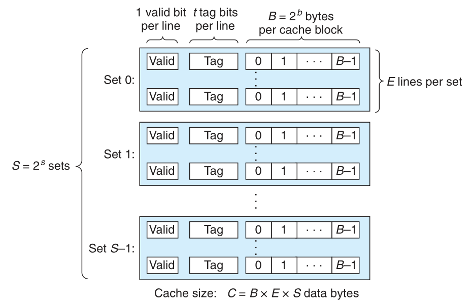
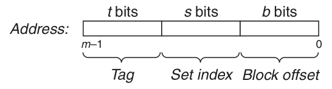
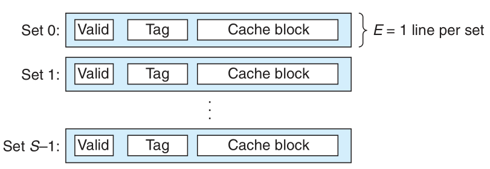
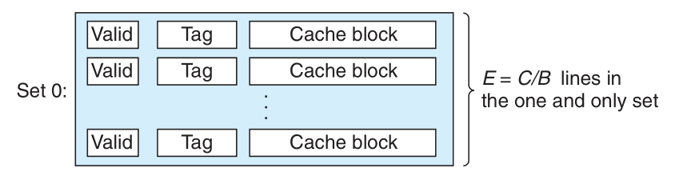
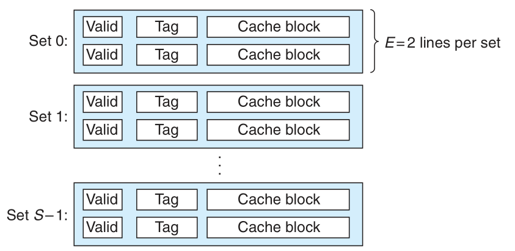
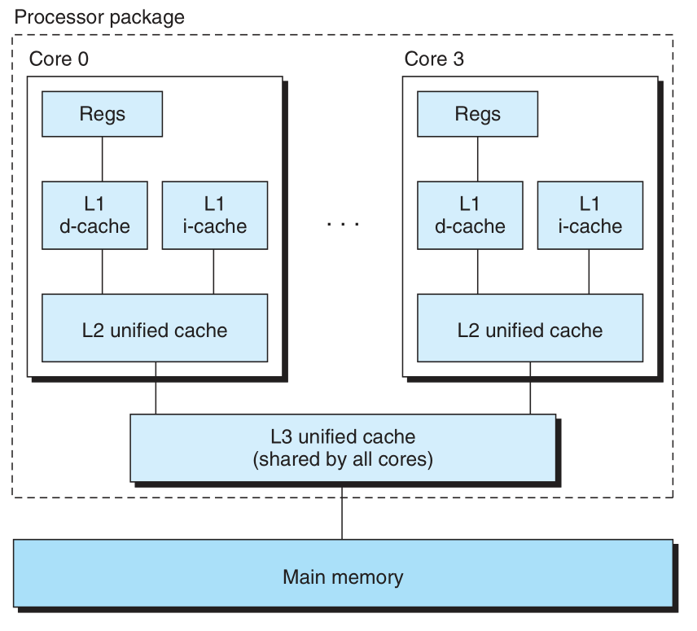
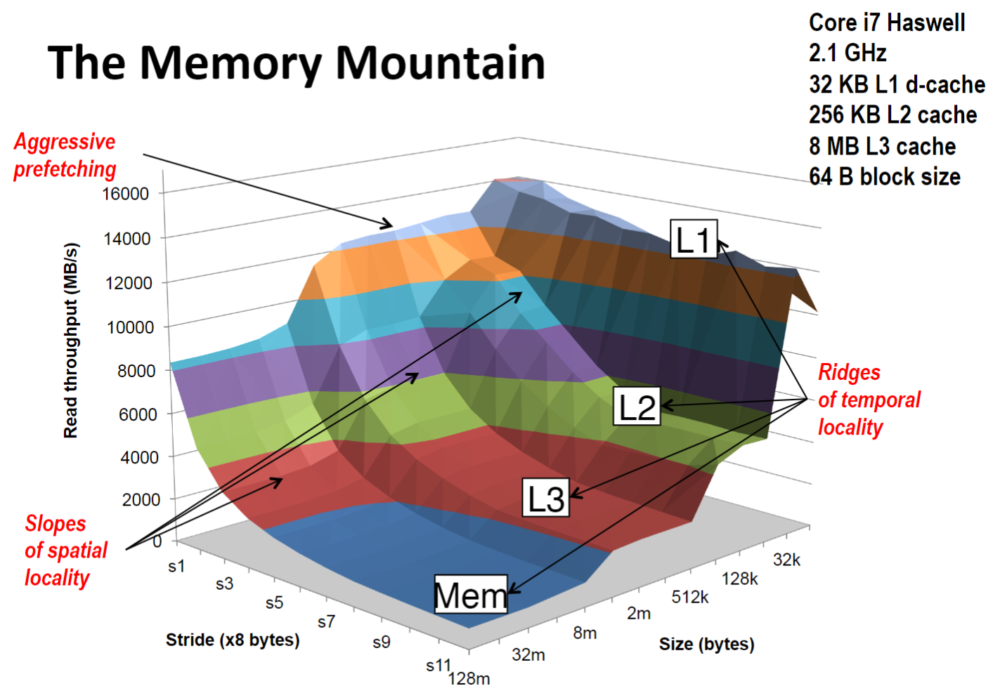
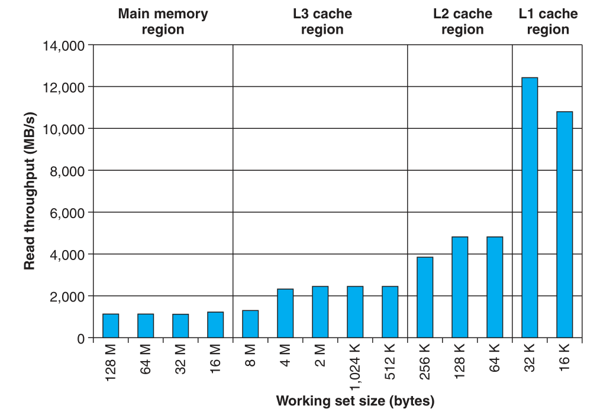
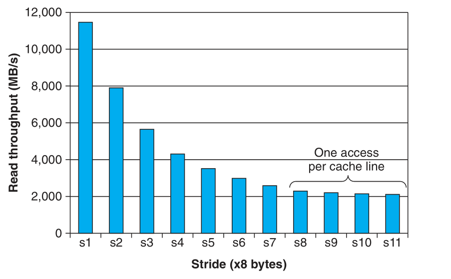

### Lecture 12 高速缓存存储器

之前我们已经讲了缓存是如何让 CPU 的效率更高的，现在来介绍缓存的具体工作原理，主要包括两个问题
1. 内存中的一个块要放入缓存时，具体放到缓存的什么位置
2. 数据放到缓存后，系统是如何标记每个块，使得系统知道每个块来自主存的哪个位置

#### 缓存的组织结构
假设在一个计算机系统中，主存的地址为 $m$ 位，则主存大小为 $M = 2^m$ 字节。缓存的结构如下所示


一共有 $S = 2^s$ 个 **高速缓存组（cache set）**，每个组包含 $E$ 个 **高速缓存行（cache line）**，每行包括 $B = 2^b$ 字节，还包括一个 **有效位（valid bit）** 和 $t$ 个 **标记位（tag bit）**

其实上面的高速缓存行即为之前所讨论过的块，是缓存和主存交换数据的单位。有效位用于标记当前块是否为有效块，标记位用于标记当前块对应主存的哪个位置

现在来解释上面的结构。首先，主存的地址有 $m$ 位，如果将主存按照 $B$ 字节一块来分块，则主存的前 $m-b$ 位可用来标记每个块（主存内一共有 $2^{m-b}$ 个块）。然后将 $2^{m-b}$ 个块均匀映射到缓存内的 $S$ 个高速缓存组内，主存中的一个块如果要被替换到缓存中去，则会将其替换到对应的高速缓存组中。映射方式如下所示


以 $m-b$ 位的右边 $s$ 位来决定，一个块要被映射到的高速缓存组即为该块的对应 $s$ 位的值。然后 $m-b$ 位中剩余的位作为标记位，则有 $t = m-b-s$

> P.S. 至于为什么选择剩余 $m-b$ 位中的低 $s$ 位作为索引组的值，理由可以参照教材 P432 的附注（原版在 P659）

> P.S. 若记 $x$ 为主存地址的 $m-b$ 位的值，则该块会被映射到第 $x \; \rm{mod} \; S$ 个高速缓存组

可以看出，缓存的大小为 $S \times E \times B$ 字节

> P.S. 由于 SRAM 是易失性的，所以在计算机开机时，缓存内的全是未定义的值，因此在计算机开机时会将缓存的有效位全置为 0

#### 读缓存
当 CPU 试图从缓存中读取某个数据时，先根据地址来确定数据可能所在的高速缓冲组，然后再根据地址来和该组中的所有行的标记位进行比较，并检查其有效位是否有效（这个过程是并行的）。如果标记位相同，则读缓存命中，且数据就在此块中，然后根据地址的低 $b$ 位在该块中进行寻址

如果该组内未查找到符合条件的行，则读缓存不命中，此时缓存会向下一层请求数据块，并将该块复制到当前缓存中，最后将数据返回

值得一提的是，对于当代的缓存结构，一共有三种，分别为直接映射缓存、组相联映射缓存、全相联映射缓存

##### 直接映射缓存
直接映射即为当 $E = 1$ 时缓存的结构，即每个组中只有一行，如下所示


这个结构的好处就是缓存的造价会更低（理由后面叙述）。缺点为在这种结构下，缓存的命中率会更低。简单说来就是，即使程序具有良好的空间局部性，且缓存中也有足够的空间，但是每次引用还是会导致不命中（准确地说是**抖动**），这个的演示可以参考 PPT 或教材

##### 全相联映射缓存
全相联映射即为当 $S = 1$ 时缓存的结构，即缓存内只有一个组，所有的行都在那个组里面，如下所示


这个结构的好处是可以充分利用缓存空间，不会在缓存空间足够的情况下发生抖动，从而提高缓存的命中率。缺点在于造价更高，如前所述，系统在一个组内比较标记位时是并行的，这导致随着组内行数的增多，电路也就更复杂，导致同样大小的缓存造价更高

##### 组相联映射缓存
组相联映射即为直接映射和全相联映射的折中，此时 $S \neq 1$ 且 $E \neq 1$，如下所示


这个结构就是充分考虑了经济和性能上做出来的一个折中方案，使得命中率比较高的情况下造价也不是太高。现在计算机上的缓存一般是四路组相联映射或八路组相联映射


#### 写缓存
当 CPU 要向缓存写入数据时，首先需要查找对应数据所在的块是否在缓存中，如果在，就是写命中，否则是写未命中

对于写命中，首先 CPU 将数据写入缓存，之后有两种策略，分别为 **直写（write-through）** 和 **写回（write-back）**。直写就是当数据写入缓存之后，立即将该块也写入下一层；而写回是当数据写入缓存之后不做处理，一直等到被修改的块将要被替换时才将其写入下一层。由于局部性，写回能显著减少总线流量，但是它的缺点就是增加了复杂性。缓存必须为每个块（即高速缓存行）维护一个额外的 **修改位（dirty bit）** 来标识这个块是否被修改过

对于写未命中，也有两种策略，分别为 **写分配（write-allocate）** 和 **非写分配（non-write-allocate）**。写分配即为先从内存中将对应的块读出到缓存中，然后修改这个块；非写分配即为绕过缓存，直接向内存中写入

下图是一个 i7 CPU 的高速缓存层次结构


#### 缓存中参数对性能的影响

##### 块大小的影响
较大的块能利用程序中可能存在的空间局部性，提高命中率。但是，对于给定大小的缓存，块越大就表示块的个数越少，这会损害利用时间局部性的程序的命中率。且块越大，传送时间越长，导致未命中时的惩罚更大

**可以通过块的大小影响来说明空间局部性和时间局部性的区别**。空间局部性即为当一个数据被引用了，其附近的数据也有很大可能会被引用，为了充分利用这个特性，可以将块做得越大越好，这样利用空间局部性的程序的命中率更高（一次不命中会将该数据附近更多的数据传到缓存，因此在一次不命中后会有更多的命中）

但是由于缓存的大小是一定的，当块更大后，缓存所能容纳的块的个数也就更少了，这会损害利用时间局部性的程序的命中率。可以考虑极端情形，当缓存内只有一个块时，假设程序在一个循环内依次访问两个不在一个块的数据，这就会产生**抖动**，此时会大幅降低利用时间局部性的程序的命中率（命中率为 0）。因此，为了充分利用程序的时间局部性，可以将块做得越小越好，这样利用时间局部性的程序的命中率更高（缓存内可以容纳更多的常用的块，而不用在获取一个块时因为空间不足将另一个常用的块丢弃）

##### 未命中时的时间
当缓存未命中时，CPU 需要等待的时间为
```
等待时间 = 命中时的时间 + 从下一级读取数据所需时间 
```

#### 存储器山
一个程序从存储系统中读取数据的速率称为 **读吞吐量（read throughput）**。如果一个程序在 $s$ 秒的时间内读 $n$ 个字节，则这段时间的读吞吐量即为 $n/s \;\; \rm{byte}/\rm{s}$

下图即为存储器山图，模拟了随着步长的变化来访问不同大小的数组时程序吞吐量的变化情况


> P.S. 这张图所测量的程序见教材或 PPT

如下图所示，随着数组逐渐变大，程序的时间局部性对程序性能的影响


可以看到，当数组大于 `32k` 后，程序吞吐量有显著下降。这是因为当数组小于 `32k` 时，整个数组可以被全部放在 L1 缓存内，此时程序只会有一次不命中。同理，当数组大于 `256k`、`4M` 也有类似的情况

如下图所示，随着步长的增大，程序的空间局部性对程序性能的影响


可以看到，随着步长的增大，程序的吞吐量逐渐降低。由于上面画图的计算机的块大小为 64 byte，而每个 `double` 元素大小为 8 byte，所以当步长大于等于 8 之后，每次都不命中，需要从下一层取新的块

#### 优化代码来提高程序的局部性
考虑一对 $n \times n$ 矩阵相乘的问题：$C = A \times B$，其实现算法如下所示
```C
for (int i = 0; i < n; i += 1) 
    for (int j = 0; j < n; j += 1) 
        for (int k = 0; k < n; k += 1) 
            c[i][j] += a[i][k] * b[k][j];
            // 假设 c[i][j] 的初始值为 0
```

假设 $n$ 很大，以至于矩阵的一行不能放进缓存。现在可以分别从空间局部性和时间局部性方面来对程序进行改进

##### 从空间局部性进行改进
可以看到，由于最内层循环的是变量 $k$，因此对数组 `c` 和 `a` 的访问有很好的空间局部性，但是对于数组 `b`，两次访问之间的地址差距一行，这导致了对数组 `b` 的每次访问都是不命中 

因此，我们可以考虑如下的改进
```C
for (int i = 0; i < n; i += 1) 
    for (int k = 0; k < n; k += 1) 
        for (int j = 0; j < n; j += 1) 
            c[i][j] += a[i][k] * b[k][j];
            // 假设 c[i][j] 的初始值为 0
```

可以看到，这样改进后对于数组 `a`、`b`、`c` 都有很好的空间局部性，有关这个版本和最初版本的比较可以见教材

##### 从时间局部性进行改进
可以看到，因为矩阵过大，不能全部装入缓存，才导致最初的版本在访问数组 `b` 时每次都不命中（在访问后面的行时，可能会将前面已加载到缓存中的某一行替换掉）。因此可以使用 **分块（blocking）** 技术，具体来说就是将大的矩阵分割为几个小矩阵，使得每个矩阵都可以全部放入缓存，然后按照分块矩阵乘法进行计算，如下所示
```C
for (int i = 0; i < n; i += SIZE) 
    for (int j = 0; j < n; j += SIZE) 
        for (int k = 0; k < n; k += SIZE) 
            // 对每个分块矩阵进行计算
            for (int ii = i; ii < i+SIZE; ii += 1>) 
                for (int jj = j; jj < j+SIZE; jj += 1)
                    for (int kk = k; kk < k+SIZE; kk += 1)
                        c[ii][jj] += a[ii][kk] * b[kk][jj];
                        // 假设 c[ii][jj] 的初始值为 0
```

可以看到，当 `SIZE` 足够小时，对数组 `a`、`b`、`c` 的分块就可以全部放入缓存，从而具有较好的时间局部性，有关这个版本和最初版本的比较可以见 PPT 
