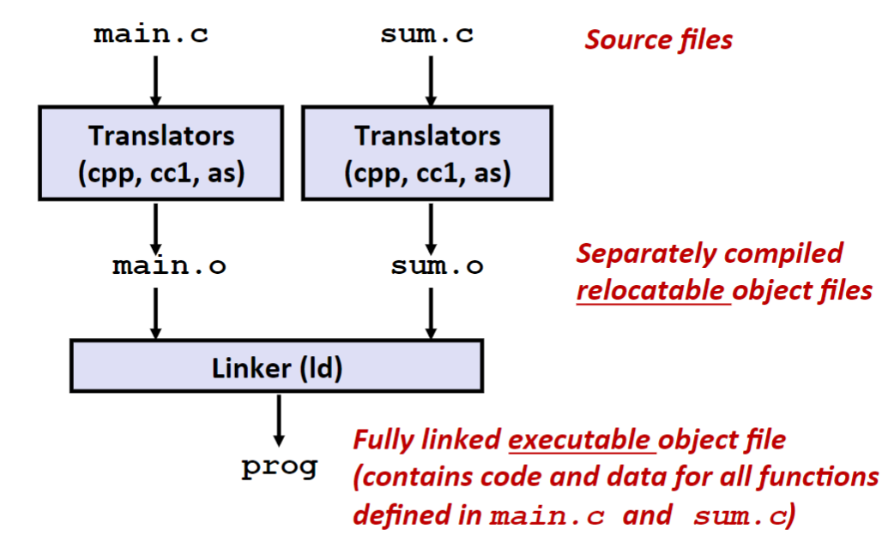
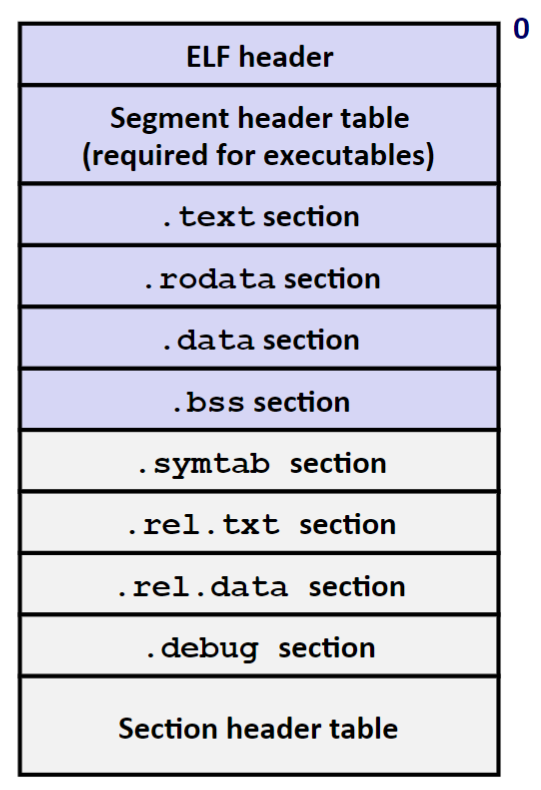
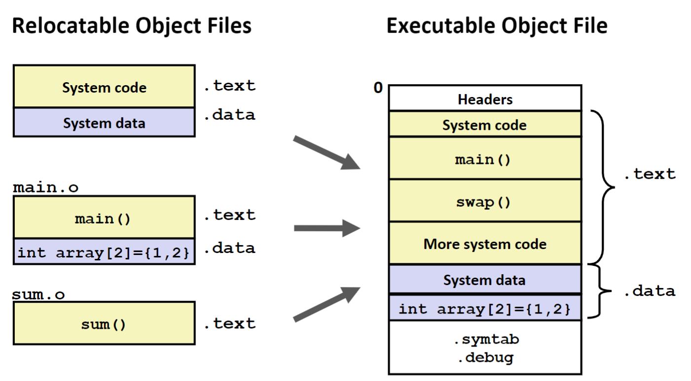
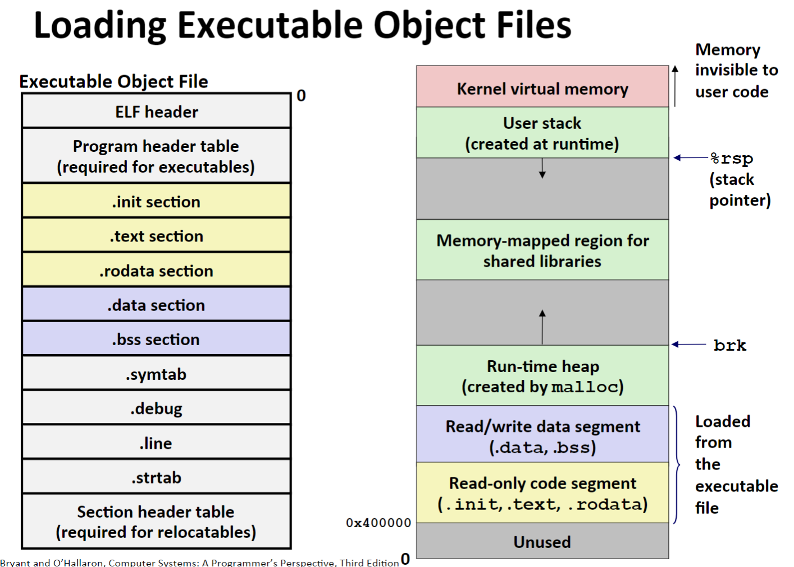
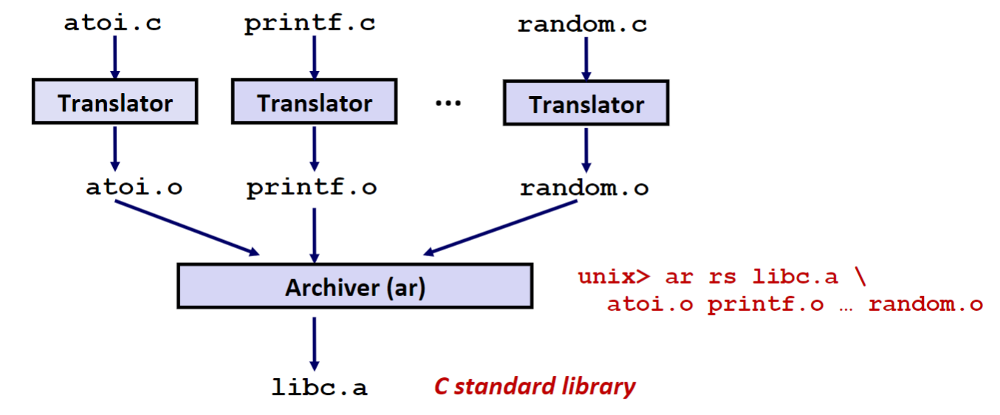
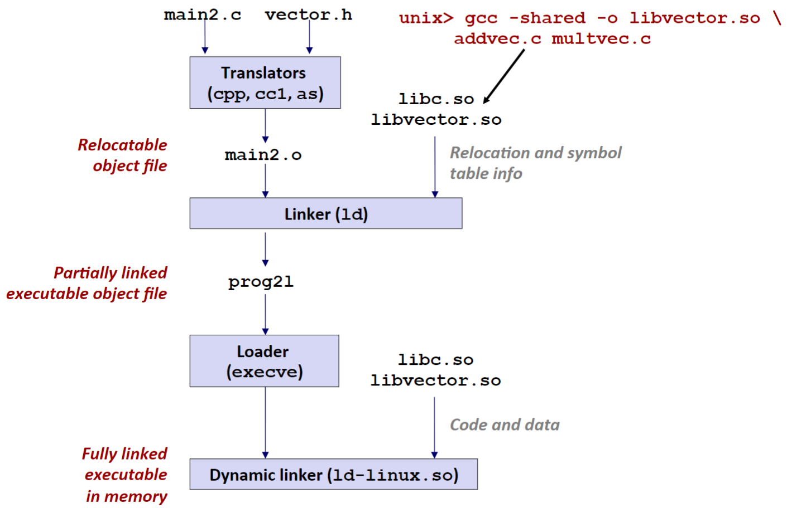

### Lecture 13 链接

#### 编译过程
对于如下示例的两个 C 的源文件
```C
/* main.c */
int sum(int *a, int n);

int array[2] = {1, 2};

int main() {
    int val = sum(array, 2);
    return val;
}
```
```C
/* sum.c */
int sum(int *a, int n) {
    int s = 0;
    for (int i = 0; i < n; i += 1)
        s += a[i]; 
    return s;
}
```
这两个 C 源文件的编译过程如下所示



第一个步骤为预处理，使用 C 预处理器 cpp 将 `.c` 文件翻译为 `.i` 文件

第二个步骤为编译，使用 C 编译器 cc1 将 `.i` 文件翻译为 `.s` 文件

第三个步骤为汇编，使用汇编器 as 将 `.s` 文件翻译为 `.o` 文件

第四个步骤为链接，使用连接器 ld 将之前生成的所有 `.o` 文件和一些必要的库链接起来，生成一个可执行文件

> Q. 为什么允许这种分离编译，为什么使用一个大文件包含所有的代码？

首先是因为模块性。将所有的代码放于一个文件中不利于代码的管理，增加了代码的复杂度

其次是因为效率。在时间上，如果你只更改了代码的一个模块而重新进行编译，则只需要重新编译那个模块，而不需要重新编译所有的模块；在空间上，你可以将所有的常用函数放入一个模块，然后编译为一个库，但是在生成可执行文件时，只会将该库内被引用的函数放入，而不是将整个库都放入

#### 静态链接
对于静态链接，链接器主要完成两个工作
1. **符号解析（symbol resolution）**。在链接过程中，将函数名、全局变量、静态变量统一称为符号。首先这些符号需要定义在某个模块内，然后其他的模块只需要声明这个符号就可以对其进行引用。符号解析的作用就是将每个符号引用和一个符号定义关联起来

2. **重定位（relocation）**。由于 C 源文件是分开编译的，因此在链接之前，除了定义函数和变量的模块，其余引用这些函数和变量的模块并不知道这些函数和变量的具体地址，所以在链接过程中需要修改这些模块内的符号引用的地址，这个过程称为重定位

接下来我们先不介绍这两个工作的具体情况，转而介绍目标文件的格式

#### 目标（Object）文件格式
目标文件有三种形式
1. 可重定位目标文件。即前面所说的 `.o` 文件，包含二进制代码和数据，可以在编译时和其他 `.o` 文件合并起来，创建一个可执行文件
2. 可执行目标文件。包含二进制代码和数据，可以直接被复制到内存并执行
3. 共享目标文件。一种特殊类型的可重定位目标文件，可以在加载或运行时被动态地加载进内存并链接

接下来介绍 **ELF（Excutable and Linkable Format）**，ELF 格式即为所有的目标文件的统一格式，如下图所示



一个目标文件被分为若干个**节（section）**，每个节的作用分别如下所示

ELF header: 定义了（生成此文件的系统的）字节顺序、字的大小和文件类型（`.o`, `.out`, `.so`）

Segment head table: 仅在可执行文件中定义，定义了程序执行时各个段的位置（如函数栈的位置、堆的位置、共享库的位置等）

.text: 已编译的代码

.rodata: 只读数据，如 `printf` 语句中的格式化字符串和 `switch` 语句中的跳转表

.data: 已初始化的全局和静态变量

.bss: 未初始化的全局和静态变量，以及所有被初始化为 0 的全局或静态变量。在目标文件中，这个节不占据实际的空间（因为全部变量都被初始化为 0），在加载进内存时才为其分配实际空间

.symtab: 一个符号表，记录了程序中定义和引用的函数、全局和静态变量的信息

.rel.text: 记录了 .text 节中的重定位信息，即记录了在重定位过程中需要更改的指令在当前文件中的地址

.rel.data: 记录了 .data 节中的重定位信息，即记录了在重定位过程中需要更改的数据在当前文件中的地址

.debug: 记录了将机器代码中行号与源代码中行号对应起来的信息，便于调试

Section header table: 记录了上述所有的段的起始位置和大小

#### 符号解析
首先，在对于模块 $m$，在链接过程中需要处理的符号分为三种
1. 由模块 $m$ 所定义并能被其他模块所引用的**全局符号**
2. 由其他模块定义且被模块 $m$ 引用的**全局符号**
3. 被模块 $m$ 定义且只能被模块 $m$ 引用的**局部符号**

> P.S. 在链接过程中，将被 `static` 关键字声明的符号称为局部符号

如对于最开始的两个 C 源文件，`main.c` 中的 `sum` 为第 2 种，`array` 为第 1 种

##### 链接器如何解析多重定义的全局符号
考虑下面的例子
```C
int a = 2;
double b;
char c = 'c';
```
```C
int a;
int b;
char c = 'a';
```

当上面两个 C 文件链接时，存在多个同名定义的符号，此时会发生什么。首先需要将符号分为两种类型
**强符号**：函数和已初始化的全局变量是强符号
**弱符号**：未初始化的全局变量为弱符号
并且 Linux 链接器使用下面的规则来处理多重定义的符号
1. 不允许有多个同名的强符号
2. 如果有一个强符号和多个弱符号同名，则选择强符号作为定义
3. 如果有多个弱符号同名，则随机选择一个弱符号作为定义

因此多个需要链接的文件里面不能含有同名函数（规则 1），更多示例参考教材 P471

规则 2 和规则 3 的应用有时会造成一些奇怪的错误，如上面的例子中的符号 `b`，由于是两个弱符号，所以应用规则 3，但是由于两个符号的类型不同，所以可能会造成错误

因此为了避免产生这些可能的错误，应该
1. 在所有的局部符号前加上关键字 `static`
2. 对于符号定义应该显示地将其初始化
3. 应当在所有符号声明前加上关键字 `extern`，来显示地告诉链接器这个不是符号定义

#### 重定位
重定位由两步组成：
1. **重定位节**： 在这一步中，链接器将所有相同类型的节合并为同一类型的新的聚合节
2. **重定位符号引用**： 在这一步中，链接器修改 .text 和 .data 中的引用，使它们指向正确的运行时地址

##### 重定位节
重定位节如下图所示



##### 重定位符号引用
当汇编器生成一个目标模块时，它并不知道符号引用的具体地址是哪里，所以对于这些引用，汇编器先将其地址设置为 0，然后再为其建立一个**重定位条目**。 重定位条目存放于 .rel.text 或 .rel.data 中，它主要用来指导链接器修改不正确的引用地址，为此，重定位条目中包括了符号引用的名字、需要修改的位置的地址（相对于某一节的偏移）等

> P.S. 有关重定位条目的内容参见教材 P479，有关示例参见 PPT

#### 加载可执行目标文件
将一个可执行文件加载到内存中如下图所示



只有可执行文件中的黄色部分和紫色部分会分别被加载到内存的 text 段和 data 段，内存中的其余部分是在运行时分配的

> P.S. 需要注意，上图比实际情况更加简化。事实上，在栈和共享库映射区之间还可能有一段堆，主要用于分配大型空间（对于小型程序就没有这一段）

#### 静态库
考虑 C 中标准库的实现，通常的做法是如下 3 种
1. 让编译器直接辨认出对标准函数的调用，并直接生成代码。缺点是会显著增大编译器的复杂度，并且每需要对标准函数进行修改，就需要一个新的编译器
2. 将所有的标准函数写在一个源文件上，并生成一个 .o 文件，程序员每次调用标准库时就将这个模块一起链接即可。缺点是这样生成的每个可执行文件都包含一份标准函数集合的完整副本，这会浪费很多的硬盘空间，且每个运行的程序都会将这个模块的副本放在内存中，是对内存的极大浪费
3. 将所有的标准函数分别写在多个源文件上，并生成多个 .o 文件，程序员每次调用标准库时就将所调用的标准函数对应的模块一起链接即可。缺点也很明显，需要程序员记住每个标准函数所在的模块，且编译时需要一个很长的命令行

由于上面的 3 种方式都不好，所以提出了静态库这个概念。参考上面的方法 3，先将每个标准函数编译为独立的模块，然后封装为一个单独的静态库文件（.a），静态库的生成如下所示



要在 gcc 链接过程中链接一个库时，需要使用 `-L` 标签，并紧挨着给出库所在的文件路径，如下所示
```shell
gcc -L. main.o libvec.a
```
上面表示在当前目录下寻找库 `libvec.a`

> P.S. 将几个 `.o` 文件封装为 `.a` 文件使用 `ar` 指令，参考教材或 PPT

#### 动态链接
虽然静态链接已经是一个比较好的解决方法了，但是还是存在一些问题
1. 静态库也需要定期更新和维护，如果需要更新某个静态库中的某个模块，则整个静态库都需要更新，导致即使是小部分更新，用户也不得不将整个静态库重新下载下来
2. 对于一些常用函数（如 `printf`），如果使用静态链接则每个使用这些函数的程序里都包含这些函数的副本，这是对磁盘空间的极大浪费。同理，当程序运行时，每个程序的内存空间里都会包含这些函数的副本，同样是对内存空间的浪费

解决方案就是使用动态链接，和静态链接不同，动态链接将链接这一步骤延后到程序加载或运行时，如下图所示



这样做的好处是
1. 每个程序中不用包括所需的标准函数的副本，从而节省了硬盘空间
2. 每个运行的程序之间共享加载到内存中的库，从而使得内存中只有对应库的一个副本，从而节省了内存空间

由于动态链接的库在内存中是共享的，所以将这些库称为共享库（`.so`）

如上图所示，即使是采用动态链接，也需要在加载之前使用链接器进行一次链接，此时没有任何数据和代码被复制到可执行文件中，链接器在这个步骤复制了一些重定位和符号表信息，使得程序在之后被加载时可以解析对可执行文件中的符号引用

生成共享库的命令如下所示
```shell
gcc -shared -fpic -o c.so a.c b.c
```

##### 从应用程序中加载和链接共享库
前面只提了在程序加载时将共享库链接上，但是也可以在程序运行时链接共享库，需要依靠几个系统接口
```C
#include <dlfcn.h>
void *dlopen(const char *filename, int flag);
```
`dlopen` 函数加载和链接共享库 `filename`，链接成功则返回对应的指针，否则返回 NULL

```C
#include <dlfcn.h>
void *dlsym(void *handle, char *symbol);
```
`dlsym` 函数输入一个已打开的共享库的指针和 `symbol`，在共享库中读取该符号 `symbol`，读取成功则返回对应符号的指针，否则返回 NULL

```C
#include <dlfcn.h>
int dlclose(void *handle);
```
`dlclose` 函数输入一个已打开的共享库的指针，卸载掉对应的共享库，成功则返回 0，否则返回 -1

```C
#include <dlfcn.h>
const char *dlerror(void);
```
`dlerror` 函数返回一个字符串，即在调用 `dlopen` `dlsym` `dlclose` 时发生的最近的错误，如果没有错误发生，则返回 NULL

> P.S. 关于这几个函数的示例，书上和 PPT 上都有示例

#### 库打桩
库打桩即允许你截获对共享库函数的调用，然后执行自己的代码。通过库打桩，你可以追踪某个特殊函数的执行情况，更好地测试，或者将其替换为一个完全不同的实现

打桩可以发生在编译时、链接时或程序被加载和运行时

##### 编译时打桩
可以参考书上示例，使用简单的宏替换来更改对函数的引用，从而将标准函数调用转换为对自己定义的函数的调用。需要注意 gcc 参数 `-I<dir>`，表示先在对应文件路径下搜索头文件

##### 运行时打桩
可以参考书上示例，使用链接器参数来更改对函数的引用。Linux 链接器支持参数 `--wrap f`，这个参数表示在链接时，将所有对符号 `f` 的引用解析成 `__wrap_f`，还要把对符号 `__real_f` 的引用解析成 `f`，而 gcc 可以将对应的参数传递给链接器

> `-Wl[,option]+` 传递 `option` 给链接器，`,` 会被转换为空格
> `-Wa[,option]+` 传递 `option` 给汇编器

##### 运行时打桩
可以参考书上示例。环境变量 `LD_PRELOAD` 被设置为一个共享库路径名的列表，在加载和运行一个程序时，需要解析未定义的引用时，动态链接器会先搜索 `LD_PRELOAD` 中的库，然后才搜索其他的库。所以可以修改环境变量 `LD_PRELOAD` 使得程序先链接自己所写的库，从而实现打桩
