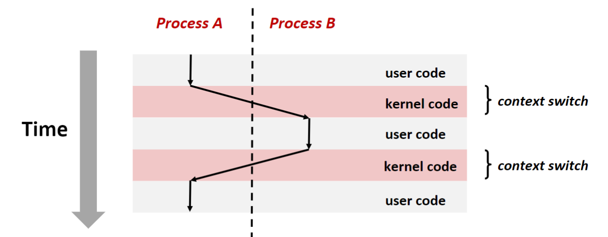
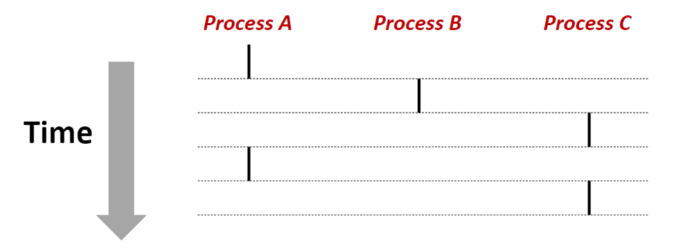
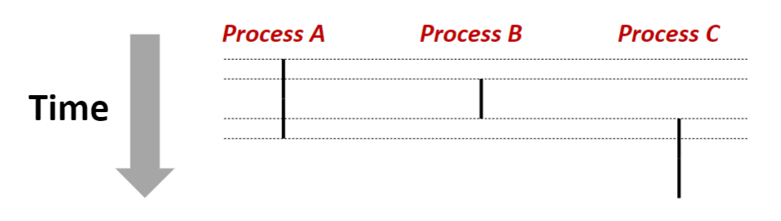
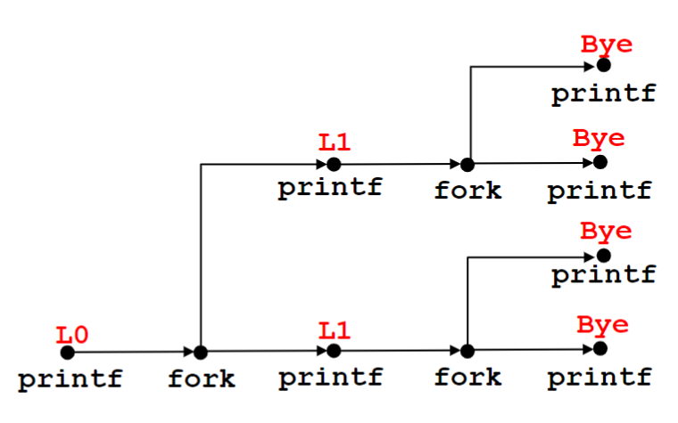
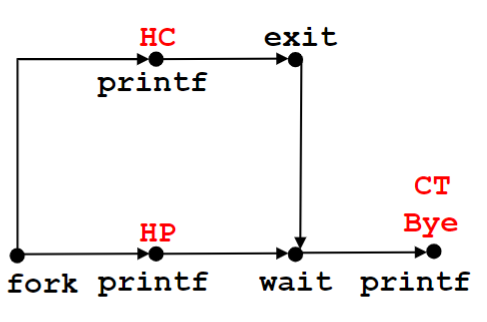
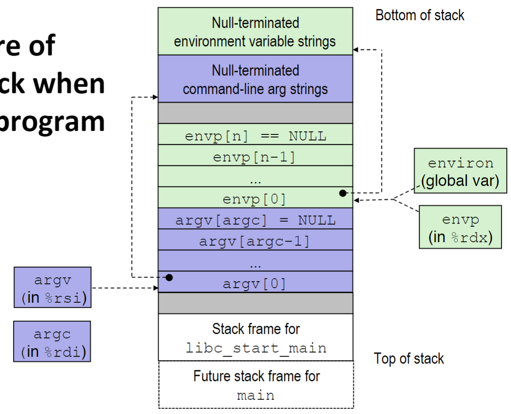

### Lecture 14 异常控制流——异常、进程
通过前面的学习我们知道，在大部分情况下，程序是按指令顺序执行的，只有两类指令会更改指令的执行顺序，分别是 `jmp` 和 `call`。

但是计算机不能只执行程序内的指令，计算机必须要能够对系统状态的变化做出反应（如用户在命令行中输入 Ctrl+C），当系统状态需要处理时，需要执行由系统提供的代码。因此，从程序指令中跳出，转而执行系统代码，这个突变称为**异常控制流**

#### 异常
一般而言，当处理器检测到系统中有事件发生时，它就会根据事件的类型，并依据 **异常表** 来间接跳转到对应的事件处理程序。当事件处理程序执行完毕时，会发生以下 3 种情况中的一种
1. 处理程序将控制返回给之前的指令，即重新执行之前的指令
2. 处理程序将控制返回给之前的指令的下一条指令
3. 处理程序终止被中断的程序

> P.S. 有关异常表的工作原理，详见《汇编语言》中关于中断的内容

异常可以总地分为两大类，分别为**异步异常**和**同步异常**
异步异常指的是异常的发生和当前执行的指令无关，异步异常只有一种，即为 **中断（interrupt）**

中断是由来自处理器外部的 I/O 设备的信号产生的，在中断处理程序执行完后，将控制返回到之前指令的下一条指令

> P.S. 中断在开始前会等待处理器执行完当前指令

同步异常指的是异常的发生是执行当前的指令所产生的结果，同步异常一共有 3 种，分别为 **陷阱（trap）**、**故障（fault）**、**终止（abort）**

陷阱是有意的异常，是用户特意指定的。主要的用途就是给用户提供一系列系统接口，称为 **系统调用（system call）**，这个指令和函数调用指令基本相同，不同的是这个调用的是系统提供的指令，而不是用户自己编写的。在陷阱处理程序执行完后，将控制返回到之前指令的下一条指令

故障由有可能修复的错误引起（如缺页异常），当执行某个指令导致了可能修复的错误时，就会发生故障，此时系统调用对应的故障处理程序。如果故障能够修复，当故障处理程序执行完后，将控制返回到之前的指令；如果故障不能修复，则故障处理程序会终止这个应用程序

终止由不可修复的错误引起（如内存访问错误）。终止处理程序会直接终止这个应用程序（准确地说，是终止处理程序将控制返回给 `abort` 例程，由 `abort` 终止这个应用程序。前面的故障在终止应用程序时也是同样的步骤）

#### 进程

> 进程即为一个正在运行的程序的实例

系统中的每个程序都运行在某个进程的 **上下文（context）** 中（说人话：上下文大概指的是运行环境之类的意思）

进程主要给应用程序提供两个关键抽象
1. 一个独立的逻辑控制流，它提供一个假象，好像我们的程序独占地使用处理器
2. 一个私有的地址空间，它提供一个假象，好像我们的程序独占地使用内存系统

> P.S. 这两点主要是说，原本在系统中，程序不能独占使用处理器和内存，程序员在编写程序时必须要考虑这一部分（比如防止内存访问时访问到其他程序的内存）。但是在引入进程机制后，将这些细节屏蔽掉了，使得程序员能够专注于代码上

##### 进程的切换
如前所述，进程提供了一个假象，好像我们的程序独占地使用处理器。而在计算机中有多个正在运行的进程，那对于单核机器，这个抽象是如何实现的？

这是通过一种称为 **上下文切换（context switch）** 的机制来实现的，内核为每个进程维护一个上下文，而在某些时刻，当控制权回到内核时，内核可以决定是否继续运行当前进程。如果决定运行其他进程，则
1. 保存当前进程的上下文
2. 恢复要运行的进程的上下文
3. 将控制传递给这个新的进程

示意图如下所示



利用这个机制，我们可以在微观上交替调用若干个进程，从而在宏观上达到这几个程序在一起运行的假象。比如如下所示的进程 A、B、C



然后他们呈现出的运行假象如下所示



#### 进程控制

> P.S. 有关如何处理 Linux 系统调用错误的方法详见教材 P512

##### 获取进程 ID
```C
#include <sys/types.h>
#include <unistd.h>

pid_t getpid(void);
pid_t getppid(void);
```
`getpid` 返回当前进程的 ID，`getppid` 返回当前进程的父进程的 ID

##### 创建和终止进程
从程序员的角度，我们可以认为进程总是处于下面三种状态之一
**运行**。进程要么在 CPU 上执行，要么在等待被执行且最终会被内核调度
**停止**。进程被 **挂起（suspended）**，且不会被调度。进程会保持停止直到它收到信号通知它再次开始运行
**终止**。进程永远停止运行了。进程会因为三种原因终止
1. 收到一个信号，该信号的默认行为是终止进程
2. 从主程序 `main` 正常返回
3. 程序调用了 `exit` 函数

```C
#include <stdlib.h>

void exit(int status);
```
`exit` 函数以 `status` 为退出状态来终止对应进程

```C
#include <sys/types.h>
#include <unistd.h>

pid_t fork(void);
```
父进程通过调用 `fork` 函数来创建一个新的子进程。由于创建子进程时，子进程的内存空间是直接复制的父进程，所以子进程几乎与父进程完全相同（进程 ID 不同）。子进程具有和父进程相同的代码段、堆、栈和共享库，子进程还获得了父进程的文件描述符，这意味着子进程可以读写父进程中所打开的任何文件

`fork` 函数也比较特别，它只被调用一次，却会返回两次，分别在父进程中和子进程中返回。在父进程中 `fork` 返回子进程的 ID，在子进程中， `fork` 返回 0。如果出错，则 `fork` 返回 -1

`fork` 函数的特点为
1. 调用一次，返回两次
2. 子进程与父进程并发执行
3. 子进程与父进程具有相同但是独立的地址空间
4. 子进程与父进程共享文件

使用进程图可以较好地对 `fork` 函数进行模拟，如下所示
```C
void fork_demo(void) {
    printf("L0\n");
    fork();
    printf("L1\n");
    fork();
    printf("Bye\n");
}
```
上面程序对应的进程图如下所示



##### 回收子进程
当一个进程由于之前所述的三种原因终止时，内核并不是立即把它从系统中清除，而是将其保持在一种已终止的状态，直到它被父进程回收。这样设计的原因是因为有时候父进程会想要知道子进程的终止状态，因此系统会在进程终止后回收大部分资源，但是保留其终止状态。一个终止了还未被回收的进程称为 **僵死进程（zombie）**

如果一个僵死进程的父进程终止了，内核会安排 `init` 进程为对应僵死进程的父进程，并将对应僵死进程回收。`init` 进程的 ID 为 1，是在系统启动时由内核创建的，他不会终止
```C
#include <sys/types.h>
#include <sys/wait.h>

pid_t wait(int *statusp);
```
`wait` 函数会挂起当前进程直到当前进程的某个子进程终止，如果 `statusp != NULL`，则 `statusp` 指向一个标识了终止进程的状态的整数；`wait` 的返回值为子进程的 ID，如果出错则返回 -1

`wait` 还有一个主要作用就是让父进程和子进程同步，如下所示
```C
void fork_demo(void) {
    int child_status;

    if (fork() == 0) {
        printf("HC: hello from child!\n");
        exit(0);
    } else {
        printf("HP: hello from parent!\n");
        wait(&child_status);
        printf("CT: child has terminated\n");
    }
    printf("Bye\n");
}
```



除了 `wait` 函数，还有一个叫 `waitpid` 的函数也可以回收子进程，只不过其使用和参数更加复杂，详见教材 P516

##### 加载并运行程序
```C
#include <unistd.h>

int execve(const char *filename, const char *argv[],
           const char *envp[]);
```
`execve` 函数在当前进程的上下文中加载并运行一个新程序或脚本 `filename`，并带参数列表 `argv` 和环境变量 `envp`。与 `fork` 不同， `execve` 调用一次并从不返回，如果发生错误则返回 -1

程序开始时，用户栈的典型结构如下图所示



> P.S. 上图中的栈底地址是小于等于 `0x7fffffffffff` 的
