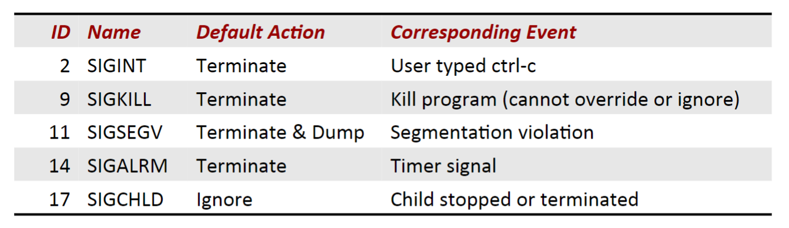

### Lecture 15 异常控制流——信号

#### Shell
在开始之前先简单讨论一下一个简单的 Shell 是如何实现的，详情代码参考教材 P524-526

这些代码实现了一个比较简单的 Shell，但还是有一些缺陷，如 build-in 命令未完全实现等，但是最主要的问题还是后台进程未回收。可以从源码中看到，后台进程在创建后程序就对其不进行控制了，这样会产生很多的僵死进程，所以需要考虑一个方法来回收僵死进程。

Linux 中提供了信号量机制来解决这个问题，当一个子进程终止时，会发送一个信号量给父进程，提醒父进程进行相应的操作

#### 信号量机制
信号量就是一条小信息，用来通知一个进程，系统中发生了某种类型的事件。其中
1. 信号是由内核发送给进程的
2. 信号的类型是由 ID 区分的（ID 是一个较小的整数）
3. 信号中包含的唯一信息就是信号的 ID

常见的信号如下图所示



##### 信号量术语
###### 发送信号
内核发送一个信号到目的进程是通过更新目的进程的上下文的某个状态值来实现的

内核发送信号可以有如下两种原因
1. 内核检测到了一个系统事件，如子进程终止或内存访问错误
2. 另一个进程通过调用 `kill` 之类的函数来显式请求内核发送一个信号给目的进程

> P.S. 一个进程可以发送信号给它自己

###### 接收信号
一个目的进程接受了信号指的是它被内核强制要求以某种方式对信号的传递作出反应，目的进程可以有如下三种可能的反应
1. 忽略这个信号
2. 终止这个进程
3. 捕获这个信号，即执行一个称为 **信号处理程序（signal handler）** 的函数

捕获一个信号和中断很相似，如下图所示


###### 阻塞信号和待处理信号
一个目的进程阻塞某个信号即为阻止该目的进程**接收**对应的信号。此时内核传输的信号仍然被传输到了目的进程，但是目的进程不对其进行处理。目的进程会直到对应的信号被取消阻塞了再对其进行处理（即接收对应信号）

一个发出了但没有被接收（目的进程阻塞了对应的信号）的信号就被称为 **待处理信号（pending signal）**。由于系统限制，同种类型的信号只能有一个待处理信号。如果某进程已经有了一个类型为 $k$ 的待处理信号，那之后系统给该进程发送的类型为 $k$ 的信号直接被丢弃。

系统在每个进程中维护了两个 32 位向量来实现阻塞信号和保存待处理信号这两个机制，这两个位向量分别为 `pending` 和 `blocked`。对于向量 `pending`，当系统传输了一个类型 $k$ 的信号，`pending` 将设置第 $k$ 位；当类型 $k$ 的信号被接收，`pending` 中的第 $k$ 位就被清除。而 `blocked` 向量则是能够被对应的系统调用手动设置

##### 发送信号
首先我们介绍一下有关进程组的概念

###### 进程组
每个进程都属于且仅属于一个进程组，进程组是由一个正整数来标识的，即进程组 ID。有关进程组的图示如下图所示


默认地，一个子进程与它的父进程同属于一个进程组。与进程组有关的操作如下所示
```C
#include <unistd.h>

pid_t getpgrp(void);
int setpgid(pid_t pid, pid_t pgid);
```
其中函数 `getpgrp` 返回当前进程的进程组，函数 `setpgid` 将进程 `pid` 的进程组改为 `pgid`

Linux 提供进程组这个概念是为了方便向大量进程发送信号。Linux 可以向一个进程组中的所有进程发送信号。在 Linux 中，有三种方式可以向进程发送信号

###### 使用 `/bin/kill` 发送信号
`/bin/kill` 程序可以向另外的程序发送任意的信号，如下所示
```
linux> /bin/kill -9 15213
```
上面表示向进程 ID 为 15213 的进程发送信号 9（SIGKILL）
```
linux> /bin/kill -9 -15213
```
上面表示向进程组 15213 中的所有进程发送信号 9（SIGKILL）

###### 从键盘发送信号
Unix shell 使用 **作业（job）** 这个抽象概念来表示对一条命令行求值而创建的进程（是一个进程组）。在任意时刻，至多只有一个前台作业和 0 个或多个后台作业。下图是关于作业的一个示例


在键盘上输入 Ctrl-C（Ctrl-Z）会导致内核向前台进程组中的每个进程发送 SIGINT（SIGTSTP）信号

SIGINT 的默认行为是终止每个进程 
SIGTSTP 的默认行为是挂起每个进程

###### 使用 `kill` 函数发送信号
```C
#include <sys/types.h>
#include <signal.h>

int kill(pid_t pid, int sig);
```
`kill` 函数可用于发送任何信号给任何进程组或进程。如果 `pid` 为正，则将信号 `sig` 发送到进程 `pid`。如果 `pid` 等于 0，那么 `sig` 被发送到调用进程所在进程组的每个进程，包括调用进程自己。
如果 `pid` 小于 0，则将 `sig` 发送到给进程组 `-pid` 中的每个进程。

##### 接收信号
当内核执行完某个异常处理程序后，准备将控制权返回给进程 $p$ 时，内核会计算
```C
pnb = pending & ~blocked
```
如果 `pnb` 为 0，则内核直接将控制返回进程 `p`，否则
1. 取出 `pnb` 中的最小位 $k$，并且强制进程 `p` 接收信号 $k$
2. 进程 `p` 对信号 $k$ 做出相应行为（此时 `pub` 中的第 $k$ 位已被清零）
3. 重复 1、2，直到 `pnb` 的值为 0
4. 将控制返回进程 `p`

进程在接受一个信号后，其默认的行为是下面的四种之一
1. 进程终止
2. 进程终止并转储内存
3. 进程挂起直到被 SIGCONT 信号重启
4. 进程忽略该信号

但是进程接收信号时的默认行为是可以更改的。唯一的例外是 SIGSTOP 和 SIGKILL，他们的默认行为是不能修改的
```C
#include <signal.h>
typedef void (*sighandler_t)(int);

sighandler_t signal(int signum, sighandler_t handler);
```
`signal` 函数可以通过下面三种方式来改变接收信号时的默认行为
1. 如果 `handler` 是 SIG_IGN，那么忽略类型为 `signum` 的信号
2. 如果 `handler` 是 SIG_DFL，那么类型为 `signum` 的信号行为恢复为默认行为
3. 否则 `handler` 就是用户定义的函数的地址，即**信号处理程序**的地址。当进程接收信号 `signum` 时就会调用这个函数。调用信号处理程序被称为**捕获信号**，执行信号处理程序被称为**处理信号**

###### 信号处理程序是并发流
一个信号处理程序也是一个逻辑控制流，并且和 `main` 程序并发运行，如下图所示


下图更清晰地展示了信号处理程序和 `main` 程序之间的可能的执行顺序


除此以外，一个信号处理程序也可以被其他信号处理程序中断，如下图所示


##### 阻塞和解除阻塞信号
**隐式阻塞机制**。内核默认阻塞当前正在处理的信号。也就是说，以一个 SIGINT 的信号处理程序不能被 SIGINT 信号中断
**显式阻塞机制**。程序可以使用 `sigprocmask` 函数和他的辅助函数来阻塞和解除阻塞选定的信号

```C
#include <signal.h>

int sigprocmask(int how, const sigset_t *set, sigset_t *oldset);
int sigemptyset(sigset_t *set);
int sigfillset(sigset_t *set);
int sigaddset(sigset_t *set, int signum);
int sigdelset(sigset_t *set, int signum);
int sigismember(const sigset_t *set, int signum);
```
这些函数的功能和使用方法详见教材 P533

#### 编写信号处理程序
编写信号处理程序时主要有三个需要注意的地方
1. 信号处理程序和主程序是并发执行的，且共享全局变量，所以对全局变量进行操作时需要特别注意
2. 信号在被阻塞时是没有队列的
3. 不同系统之间的信号量机制不同，系统之间的移植会有困难

首先，教材中给出了总的 6 条建议，详见教材 P533

##### 编写异步安全的程序
首先就是上面的第 1 点，在操作全局变量时特别注意，具体来说就是在对全局变量进行操作时将所有的信号全都阻塞掉

除了用户定义的模块，C 的系统模块里面也有定义全局变量（如 I/O 模块），虽然这些全局变量只能由对应模块所提供的接口来访问，但是有可能某个函数将对应的全局变量更改到一半，然后有信号传入，然后信号处理程序中也调用了相应模块的接口，且更改了对应的全局变量，这样会导致系统的错误。

为了避免上述这种情况，我们只在程序中调用所谓**异步信号安全**的函数，这些函数满足
1. 它是可重入的，即它的所有数据均保存在栈中（避免上面所讨论的情况）
2. 它不能被信号处理程序中断

Linux 中的异步信号安全函数参见教材 P534

##### 正确的信号处理
主要是指上面的第 2 点，这个可以参考教材 P537 的例子。信号在被阻塞时是没有队列的，如果存在一个阻塞的信号就表明至少有一个信号到达了

##### 同步流来避免并发错误
这个可以参考教材上对两个错误示例进行更改的过程，此处介绍一下 `pause` 和 `sigsuspend` 函数
```C
#include <unistd.h>

int pause(void);
```
`pause` 会让调用它的进程或线程休眠，直到一个会导致进程终止或会导致信号处理程序运行的信号传入（即会被当前进程忽略的信号传入不会使进程退出休眠）

`pause` 只有在成功捕获信号并且信号处理程序返回后才返回，在这种情况下，`pause` 返回 -1，且 `errno` 被设置为 EINTR

如果信号导致程序终止，则 `pause` 不会返回

```C
#include <signal.h>

int sigsuspend(const sigset_t *mask);
```
`sigsuspend` 等价于下述代码的原子（不可中断）版本
```C
sigprocmask(SIG_SETMASK, &mask, &prev);
pause();
sigprocmask(SIG_SETMASK, &prev, NULL);
```
`sigsuspend` 的返回情况和 `pause` 相同
