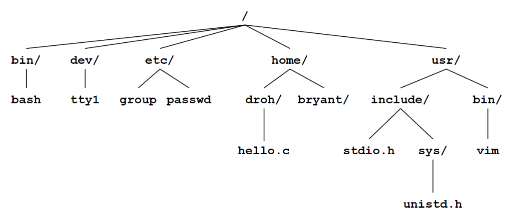
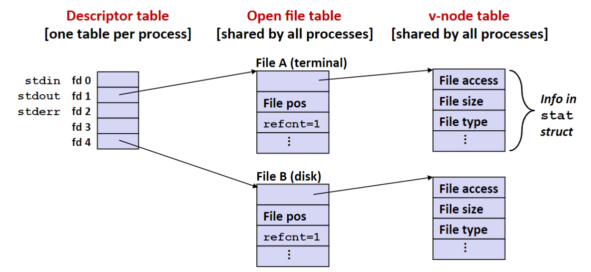
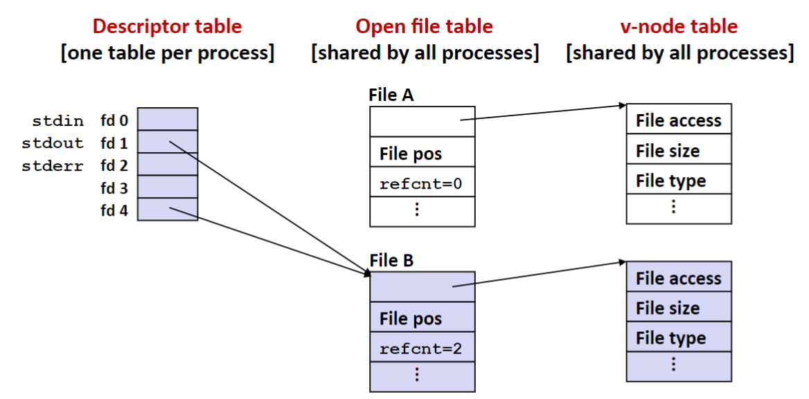
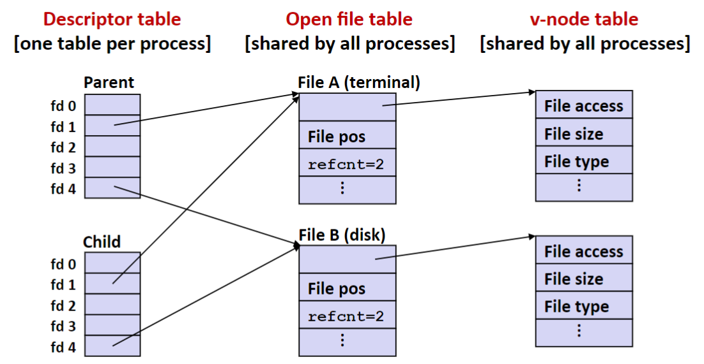
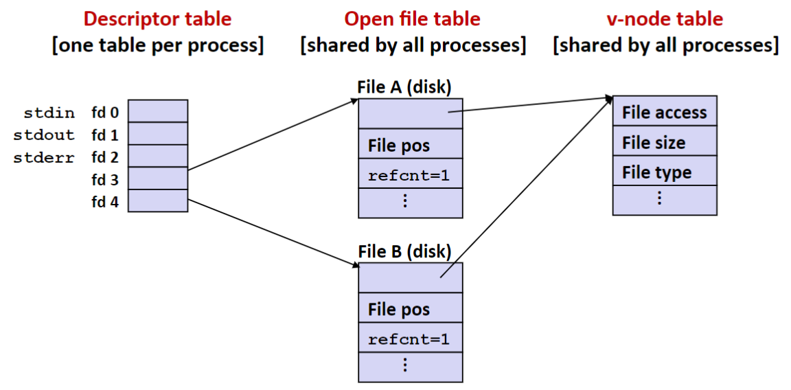

### Lecture 16 系统级 I/O
#### 文件
Linux 系统中有多种文件类型，这里主要讲解以下三种文件
1. **普通文件（regular file）**。普通文件一般分为 **文本文件（text file）** 和 **二进制文件（binary file）**，文本文件是只含有 ASCII 或 Unicode 字符的普通文件；二进制文件是除此以外的所有文件
2. **目录（directory）**。目录是包含一组 **链接（link）** 的文件，其中每个链接都将一个文件名映射到一个文件
3. **套接字（socket）**。套接字是用来和另一个进程进行跨网络通信的文件

> P.S. 文本文件就是由一系列文本行组成的，一个文本行由一个换行符 `\n` 结尾

> P.S. 在 Linux 和 Unix 中，换行符为 `\n`，但是在 Windows 中，换行符为 `\r\n`

> P.S. 有关目录的详细讲解参见 `APUE`

目录的一个示例结构如下图所示



> P.S. 内核为每个进程维护 **当前工作路径（current working directory）** 的值

#### 系统级 I/O
```C
#include <sys/types.h>
#include <sys/stat.h>
#include <fcntl.h>

int open(char *filename, int flags, mode_t mode);
```
`open` 函数打开一个文件，成功则返回文件描述符，否则返回 -1

```C
#include <unistd.h>
int close(int fd);
```
`close` 函数关闭一个文件，成功则返回 0，否则返回 -1

> P.S. 关闭一个已关闭的文件描述符会出错

```C
#include <unistd.h>

ssize_t read(int fd, void *buf, size_t n);
ssize_t write(int fd, const void *buf, size_t n);
```
`read` 函数从描述符 `fd` 的文件处复制最多 `n` 个字节到缓冲区 `buf` 内，返回 -1 表示错误，返回 0 表示 EOF，否则表示的是实际传输字节数量

`write` 函数从内存位置 `buf` 复制至多 `n` 个字节到描述符 `fd` 的文件，成功则返回写入的字节数，否则返回 -1

> P.S. 有关上面这些函数的细节，参考 `C 程序设计语言` 或 `APUE`

在某些情况下，`read` 和 `write` 传送的字节数比应用程序要求的少（小于参数 `n`），这种情况称为 **不足值（short count）**，出现这种情况的原因有
1. 读时遇到了 EOF
2. 在从终端读文本行
3. 读写网络套接字

> P.S. 如果打开的文件是与终端相关联的，那么每次 `read` 函数将一次传送一个文本行

事实上，除了 EOF，在读取磁盘文件时，将不会遇到不足值，而且在写磁盘文件时，也不会遇到不足值

#### RIO 包
RIO 包是由本课程相关人员编写的，不是 C 中的标准函数。编写这个 I/O 包的目的在于处理前面所提到的不足值的问题，RIO 包提供了两组输入输出函数，分别为不带缓冲区和带缓冲区的输入输出。关于这一部分，教材上有这几个函数实现的源码，详见教材 P627

> P.S. 有关带缓冲区输入输出接口的编写，可以参考 `C 程序设计语言`

#### Unix 中文件的结构
##### 元数据
在 Unix 中，每个文件都包含文件信息，也被称为 **元数据（metadata）**，可以通过 `stat` 函数来读取
```C
#include <unistd.h>
#include <sys/stat.h>

int stat(const char *filename, struct stat *buf);
```
`stat` 函数将文件 `filename` 的元数据读入缓冲区 `buf` 中，成功则返回 0，否则返回 -1。元数据的结构即为 `struct stat` 的结构，详情参见教材 P632 或 man 手册

##### 文件结构
内核用三个相关的数据结构来表示打开的文件，分别为
1. **描述符表（descriptor table）**。每个进程都有它独立的描述符表，它的表项是由文件描述符来索引的，每个打开的描述符表项指向文件表中的一个表项
2. **文件表（file table）**。打开文件的集合是由一张文件表来表示的，所有的进程共享这张表。这张表的表项包括当前所读到的文件位置、**引用计数（reference count）**、以及一个指向 v-node 表对应表项的指针。关闭一个描述符会较少响应文件表表项中的引用计数，内核不会立刻删除这个表项，直到它的引用计数为 0
3. **v-node 表（v-node table）**。同文件表一样，所有的进程共享这张表，每项包含了文件的相应信息

假设初始状态如下所示



有一个系统调用 `dup2` 可以用来进行 I/O 重定向，如下所示
```C
#include <unistd.h>

int dup2(int oldfd, int newfd);
``` 
`dup2` 复制描述符表表项 `oldfd` 到描述符表项 `newfd`，覆盖描述符表项 `newfd` 之前的内容，上图调用 `dup2(4, 1)` 后如下图所示



对于系统调用 `fork`，其调用后，子进程也会继承父进程的描述符表，在初始状态调用 `fork()` 后如下图所示



当然，多个描述符也可以通过不同的文件表表项来引用同一个文件。比如，如果以同一个 `filename` 调用 `open` 函数两次，就会发生如下的情况



> P.S. 关于这些内容更详细的解释参见 `TLPI` 5.4 节