### Lecture 17 虚拟内存 —— 概念

#### 地址空间
计算机的主存为一个由 $M$ 个连续的字节组成的一个数组，每个字节都有一个唯一的 **物理地址（Physical Address, PA）**，在早期的计算机上 CPU 使用物理地址来访问内存，我们把这种方式称为 **物理寻址**。如下图所示

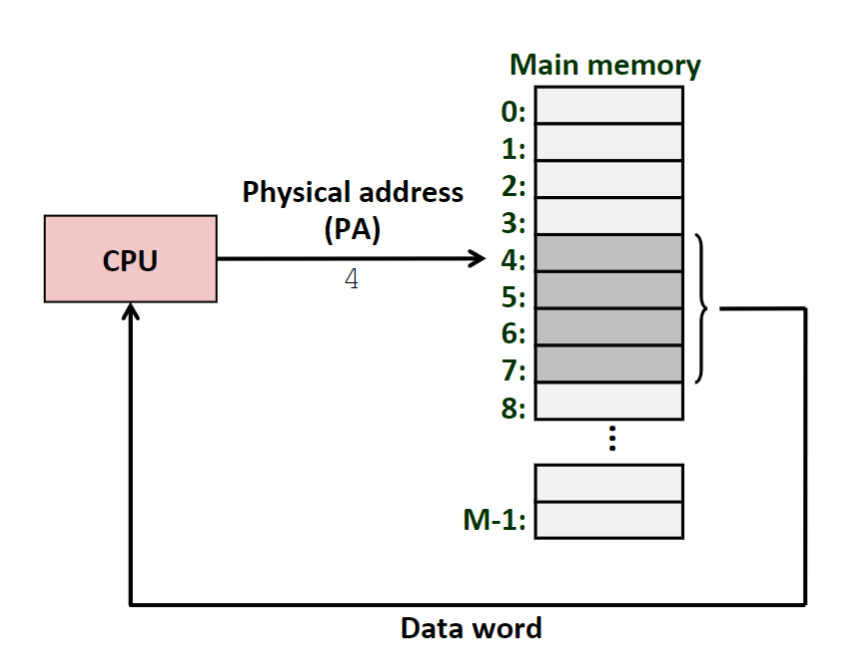

但是，现代计算机由于各种原因，采用 **虚拟寻址** 的方式来进行寻址。即 CPU 使用 **虚拟地址（Virtual Address, VA）** 来访问内存，但是这个虚拟地址在被送到内存之前会被 **内存管理单元（Memory Management Unit, MMU）** 转换为对应的物理地址，如下图所示

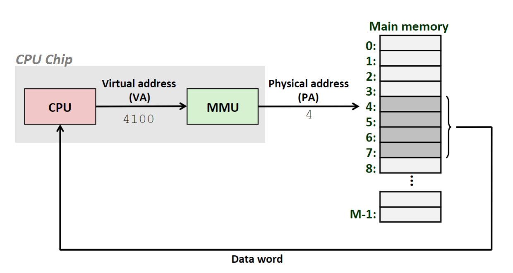

采用这种不直观的方式来访问内存是为了向 CPU 提供关于内存的抽象，CPU 只能访问到虚拟地址，CPU 所能访问到的虚拟地址集合即为 **虚拟内存**。基于如下三个原因采用这种方式来对内存进行访问
1. 虚拟内存可以作为缓存的工具
2. 虚拟内存可以作为内存管理的工具
3. 虚拟内存可以作为内存保护的工具

#### 虚拟内存作为缓存的工具
首先介绍虚拟内存的原理。假设虚拟内存大小为 $N = 2^n$，物理内存大小为 $M = 2^m$。从概念上来讲，虚拟内存是存放在磁盘上的，当 CPU 需要访问某个虚拟地址时，系统会将对应的 **页（Page）** 缓存到物理内存中，之后 CPU 再进行访问。假设一个页的大小为 $P = 2^p$，则虚拟内存也被分割为若干个 **虚拟页（Virtual Page, VP）**，大小为 $P$，物理内存也被分割为若干个 **物理页（Physical Page, PP）**，大小也为 $P$ 

从上面可以看出，物理内存就是虚拟内存的缓存，且由于一次未命中的代价比较大（需从硬盘中读取数据），所以缓存块（即页）的大小更大，一般为 4Kb 到 4Mb，且这个缓存采用的是全相联映射。为了提高命中率，虚拟内存的页面置换算法也更复杂。

虚拟页面可以分为如下三种
1. **未分配的**。系统还未分配（创建）的页，未分配的页没有任何数据，因此不占用任何磁盘空间
2. **未缓存的**。在磁盘中已分配空间，但未缓存到物理内存中
3. **已缓存的**。在磁盘中已分配空间，但已缓存到物理内存中

虚拟页面映射如下所示

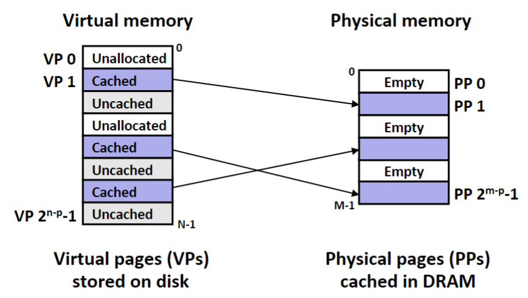

##### 页表
**页表（Page Table）** 是系统管理的一个数据结构，他存放虚拟页和物理页之间的映射关系，即一个虚拟页被映射到了哪个物理页，页表的结构如下图所示

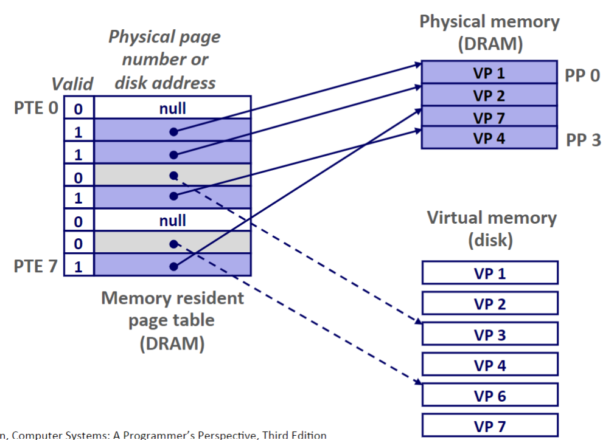

页表中的一个表项即为 **页表条目（Page Table Entry, PTE）**，每个 PTE 由一个有效位和一个 $n$ 位地址字段组成。如果设置了有效位，即表示该虚拟页是已缓存的，且对应的物理页的地址就在地址字段中；如果未设置有效位，则一个空地址表示该虚拟页还未分配，否则该虚拟页就是未缓存的，对应地址字段指向虚拟页在磁盘中的位置

> P.S. 有关虚拟地址是如何转换为物理地址的之后会讲，现在只用知道虚拟地址可以通过页表和 MMU 转换为物理地址

##### 页命中
当 CPU 访问一个虚拟地址时，如果虚拟地址已经被缓存到物理内存中，则虚拟地址可以被 MMU 转换为物理地址，之后内存返回对应的值，这种情况称为页命中，如下所示

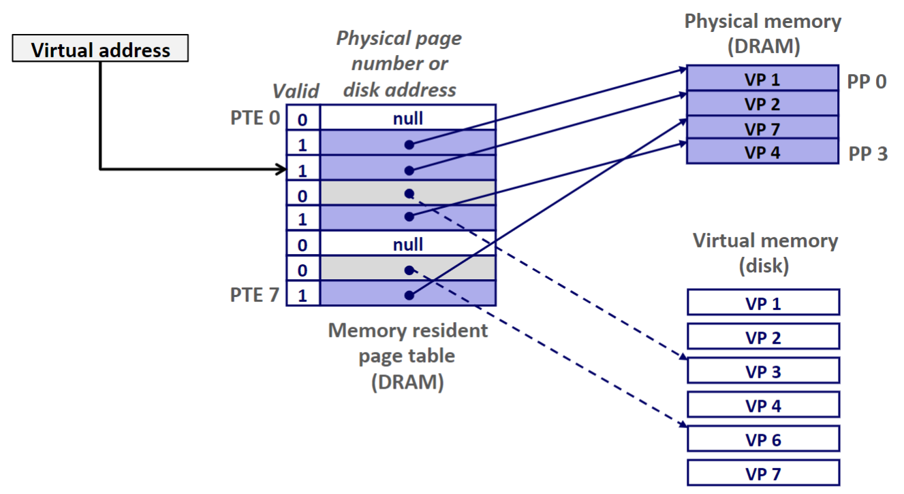

##### 缺页
当 CPU 访问的虚拟地址所在页是未缓存状态时，称为缺页。因为虚拟地址对应的数据不在物理内存中，此时会触发异常，内核会将对应的虚拟页从磁盘复制到物理内存中，如果物理内存已满，则会替换掉一个原有的虚拟页，替换完成后更新页表。之后异常返回，CPU 重新执行访存指令，此时页命中，所有的过程如下所示

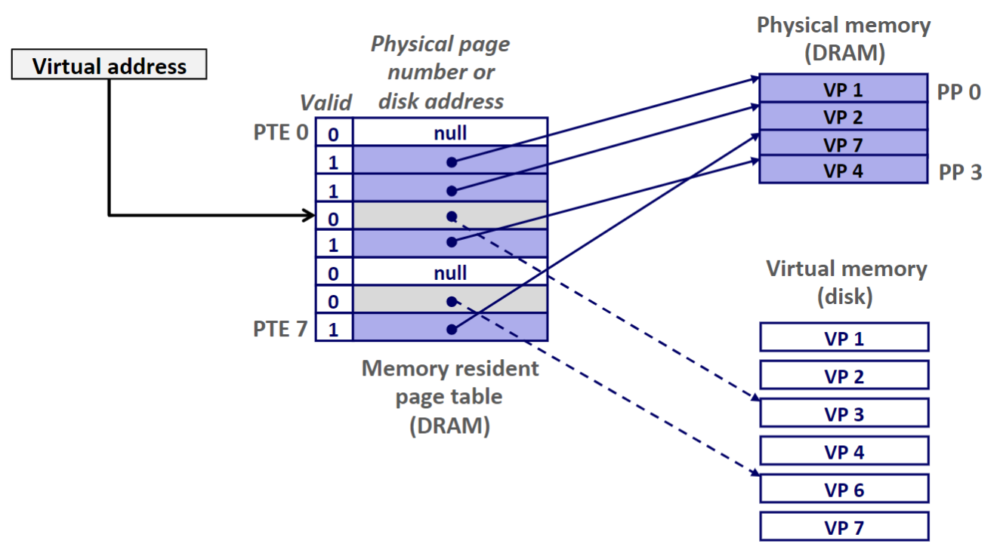

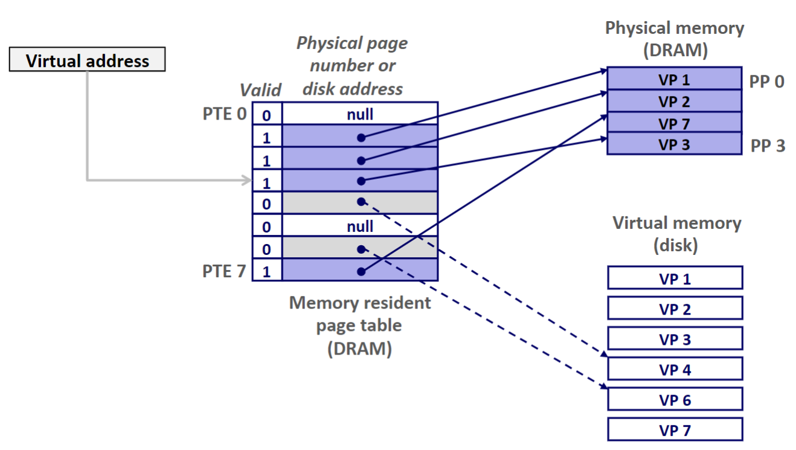

> P.S. 上面的这种直到缺页触发才换页的策略称为 **按需页面调度（demand paging）**，也可以尝试采用其它策略

##### 分配页面
当 CPU 访问的虚拟地址所在页是未分配状态时，就需要分配页面（此时一般是因为程序调用了 `malloc` 函数）。分配页面即为在磁盘上创建对应的空间并更新对应的 PTE，使它指向新分配的页面

#### 虚拟内存作为内存管理的工具
由于现代的计算机会同时运行多个进程，多个进程会同时使用 CPU 和主存，而多个进程同时使用一个主存会产生一些问题，如各个进程的内存应当怎么协调，进程需要额外空间时该怎么办，新加一个进程时它的内存应该怎么分配等问题。而虚拟内存可以有效管理不同进程的内存

事实上，虚拟内存是以进程为单位的，即每个进程都有一个独立的页表，因此也有一个独立的虚拟内存地址，如下图所示

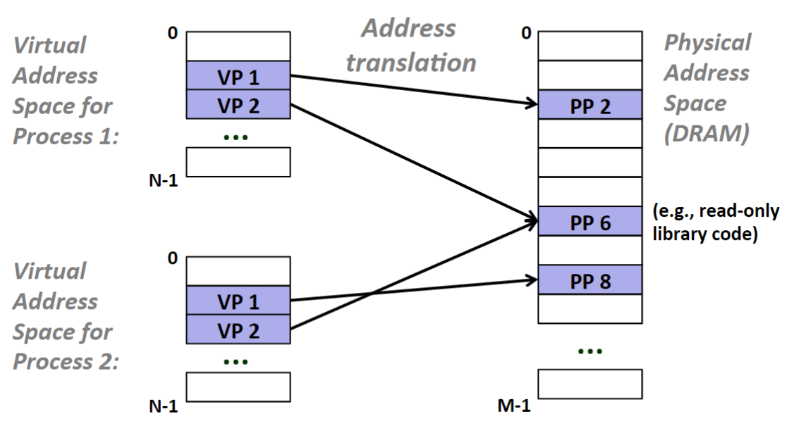

可以看到，多个虚拟页面可以映射到同一个物理页面上。除此以外，这样设计还可以简化链接和加载步骤，详见教材和 PPT

#### 虚拟内存作为内存保护的工具
由于虚拟内存的机制，所有的虚拟地址都要先通过访问页表来转换为物理地址，所以可以在 PTE 上加一些权限位，不符合权限的访问则给与拒绝，如下图所示

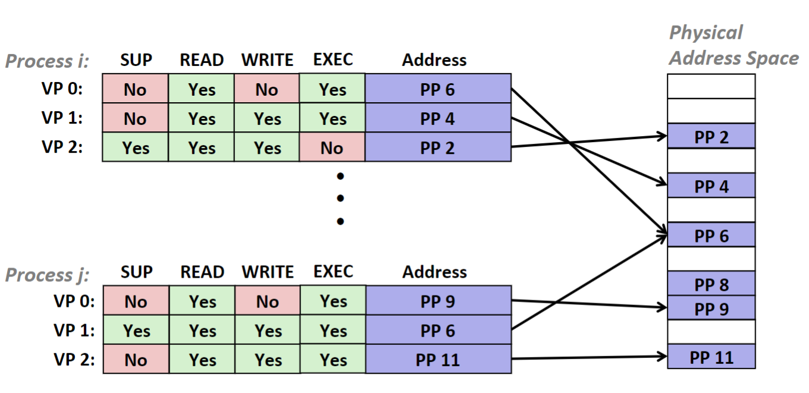

#### 内存翻译
首先将 **虚拟页号（Virtual Page Number）** 记为 VPN，**物理页号（Physical Page NUmber）** 记为 PPN，**虚拟页面偏移（Virtual Page Offset）** 记为 VPO，**物理页面偏移（Physical Page Offset）** 记为 PPO

##### 地址翻译
首先我们知道，虚拟地址即为 `VPN | VPO`，所以可以从虚拟地址中获取 VPN 和 VPO。然后有一个页表基址寄存器（PTBR）专门存放页表的开始位置，所以 PTE 的地址即为
```
PTE_address = PTBR + VPN * sizeof(PTE)
```
显然，`VPO == PPO`，且物理地址即为 `PPN | PPO`，所以页表中只存储物理地址所在的页表号，得到 PPN 后在生成实际的物理地址。整个过程如下图所示

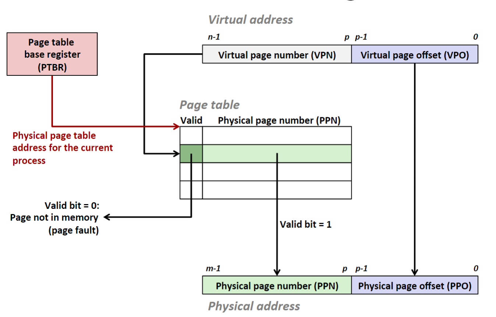

当页命中时，CPU 获取数据的过程为
1. CPU 生成一个虚拟地址，并把它传送给 MMU
2. MMU 生成 PTE 地址，并从高速缓存/主存获取 PTE
3. 高速缓存/主存向 MMU 返回 PTE
4. MMU 构造物理地址，并把它传给高速缓存/主存
5. 高速缓存/主存返回所请求的数据给 CPU

整个过程如下图所示

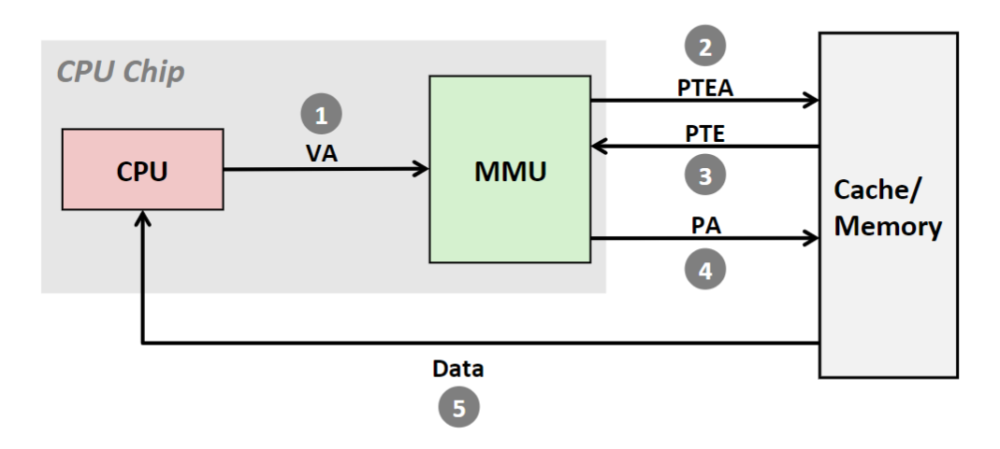

上述过程完全是由硬件完成的，但是当缺页时，是由硬件和内核共同完成的，步骤如下所示
1. 和页命中的前三步相同
2. PTE 的有效位为 0，所以 MMU 触发了一次异常，CPU 开始执行内核中的缺页异常处理程序
3. 缺页处理程序确定出内存中的牺牲页，如果这个页面已经被修改了，则把它换出到磁盘
4. 缺页处理程序将所需页面调入内存，并更新对应 PTE
5. 缺页处理程序将控制返回到原来的进程，再次执行导致缺页的指令。重新执行页命中时的 5 个步骤

整个过程如下图所示

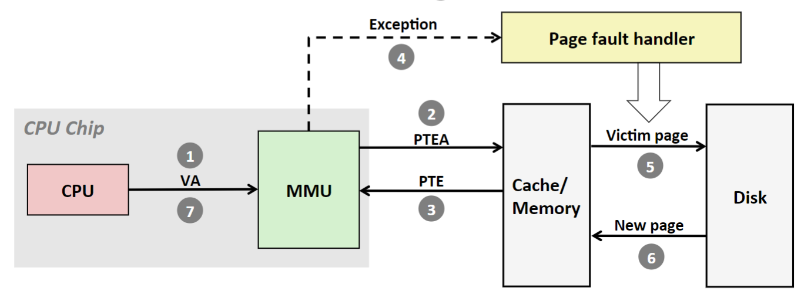

##### 结合高速缓存和虚拟内存
对于既使用虚拟内存，又使用高速缓存的系统，都有应该使用虚拟地址还是物理地址来访问高速缓存的问题。但是大多数系统使用物理地址，即将高速缓存放在 MMU 和主存之间，如下图所示

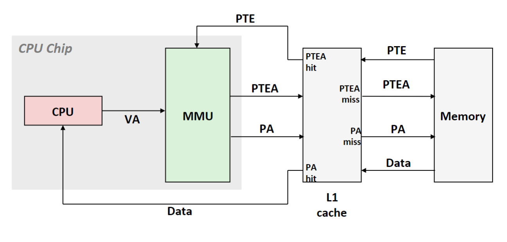

> P.S. PTE 也可以被缓存

##### 利用 TLB 加速地址翻译
每次 CPU 产生一个虚拟地址，MMU 就必须要查询一个 PTE，在最坏的情况下，这会要求内存多取一次数据，代价是几十到几百个周期。为了消除这个开销，于是很多系统都在 MMU 中包括了一个关于 PTE 的缓存，称为 **翻译后备缓冲器（Translation Lookaside Buffer, TLB）**。由于 TLB 内不使用物理地址，所以需要想个其他方法来索引 TLB，如下所示

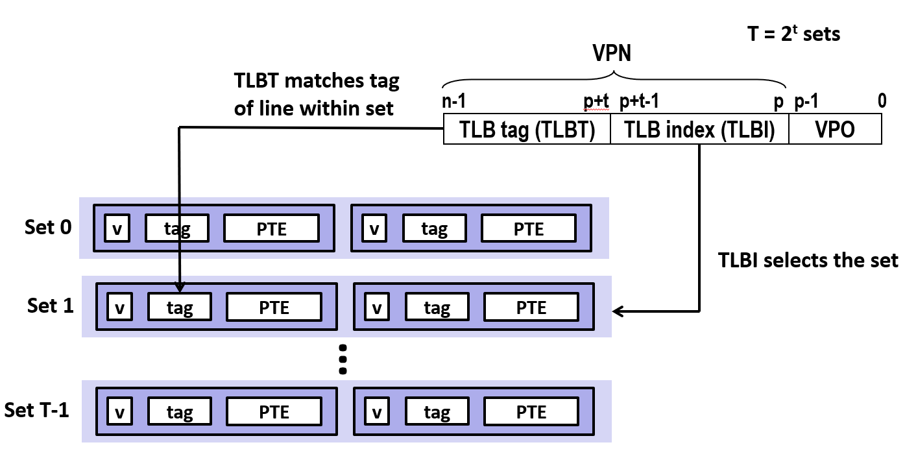

将 VPN 分割为 TLBT 和 TLBI，并且以组相联映射的方式来索引 TLB 中的 PTE

带 TLB 的系统 TLB 命中和 TLB 不命中的流程图如下所示，具体步骤参见教材

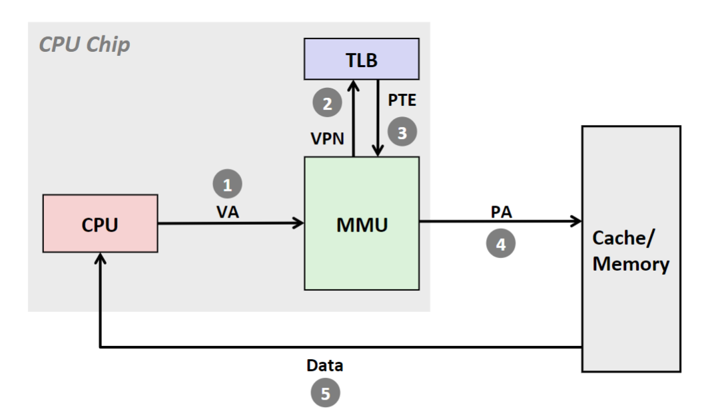

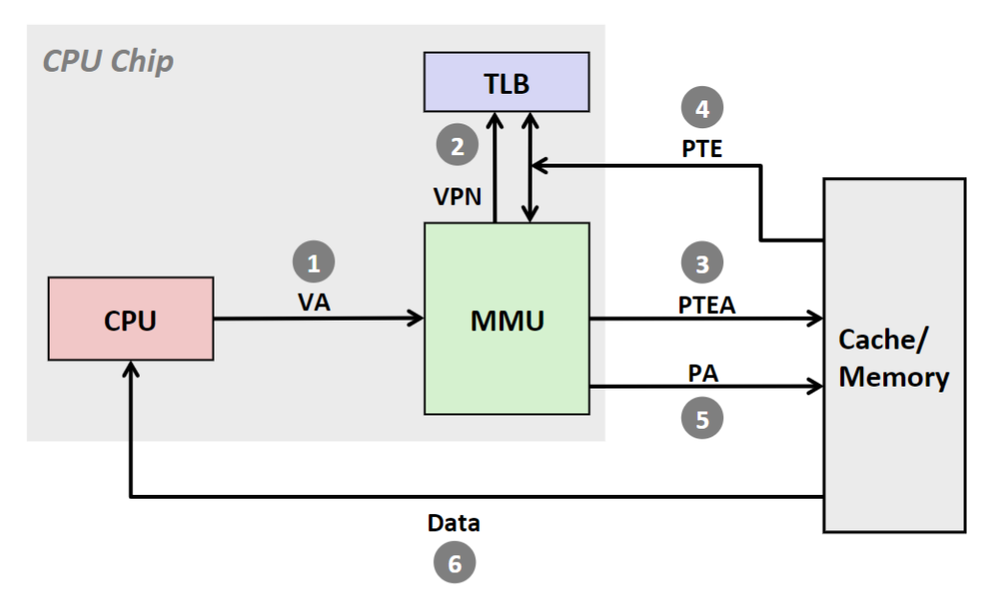

##### 多级页表
首先我们估计一下前面所述的页表的大小，假设页大小为 $P = 4 \rm \; {Kb}$，虚拟内存大小为 $N = 2^{48} \; \rm{byte}$，则 PTE 的个数为 $N / P = 2^{36}$，假设每个 PTE 的大小为 $8 \; \rm{byte}$，则页表所占用空间为 $2^{39} \; \rm{byte} = 512 \; \rm{Gb}$，显然太大了

为了解决这个问题，则引出了多级页表的措施，一个二级页表如下图所示

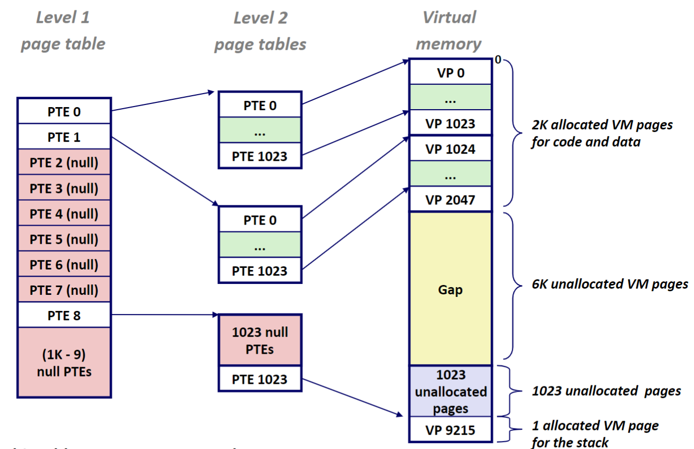

可以看到，多级页表能够节省空间的原因是：虚拟内存的大部分空间都没有使用，进程只使用了一小部分，如果为每个虚拟页都创建一个 PTE，则大部分的 PTE 根本不会被用到。因此可以采用多级页表的方式，在最顶层一个表项的**块**更大，如果这个块全部都是空的，则只需一个 PTE 就能记录下来

多级页表索引的示意图如下所示

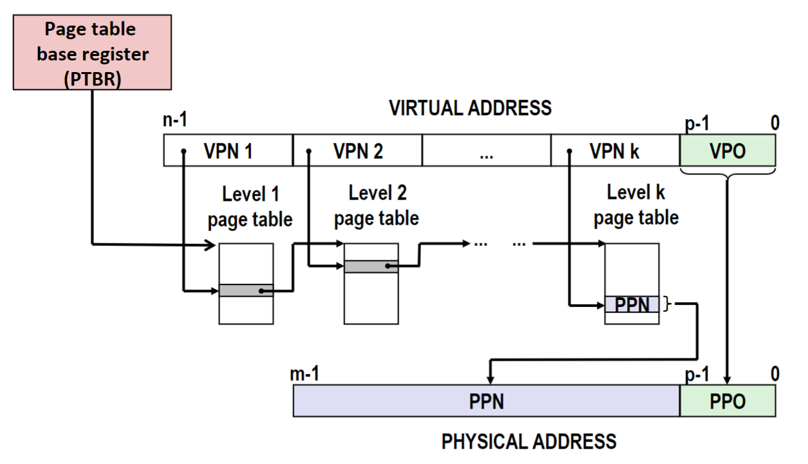

除了最后一级页表，之前的页表项存储的都是下一级页表的起始地址