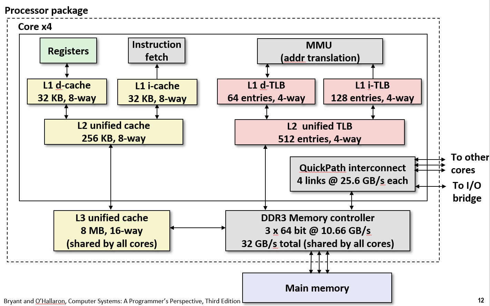
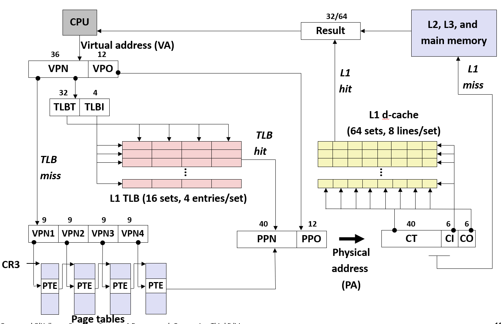
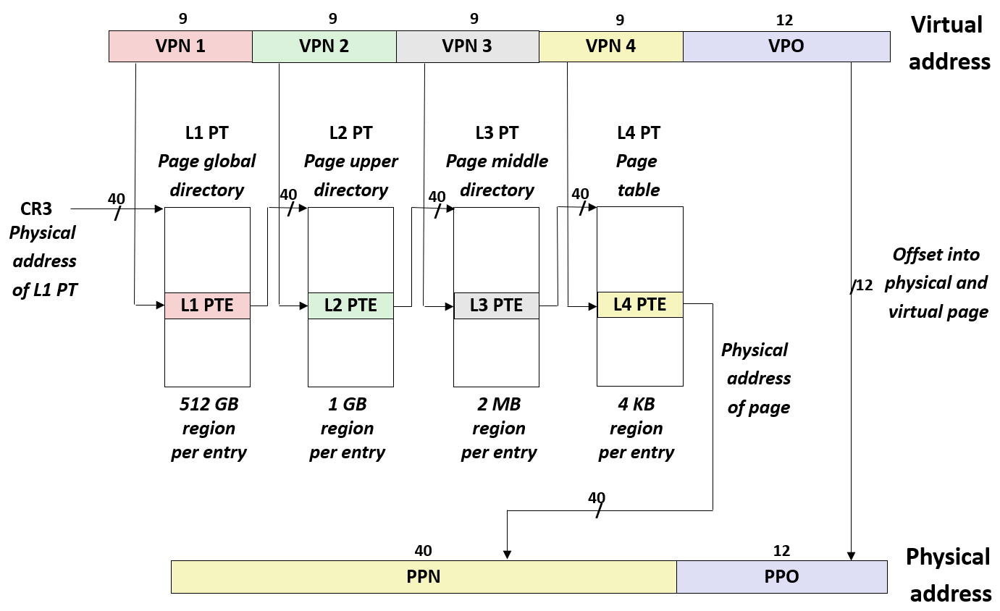
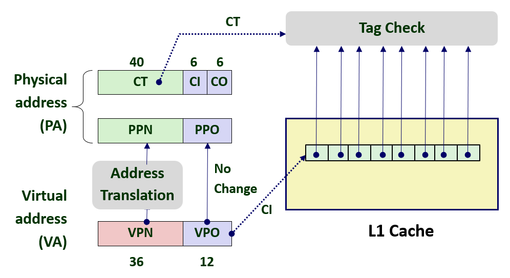
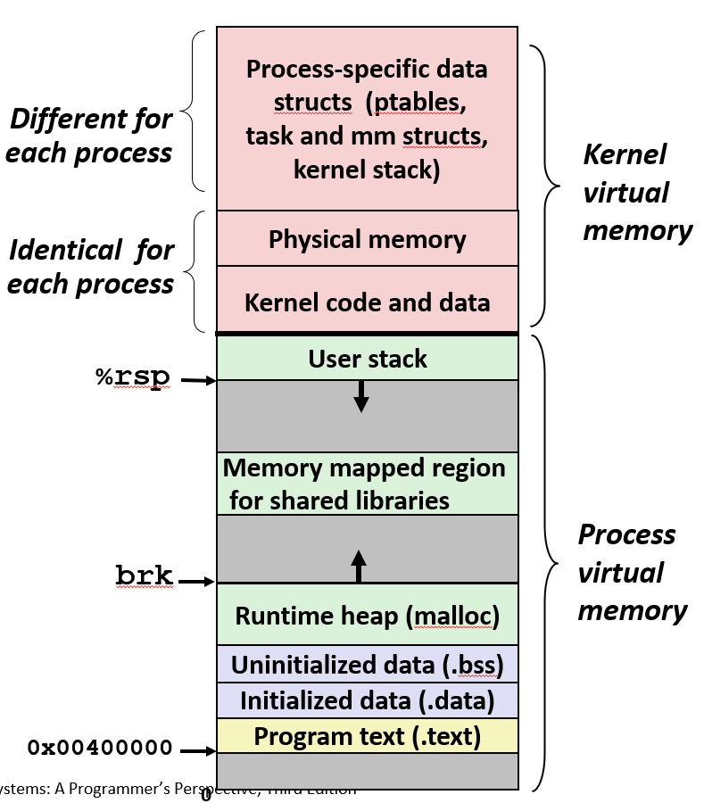
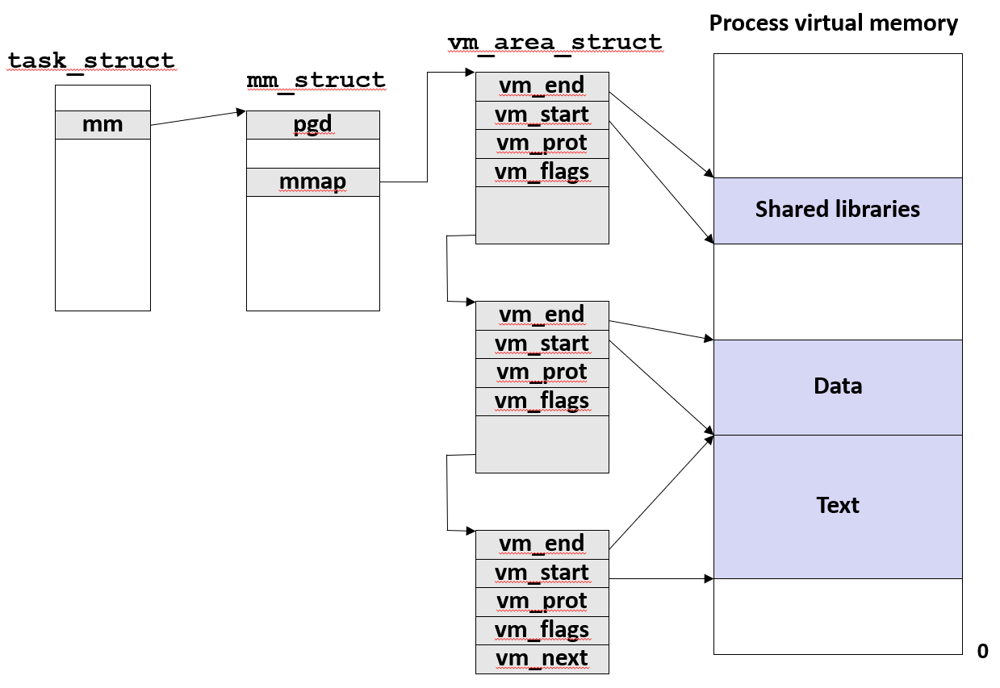

### Lecture 18 虚拟内存 —— 系统

#### Intel i7/Linux 内存系统
Intel i7 的内存系统如下图所示

其中 L1 和 L2 缓存每个核心都有，但是 L3 缓存是由所有的核共享的，且 L1 缓存分为数据缓存和指令缓存。上图还可以看出，TLB 也有缓存。

Intel i7 的地址翻译示意图如下所示

地址翻译流程和之前讨论过的类似，唯一需要注意的就是上图的 `PPN` 和 `CT` 位数相同，这不是巧合，这样设计的原因之后叙述

> P.S. 有关多级页表中 PTE 的结构，参见教材 P578

多级页表的地址翻译如下图所示

##### 优化地址翻译
如前面所述，地址的翻译可分为两个步骤
1. MMU 将虚拟地址翻译为物理地址
2. 将物理地址传送到 L1 缓存

在实际的硬件中使用了一些技巧，允许这两个步骤部分重叠，如下图所示

系统设计师故意将 `CI | CO` 的位数设置成和 `PPO` 相同，即和 `VPO` 相同，因此可以在 `VPN` 还在进行地址翻译时，直接将 `VPO` 传递给 L1 缓存，这样使得缓存可以提前做好准备，通过 `CI` 提前获取高速缓存组。当 MMU 得到 `PPN` 后，缓存已经准备好将这个 `PPN` 与这 8 个标记中的一个进行匹配了

##### Linux 虚拟内存系统
一个 Linux 进程的虚拟内存如下所示

需要注意的是，虚拟地址的位数为 48 位，且用户栈栈底的位置小于 `0x7fffffffffff`。也就是说，所有由用户使用的地址都是以 0 开头，而以 1 开头的地址均由内核使用

除此以外，Linux 也将一组连续的虚拟地址（大小为主存的大小）映射到全体物理空间，这为内核提供了一种便利的方法来访问物理内存中任何特定的位置

Linux 组织一个虚拟内存的方式如下所示

Linux 将虚拟内存组织为一些区域（也称为段）的集合。上图的 `pgd` 指向第一级页表的基址，而 `mmap` 指向一个 `vm_area_structs` 的链表，其中每个 `vm_area_structs` 都描述了当前虚拟地址空间的一个区域。除此之外，第一级页表的基址存放在 `CR3` 控制寄存器中，也就是说，只要更换 `CR3` 的值，就相当于更换了整个虚拟空间

#### 内存映射
Linux 通过将一个虚拟内存区域与一个磁盘上的文件关联起来，以初始化这个虚拟内存区域的内容，这个过程称为 **内存映射（memory mapping）**。虚拟内存可以映射到两种文件
1. 普通文件。一个区域可以映射到一个普通文件的连续部分，如果区域比文件区还大，那么就用零来填充这个区域的剩下部分
2. 匿名文件。一个区域也可以映射到一个匿名文件，匿名文件是由内核创建的，包含的全是二进制零

##### 共享对象
一个对象可以被映射到虚拟内存的一个区域，要么作为**共享对象**，要么作为**私有对象**。如果多个进程将同一个共享对象映射到其虚拟内存内，那么某一个进程对这个共享对象的任何写操作，都会反映到磁盘上的原始对象中。对于其他进程，这个修改也是可见的。而对于私有对象的区域做的改变，对于其他进程来说是不可见的，并且进程对这个区域所做的任何写操作都不会反映在磁盘上的对象中

私有对象使用一种叫做 **写时复制（copy-on-write）** 的技术被映射到虚拟内存中。

> P.S. 有关写时复制的细节参见教材 P584，这可以为进程提供一个抽象，即每个进程都含有一份私有对象的复制，但是其在物理内存中很可能只有一份实际的私有对象

`fork` 函数在运行时就采用了写时复制的策略，它在运行时只创建了有关进程的相关信息，其余部分（如代码段，栈等）都采用的写时复制技术。这样的设计使得 `fork` 的开销很小，且节省了很多的内存

`execve` 函数在运行时则主要进行了以下操作
1. 删除已存在的用户区域
2. 映射私有区域
3. 映射共享区域
4. 设置 `%rip`

> P.S. 有关系统调用 `mmap`，可以参考教材
