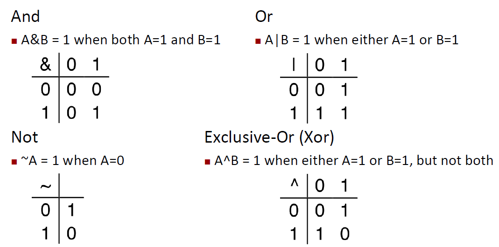
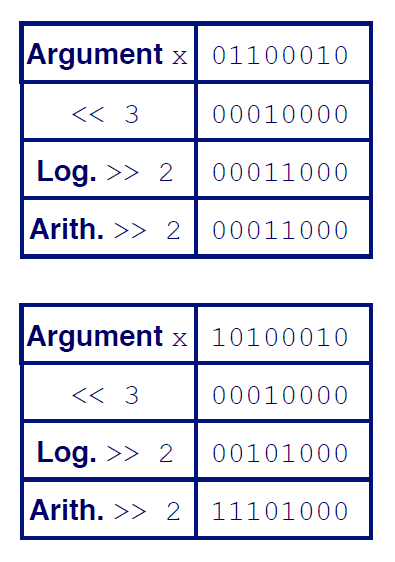
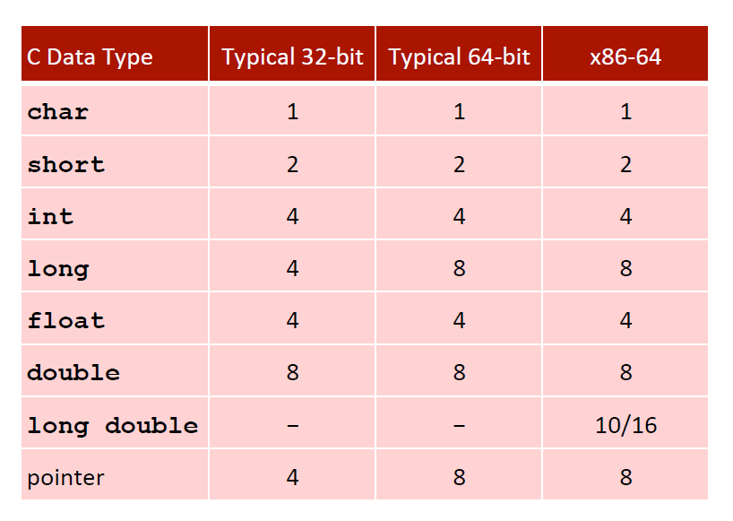
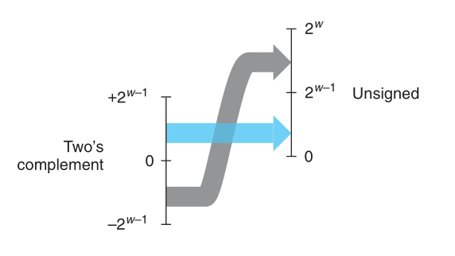
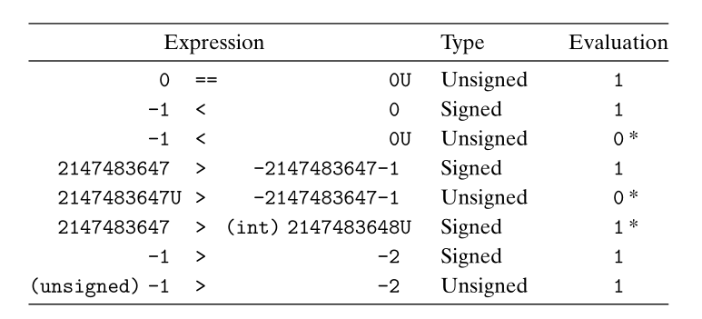
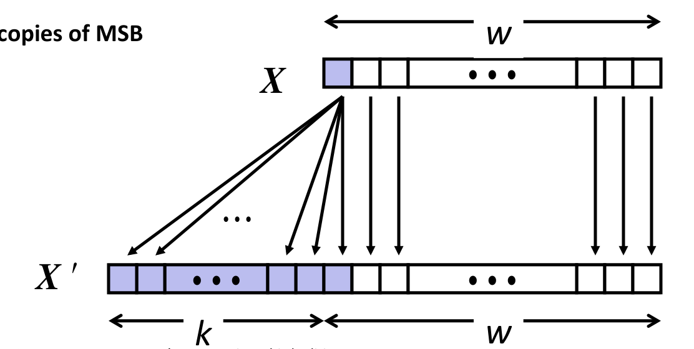
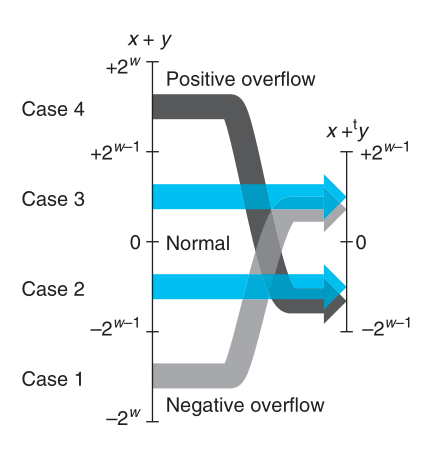
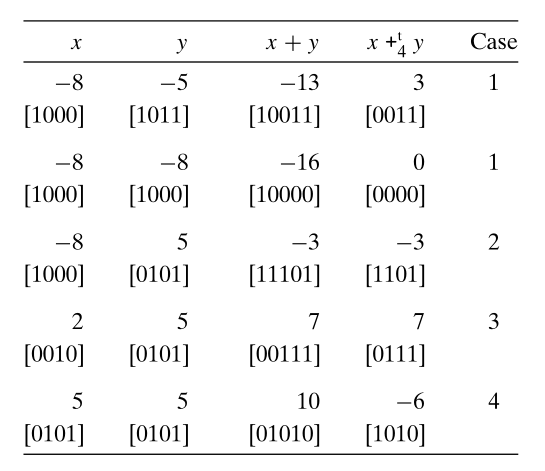
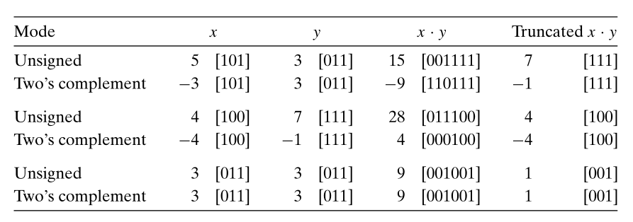
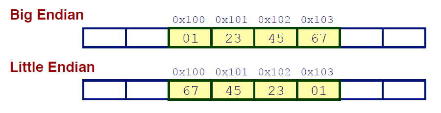

### Lecture 2 信息的表示和处理 —— 整数
#### 1. 补充知识
> Q: 为什么要有 8 进制或 16 进制
> Ans: 当我们在研究二进制（或计算机内的信息）时，一长串的01代码是相当难以理解的，采用 16 进制可以将 4bit 的二进制分为一组，更方便研究

> P.S. 有关计算机内的字节顺序（即大端法，小端法）见教材 2.1.3

##### 布尔代数简介
> Q: 为什么要学习布尔代数
> Ans: 因为计算机底层只有与或非三种门，计算机上层的所有操作都是通过布尔代数来实现的（参见《编码的奥秘》）

下图为布尔代数运算规则


##### 实例--使用二进制来表示集合
假设存在 $n$ 个元素，分别为

$$
a_1, a_2, \cdots, a_n
$$

我们可以用一个 $n$ 位的二进制数 $x$ 来表示一个集合 $A$. 假如 $x$ 的第 $i$ 位为 1，则表示 $a_i \in A$，若为 0，则表示 $a_i \notin A$. 如此一来，集合的相关运算可表示如下

$$
A_1 \cap A_2 = x_1 \And x_2 \\
A_1 \cup A_2 = x_1 \mid x_2 \\
A_1 \cup A_2 - A_1 \cap A_2 = x_1 \wedge x_2 \\
\complement_U A = \; \sim x \\
$$

> P.S. 这种表示方法在 C 语言中经常使用

##### 逻辑运算
相对于布尔代数，逻辑运算不是对单个位做运算，而是对整个变量做运算，且他们是**短路的**. 在逻辑运算中，0 表示 `False`，任何非 0 值均为 `True`

逻辑运算符包括 $\&\&$, $\mid\mid$ 和 $!$ 三种运算符

##### 移位运算
一共有三种移位运算，一种左移和两种右移. 

**左移**即为将对应的 bit 向高位移动，多余的 bit 舍去，不足的用 0 填充

**逻辑右移**即为将对应的 bit 向低位移动，多余的 bit 舍去，不足的用 0 填充

**算术右移**即为将对应的 bit 向低位移动，多余的 bit 舍去，不足的填充当前的最高位 bit

具体图示如下


> P.S. 当移位的数字 $k$ 大于 $x$ 本身的位数 $w$ 时，在C语言中，此时的行为是未定义的，详见教材 P41

> Q: 为什么会有算数右移
> Ans: 因为对有符号数进行操作需要这个操作

> P.S. 在 C 语言中，对有符号数进行右移为算术右移，对无符号数右移为逻辑右移

#### 2. 整数的表示
> Q：整数在计算机中是如何表示的
> Ans: 在计算机中使用二进制表示整数

下图为C语言中一些典型的类型所占用的空间，单位为 byte


##### 无符号数的编码
对于一个十进制非负数 $x$，其作为无符号数时的二进制表示即为将 $x$ 转为其二进制形式. 若假设有一个 $n$ 位的无符号数 $x$，其二进制表示为 $[x_{n-1}, x_{n-2}, \cdots, x_0]$，则其表示的十进制数为

$$
\begin{equation}
    x_u = \sum_{i=0}^{n-1} x_i \cdot 2^i
\end{equation}
$$

显然，其表示范围为 $[0, \; 2^n-1]$
记 $U_{max} = 2^n - 1$

##### 有符号数的编码（补码编码）
> 由之前的讨论可以看出，用二进制来表示非负数是很简单的，但是如何表示负数？准确地说是如何在二进制中表示数字的符号. 一种可行的方式是将最高位设为符号位，这样就引入了**源码**的概念

若假设有一个 $n$ 位的有符号数 $x$，其二进制表示为 $[x_{n-1}, x_{n-2}, \cdots, x_0]$，则其表示的十进制数为

$$
\begin{equation}
x_t = -x_{n-1} \cdot 2^{n-1} + \sum_{i=0}^{n-2} x_i \cdot 2^i
\end{equation}
$$

显然，其表示范围为 $[-2^{n-1}, \; 2^{n-1} - 1]$
记 $T_{min} = -2^{n-1}$，$T_{max} = 2^{n-1} - 1$，显然有

$$
T_{min} = - T_{max} - 1 \\
U_{max} = 2 \cdot T_{max} + 1
$$

> P.S. C语言的头文件 `<limits.h>` 定义了一组常量，用来限定这台机器上的不同整型的取值范围，e.g. INT_MAX, INT_MIN

> P.S. 教材 P47 讲述了另外两种有符号数的二进制表示方法

##### 有符号数和无符号数之间的转换
> 在C语言中，经常需要考虑强制类型转换的问题. 对于相同字长的有符号数和无符号数之间的强制类型转换，C语言底层并不会改变其二进制表示，但是由于无符号数编码和有符号数编码对同一个二进制串的解释不同，所以显示出来的结果也不同

考虑下面的强制类型转换的例子
```C
short int v = -12345;
unsigned short uv = (unsigned short) v;     // uv 和 v 的底层二进制码相同
printf("v = %d, uv = %u\n", v, uv)
```
上述代码的输出结果为
```
v = -12345, uv = 53191
```
显然，底层二进制码相同，但是解释结果不同，从上述结果可以推导出此结果. 由 $(1) - (2)$ 得

$$
x_u - x_t = x_n \cdot 2^n
$$

在C语言中，short int 为 16 位，且 $v$ 的最高位为 1，带入上式可得

$$
x_u - x_t = 2^{16} = 65536
$$

此结果即为 $uv$ 和 $v$ 之差，因此我们有

$$
x_u = x_t + x_n \cdot 2^n
$$

图示如下


> P.S. 当执行一个运算时，如果它的一个运算数是有符号的而另一个是无符号的，那么C语言会隐式地将有符号运算数强制类型转换为无符号运算数，并假设这两个数都是非负的来执行这个运算

隐式强制类型转换如下图所示


**有符号数的扩展**
> Q: 如何将一个 $w$ 位的有符号数 $x$ 扩展为 $w + k$ 位且保持其值不变
> Ans: 将 $x$ 的前 $k$ 位置为 $x$ 的符号位

扩展方法如下图所示


记 $x^*$ 为 $w+1$ 位的有符号数，且其首位为 $x$ 的符号位，后续各位与 $x$ 相同，以下证明 $x^* = x$

$$
\begin{align}
    x^* & = -x_{w-1} \cdot 2^w + \sum_{i=0}^{w-1} x_i \cdot 2^i \\
    & = -x_{w-1} \cdot 2^w + x_{w-1} \cdot 2^{w-1} + \sum_{i=0}^{w-2} x_i \cdot 2^i\\
    & = -x_{w-1} \cdot 2^{w-1} + \sum_{i=0}^{w-2} x_i \cdot 2^i \\
    & = x
\end{align}
$$

故上图中的 $x' = x$

> P.S. 对于无符号数扩展，只需要在其前 $k$ 位填充数字 $0$ 即可

整数的扩展用于更小位长的整数类型强制类型转换为更长位长的整数类型，考虑下面这个例子
```C
short sx = -12345;              /* -12345 */
unsigned short usx = sx;        /*  53191 */
int x = sx;                     /* -12345 */
unsigned ux = x;                /*  53191 */
```

##### 整数的截断
> Q: 如何将一个 $w$ 位的整数 $x$ 截断为 $k (k \leqslant w)$ 位的整数 $x^*$ 且保持其值不变
> Ans: 将 $x$ 的前 $w-k$ 丢弃

对于无符号整数，有 $x^* = x \; \rm{mod} \; 2^k$ 成立，显然，截断一个数字可能会改变其值的大小

整数的截断用于更大位长的整数类型强制类型转换为更小位长的整数类型，考虑下面这个例子
```C
int x = 53191;
short sx = (short) x;       /* -12345 */
int y = sx;                 /* -12345 */
```

#### 3. 整数的运算
> 在计算机中，常用的整数间的运算包括 `+`, `-`, `*`, `/`, `mod` 等. 由于计算机中存储一个数字的空间是有限的，所以进行部分运算时会存在溢出的问题

##### 无符号数加法
> 对于无符号数，其加法即为二进制加法

对于 $w$ 位长的无符号数 $x, y$，其取值范围为 $[0, \; 2^w - 1]$，所以有

$$
0 \leqslant x + y \lt 2^{w+1}
$$

成立，显然 $x$ 和 $y$ 的和需要 $w+1$ 位的空间来存储. 但在C语言中，整数的空间是不变的，所以会将结果的最高位舍去. 若定义 $+_w^u$ 为C语言中无符号数的加法，则有

$$
z = x +_w^u y = (x + y) \; \textrm{mod} \; 2^w 
$$

显然，只有当无符号数的最高位为 1 被舍去时才会对结果有影响，我们称这种情况为**溢出**

> 对于 $w$ 位的无符号整数 $x, y$，记 $z = x +_w^u y$，当且仅当 $z < x$ (或者等价地 $z < y$) 时，发生了溢出

如果记集合 $G = \{ x | x \in [0, \; U_{max}], x \in Z \}$，则有 $(G, +_w^u)$ 为一个群，且是阿贝尔群. 显然，其单位元为 $0$，且对于 $G$ 中的元素 $x$，记其逆元为 $-_w^u x$，则有

$$
-_w^u x = 
\begin{cases}
x, & x = 0 \\
2^w - x, & x > 0 \\
\end{cases}
$$

上式有更为简洁的表达:

$$
\begin{equation}
-_w^u x = \; \sim x +_w^u 1
\end{equation}
$$

可以验证

$$
\begin{align*}
x +_w^u (-_w^u x) & = x +_w^u \sim x +_w^u 1 \\
              & = (2^w - 1) + _w^u 1 \\
              & = -_w^u 1 + _w^u 1 \\
              & = 0
\end{align*}
$$

引入群的概念后，我们可以看出，**溢出**即为两个数字分别在群 $(G, +_w^u)$ 和群 $(N, +)$ 内运算的不同

> P.S. 由上述讨论，我们可以窥见补码设计思路的一部分. 即令一部分较小的数的映射方法和无符号数映射相同，而将其逆元（由 $(7)$ 可以看出均为较大的数）映射为负数

##### 有符号数的加法
对于补码的加法，C语言在底层使用和无符号数相同的运算，区别只在于对于相同的二进制数，所映射出来的整数值不一定相同，如下所示

```C
#include <assert.h>

int s, t, u, v;
s = (int) ((unsigned) u + (unsigned) v);    // 无符号数加法
t = u + v;                                  // 补码加法
assert(s == t);                             // True
```

对于补码，其存在两种溢出方式，分别为**正溢出**和**负溢出**. 对于 $w$ 位的有符号数 $x, y$，其运算结果如下所示


对于结果超过 $T_{max}$ 的溢出，我们称为**正溢出**. 对于结果超过 $T_{min}$ 的溢出，我们称为**负溢出**.
> P.S. 上图只是从表层程序员角度来看，实际上在底层补码和无符号数使用相同的 $'+'$ 运算

补码溢出的实例如下($w = 4$)


> P.S. 对于 $w$ 位的有符号数 $x, y$，记 $s = x +_w^t y$. 当且仅当 $x, y \geqslant 0$，且 $s < 0$ 时，发生了正溢出. 当且仅当 $x, y < 0$，且 $s \geqslant 0$ 时，发生了负溢出

由上述讨论可知，在群 $(G, +_w^u)$ 中，存在两个特殊元素 $x, y \in G$，使得其逆元为其本身，分别为 $0, T_{min}$. 对于 $0$，其在群 $(N, +)$ 中逆元也为其本身，但是对于 $T_{min}$，其在群 $(N, +)$ 中逆元为 $T_{max} + 1$. 所以此处需要注意，$T_{min}$ 的逆运算为其本身

##### 整数的减法
计算机底层没有减法操作，减法是通过和减数的逆元相加实现的，即

$$
x - y = x +_w^u (-_w^u y)
$$

例如
```C
#include <limits.h>
#include <assert.h>

unsigned x = 5;
unsigned y = 6;
assert(x - UINT_MAX == 6);      // True
```

##### 无符号数乘法
> 对于无符号数，其乘法即为二进制数乘法
 
对于 $w$ 位的无符号数 $x, y$，有

$$
0 \leqslant x \cdot y \leqslant (2^w - 1)^2
$$

显然，如果要完整存储这个结果需要 $2w$ 位的存储空间. 所以在 C 语言中，无符号数乘法取结果的低 $w$ 位. 若定义 $*_w^u$ 为无符号数乘法，则有

$$
\begin{equation}
x *_w^u y = (x \cdot y) \; \textrm{mod} \; 2^w
\end{equation}
$$

##### 有符号数乘法
对于补码的乘法，在 C 语言在底层使用和无符号数相同的运算，区别只在于对于相同的二进制数，所映射出来的整数值不一定相同，如下所示
```C
#include <assert.h>

int s, t, u, v;
s = (int) ((unsigned) u * (unsigned) v);    // 无符号数乘法
t = u * v;                                  // 补码乘法
assert(s == t);                             // True
```
实例如下所示($w = 4$)


在设计补码乘法的时候，显然是要保证运算的结果和实际结果误差最小才行，下面证明对补码采用和无符号数相同的乘法所得的结果和实际结果截断后的结果相同

记 $x, y$ 为 $w$ 位的补码，记 $x' = x + x_{w-1} \cdot 2^w$，$y' = y + y_{w-1} \cdot 2^w$，显然，$x', y'$ 即为对应的无符号数，则无符号数乘法结果为（不截断，用 $2w$ 位存储）

$$
\begin{align*}
x' \cdot y' & = (x + x_{w-1} \cdot 2^w) \cdot(y + y_{w-1} \cdot 2^w) \\
& = x \cdot y + (x \cdot y_{w-1} + y \cdot x_{w-1} + x_{w-1} \cdot y_{w-1} \cdot 2^w)2^w\\
\end{align*}
$$

补码乘法结果为（不截断，用 $2w$ 位存储，且转换为无符号数）

$$
x \cdot y + t \cdot 2^{2w}
$$

其中 $t$ 为 $x \cdot y$ 结果的最高位，则有

$$
x' \cdot y' - x \cdot y - t \cdot 2^{2w} = \delta \cdot 2^w
$$

其中，$\delta$ 为某一常数，则上式证明了当只保留结果的低 $w$ 位时，采用无符号数乘法和实际结果截断后的结果相同，因此补码乘法可以直接采用无符号数乘法

> P.S. 注意习题 2.35，该题提供了一种检测乘法溢出的手段

##### 乘法的优化——乘以常数
> 在大多数机器上，整数乘法指令相当慢，需要 10 个或更多时钟周期，而加法、减法、移位等运算只需要 1 个时钟周期，因此编译器采用了一项重要的优化，即使用加法和移位的组合来代替乘法

首先我们需要知道

$$
x \cdot 2^k \iff x \ll k
$$

假设 $x, y$ 均为无符号整数，且 $x$ 为常数，则有

$$
\begin{align*}
x \cdot y & = (\sum_{i=0}^{n-1} x_i \cdot 2^i) \cdot y \\
& = \sum_{i=0}^{n-1} x_i \cdot 2^i \cdot y \\
\end{align*}
$$

有符号整数的情形与上式类似，只是需要引入减法

##### 除以 2 的幂
> 在大多数机器上，整数除法需要30个或更多的时钟周期，因此类似于乘法，整数除法也有类似的优化策略

> P.S. 此处不讨论整数除法，只讨论除数为2的幂的形式

在 C 语言中，整数除法总是舍入到 $0$，我们定义 

$$
x /_w^t y = 
\begin{cases}
\lfloor x / y \rfloor, & x / y \geqslant 0 \\
\lceil x / y \rceil, & x / y < 0 \\
\end{cases}
$$

首先可以证明，当 $y = 2^k$ 时，有

$$
\Big \lfloor \frac{x}{2^k} \Big \rfloor \iff x \gg k
$$

成立. 除此以外，可以用向下舍入来代替向上舍入，即

$$
\Big \lceil \frac{x}{y} \Big \rceil = \Big \lfloor \frac{x + y - 1}{y} \Big \rfloor
$$

故

$$
\Big \lceil \frac{x}{2^k} \Big \rceil \iff \big (x + (1 \ll k) - 1 \big ) \gg k
$$

故当除数为 $2^k$ 时，用 C 语言描述为
```C
(x >= 0 ? x : x + (1 << k) - 1) >> k    // x / 2^k
``` 
> P.S. 对于除以2的幂的无符号除法，对被除数使用逻辑右移即可实现该功能

除以2的幂的无符号除法和有符号除法对比如下
```C
int x, y;
unsigned int ux, uy;

x = -3;
ux = (unsigned) x;
y = uy = 4;

printf("x = %d, y = %d, x / y = %d\n", x, y, x / y);
printf("ux = %u, uy = %u, ux / uy = %u\n", ux, uy, ux / uy);
``` 

其输出为
```C
x = -3, y = 4, x / y = 0
ux = 4294967293, uy = 4, ux / uy = 1073741823
```

##### 字节在内存中的顺序
当一个字存储在内存中时，其内部的字节的存储顺序有两种，分别为**大端序**和**小端序**，假设有一个数字 `0x01234567`，则两种顺序存储的示意图如下所示


> P.S 程序的字长是由硬件和编译器共同决定的
