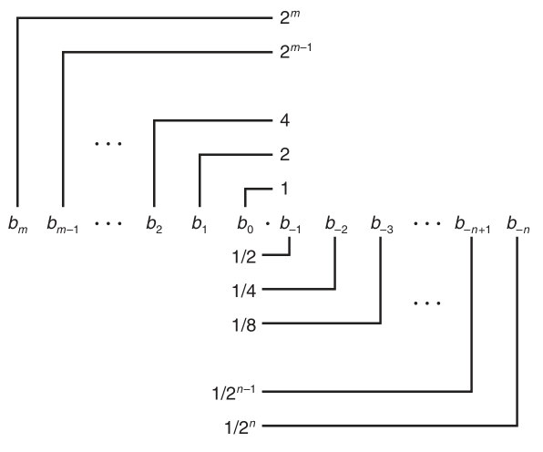
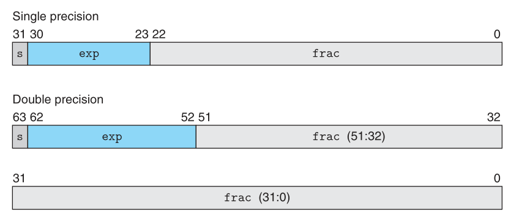
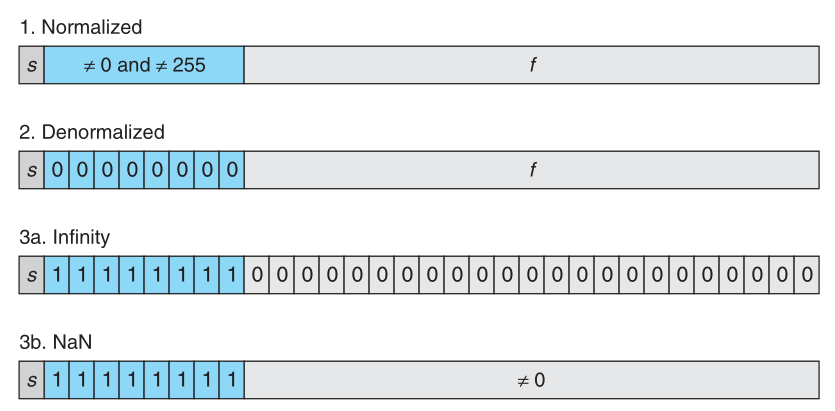
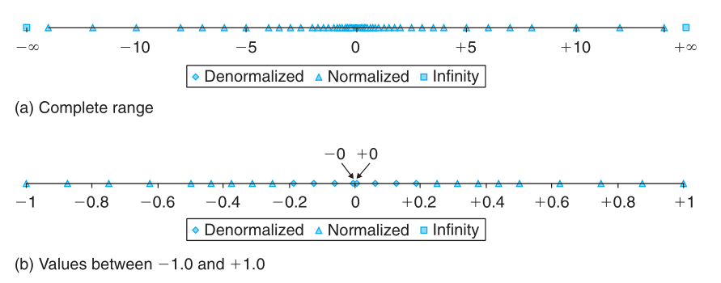
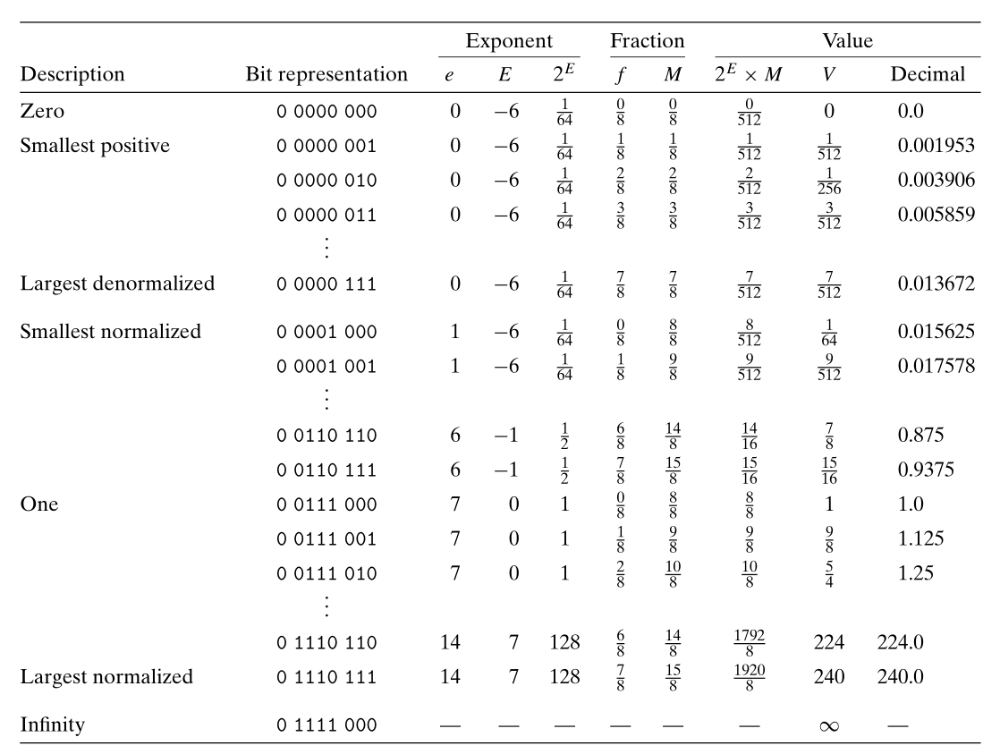
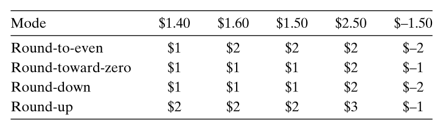
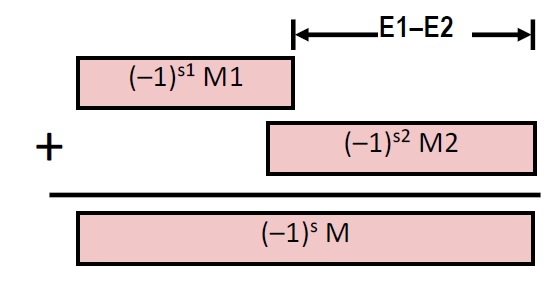

### Lecture 4 信息的表示和处理 —— 浮点数
#### 1. 二进制小数
对于一个二进制数字

$$
b_{m}b_{m-1} \ldots b_1b_0 \ldotp b_{-1}b_{-2} \ldots b_{-n}
$$

其值为

$$
\begin{equation}
    b = \sum_{i=-n}^m b_i \cdot 2^i
\end{equation}
$$

可以看出，二进制和十进制的唯一区别就是基数由 $10$ 变成了 $2$，二进制数的各位加权如下所示


需要注意的是，假设采用 $(1)$ 中的表达，小数点前有 $m+1$ 位，小数点后有 $n$ 位，显然在表示较小数字时前 $m+1$ 位中会有较大浪费，而且能表示的数字有上限（小于 $2^{m+1}$）. 假如将小数点右移一位，可以发现能表示的数字范围扩大了，但是精度变小了，将小数点左移则相反，因此我们可以使用浮点数来表示实数，即整数位数和小数位数之和不变，但小数点的位置可变

除此以外，我们仅能用有限位数表示形如 $ x / 2^k $ 的有理数，其中 $x, k$ 均为整数，其余的有理数均不能在有限位数内表示

#### 2. IEEE 浮点表示
IEEE 浮点标准用 

$$
\begin{equation}
V = (-1)^s \times M \times 2^E
\end{equation}
$$ 

的形式（类似于科学计数法）来表示一个数
1. 符号：$s$ 决定数字是负数($s=1$)还是正数($s=0$)
2. 尾数：$M$ 是一个二进制小数
3. 阶码：$E$ 是一个有符号数，其作用是对浮点数加权

如上所述，要表示一个浮点数需要有 3 个不同的字段来分别存储值，所以我们将一个浮点数区域分为 3 个部分来分别存储上述的 3 种不同的值，如下所示


1. 一个单独的符号位 `s` 存储符号位 $s$
2. `exp` 字段编码有符号数 $E$
2. `frac` 字段编码二进制小数 $M$

> P.S. 在单精度浮点格式（C 语言中为 `float`）中，`s`、`exp`、`frac`字段长度分别为 `1` 位、`8` 位、`23`位，而在双精度浮点格式（`double`）中，字段长度分别为 `1` 位、`11` 位、`52` 位，如上图所示

上述只是对 IEEE 浮点标准进行了大概的介绍，接下来介绍对于具体的某个字段是如何存储信息的. 首先，根据 `exp` 的值，被编码的值可以分成三种不同的情况，如下图所示


##### 情况 1. 规格化的值
首先需要指出，`exp` 字段内存储的是无符号整数 $e$. 记 `exp` 字段长 $k$ 位，则有

$$
e = \sum_{i=0}^{k-1} e_i \cdot 2^i
$$

而 `exp` 字段被解释为以**偏置**形式表示的有符号整数，即 $E = e - Bias$，其中 $Bias = 2^{k-1} - 1$

> P.S. 此方式和用补码表示有符号数的方式不同

其次 `frac` 字段内存储的是二进制小数 $f$，且 $0 \leqslant f < 1$. 记 `frac` 字段长 $n$ 位，其二进制表示为 $0.f_{n-1} \cdots f_1 f_0$，即

$$
f = \sum_{i=0}^{n-1} f_i \cdot 2^{i-n}
$$

在**情况 1**下，`frac`字段被解释为以 $1$ 开头的一个小数，即 $M = 1 + f$，这种方式可以获得一个额外精度位，此时 $M \in [1.0, \; 2.0)$

##### 情况 2. 非规格化的值
> 虽然使用**情况 1**中的编码方案已经能够表达绝大部分的数字了，但是其还不能够表达 $0$ 和接近于 $0$ 的数字

由 $(2)$ 可以看出，$(-1)^s \neq 0$，$2^E \neq 0$，因此，要想 $V = 0$ 成立，只能使 $E = 0$. 
在这种情况下，阶码值为 $E = 1 - Bias$（情况1中的最小值）而不是 $E = 0 - Bias$，而 `frac` 字段被解释为 $M = f$，此时 $M \in [0.0, \; 1.0)$

> 这样设置的好处是全 $0$ 表示数字 $0$，注意由于符号位的原因，$0$ 有两种表示方法，$+0$，$-0$

##### 情况 3. 特殊值
当阶码全为 $1$ 时，可以表示两类特殊的值. 当小数域全为 $0$ 时表示 $\infin$，根据 $s$ 的值来决定是 $+\infin$ 还是 $-\infin$. 
当小数域不全为 $0$ 时表示 `NaN`，即 `Not a Number`，当某些运算无意义时就会返回 `NaN`，如 $\sqrt{-1}$，$\infin - \infin$

#### 3. 数字示例
下图是浮点数所能准确表示的数在数轴上的分布，可以看到，那些可表示的数并不是均匀分布的，而是越靠近原点处它们越稠密

下图展示了假定的 $8$ 位浮点格式的示例，其中有 $k=4$ 的阶码位和 $n=3$ 的小数位，偏置量为 $Bias = 2^{k-1} - 1 = 7$


假如我们将上表中的位表达式解释为无符号整数，可以看出它们是按升序排列的，和它们表示的浮点数顺序相同. IEEE 格式如此设计就是为了浮点数能够使用整数排序函数来进行排序

#### 4. 舍入
由上图数轴分布所示，浮点数只能精确表示一个区域内的有限个实数，所以当运算的结果并未落在这些点上时，需要用结果附近的某一个点来近似代替该结果，这个过程即为**舍入**

下图是现在最为常用的四种舍入方式


其中 **向偶数舍入(Round-to-even)** 即为默认的方式，一般而言，采用这种方式算出的结果和实际结果误差最小. 其他三种方式用于产生实际值的确界. 记实际值为 $x$，则向零舍入把正数向下舍入，负数向上舍入，得到值 $\hat{x}$，则有 $\lvert \hat{x} \rvert \leqslant \lvert x \rvert$. 向下舍入把正数和负数均向下舍入，得到值 $x^-$，则有 $x^- \leqslant x$. 向上舍入把正数和负数均向上舍入，得到值 $x^+$，则有 $x^+ \geqslant x$

> P.S. 关于向偶数舍入的具体机制参见教材 P84

#### 5. 浮点运算
##### 浮点数乘法
记浮点数 $V_1 = (-1)^{s_1} \times M_1 \times 2^{E_1}$，$V_2 = (-1)^{s_2} \times M_2 \times 2^{E_2}$，则有

$$
\begin{align*}
V_1 \times V_2 & = (-1)^{s_1} \times M_1 \times 2^{E_1} \times (-1)^{s_2} \times M_2 \times 2^{E_2} \\
& = (-1)^{s_1 + s_2} \times (M_1 \cdot M_2) \times 2^{E_1 + E_2}
\end{align*}
$$

若记 $V = V_1 \times V_2$，则有 

$$
\begin{align}
s & = s_1 + s_2 \\
M & = M_1 \cdot M_2 \\
E & = E_1 + E_2 \\ 
\end{align}
$$

由于符号位只有一位，故 $(3)$ 可以替换为 $s = s_1 \otimes s_2$. 因此根据上述三个式子可以实现浮点数乘法，之后需要对结果进行修正
1. 如果 $M \geqslant 2$，需要将 $M$ 右移，并将 $E$ 加 $1$
2. 如果 $E$ 溢出，则 $V$ 溢出
3. 对 $M$ 进行舍入

##### 浮点数加法
若假设 $E_1 \geqslant E_2$，则有

$$
\begin{align*}
V_1 + V_2 & = (-1)^{s_1} \times M_1 \times 2^{E_1} + (-1)^{s_2} \times M_2 \times 2^{E_2} \\
& = (-1)^{s_1} \times 2^{E_1} \times(M_1 + (-1)^{s_2 - s_1} \times 2^{E_2 - E_1} \times M_2)
\end{align*}
$$

若记 $V = V_1 + V_2$，则有

$$
\begin{align}
s & = s_1 \\
E & = E_1 \\
M & = M_1 + (-1)^{s_2 - s_1} \times 2^{E_2 - E_1} \times M_2 \\
\end{align}
$$

如下图所示


在计算完之后同样需要修正
1. 如果 $M \geqslant 2$，需要将 $M$ 右移，并将 $E$ 加 $1$
2. 如果 $M < 1$，需要将 $M$ 左移 $k$ 位，并将 $E$ 减 $k$
3. 如果 $E$ 溢出，则 $V$ 溢出
4. 对 $M$ 进行舍入

需要注意的是，浮点数加法不具有结合性，如
```c
(3.14 + 1e10) - 1e10 = 0.0
3.14 + (1e10 - 1e10) = 3.14
```
浮点数乘法也不满足结合性
```c
(1e20 * 1e20) * 1e-20 = inf
1e20 * (1e20 * 1e-20) = 1e20
```
浮点数乘法对浮点数加法也不满足分配律
```c
1e20 * (1e20 - 1e20) = 0.0
1e20 * 1e20 - 1e20 * 1e20 = NaN
```

#### 6. C 语言中的浮点数
C 语言中有两种浮点数类型，分别为单精度的 `float` 和双精度的 `double`，接下来讨论 C 语言中浮点数和整型数之间的强制类型转换

和整型之间相互强制类型转换不同，整型和浮点数之间的强制类型转换会改变数字的位模式. 需要注意到，`float` 的尾数部分为 23 位，`double` 的尾数部分为 52 位，而 `int` 为 32 位，现在分下面四种情况讨论
1. `float`/`double` $\rarr$ `int`
首先对于小数部分直接截断，其次如果数字溢出或是值为 `NaN`，一般将值设为 $T_{min}$. 需要注意，由于 `float` 的尾数位数小于 `int`，所以 `float` 在强制类型转换时不一定会有精度丢失
2. `int` $\rarr$ `double`
这个是无精度丢失的转换，`int` 的位数小于 `double` 尾数的位数
3. `int` $\rarr$ `float`
可能会有精度的丢失的转换