### Lecture 5 程序的机器级表示——汇编基础
> 我们需要知道 CPU 所能够直接解释的语言只有机器（二进制）语言，而且机器语言和汇编语言其实是一个东西，它们是一一对应的关系，只不过汇编语言易读性更好. 因此，为了了解程序是如何在计算机上运行起来的，首先有必要了解汇编语言

> P.S. 如前所述，CPU 所能够直接解释的语言只有机器语言. 而对于不同的 CPU，其对应的机器语言指令集也不一定相同. 指令集大致分为 `CISC` 和 `RISC` 两种类型，其中 Intel 指令集就是典型的 `CISC` 指令集，对应的就是 Intel 芯片和 AMD 芯片，而 ARM 指令集是典型的 `RISC` 指令集，对应的就是 ARM 芯片

#### 1. C 语言和汇编语言
##### 计算机硬件提供给汇编语言的接口
计算机硬件提供给汇编语言的接口有两种
1. 指令. 汇编语言用相应的代码来表示某种操作，CPU负责解释相应的代码并执行操作
2. 地址. 硬件提供给汇编语言的地址有两种，分别为寄存器和主存

##### C源码的编译
下图是将 C 源程序 `p1.c` 和 `p2.c` 转换为可执行程序 `p` 的过程图
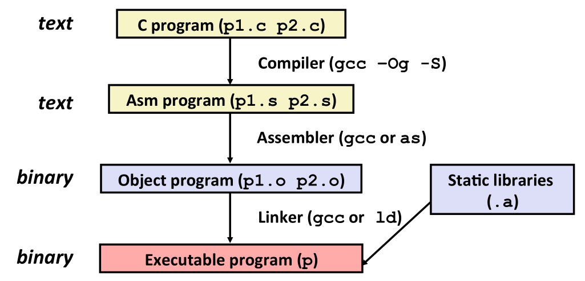

其中第一条指令为
```shell
gcc -Og -S <filename>       # 用于将 .c 文件转换为 .s 文件    
# -Og 表示适用于 debug 的编译  这个选项使得汇编代码可读性更高
```
在本章中，我们主要研究 `.s` 文件，下面是一个相应的例子，截取某个 C 源文件中的 `multstore` 函数如下所示
```C
long mult2(long, long);

void multstore(long x, long y, long *dest) {
    long t = mult2(x, y);
    *dest = t;
}
```
将该源文件编译为 `.s` 文件后，截取函数 `mulstore` 如下图所示
```C
multstore:
.LFB1:
        .cfi_startproc
        endbr64
        pushq   %rbx
        .cfi_def_cfa_offset 16
        .cfi_offset 3, -16
        movq    %rdx, %rbx
        call    mult2
        movq    %rax, (%rbx)
        popq    %rbx
        .cfi_def_cfa_offset 8
        ret
        .cfi_endproc
```
而将源文件编译为 `.o` 文件后反汇编得到汇编代码如下所示
```C
0000000000000009 <multstore>:
   9:   f3 0f 1e fa             endbr64
   d:   53                      push   %rbx
   e:   48 89 d3                mov    %rdx,%rbx
  11:   e8 00 00 00 00          callq  16 <multstore+0xd>
  16:   48 89 03                mov    %rax,(%rbx)
  19:   5b                      pop    %rbx
  1a:   c3                      retq
```
相比之下，可以发现 `.s` 文件中多了前面带 `.` 的行，这种行都是指导汇编器和链接器工作的伪指令，并不被实际编译为机器代码

> P.S. 汇编代码有两种主流格式，分别为 `ATT` 和 `Intel` 格式，在这门课中我们主要讨论 `ATT` 格式的汇编代码. `Intel` 格式的代码可以按照如下命令生成
> ```shell
> gcc -Og -S -masm=intel <filename>
> ```

#### 2. 汇编语言简介
##### 数据类型
在汇编语言中只有两种数据类型，分别为整型和浮点型. 其中整型按字节大小分为 `byte(b)`、`word(w)`、`double word/long word(l)`、`quad word(q)`. 浮点型分为单精度`(4 byte)`和双精度`(8 byte)`，分别对应 C 中的 `float` 和 `double`.

> P.S. 大多数 `ATT` 格式的汇编语言指令都会有一个字符的后缀，表明操作数的大小. 例如数据传送指令 `mov` 的四个变种：`movb`、`movw`、`movl`、`movq`

> P.P.S. 在汇编语言中没有如数组，结构 `struct` 等数据结构，这些数据结构都是由编译器手动构造出来内存中的连续字节

##### 寄存器和操作数指示符
一个`x86-64`的 CPU 包含一组 16 个存储 64 位值的`通用目的寄存器`，如下图所示
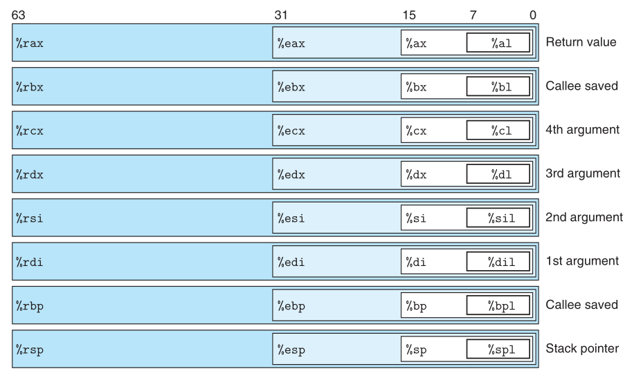
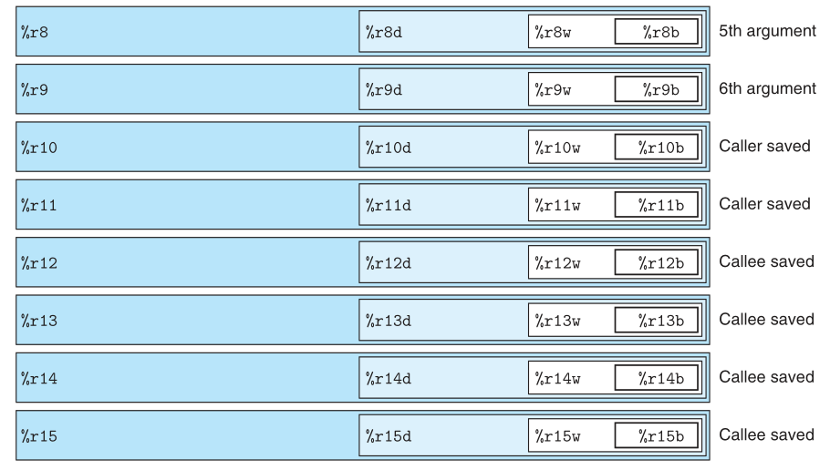

大多数指令都有一个或多个`操作数`，分别为 `立即数`、`寄存器数`、`内存引用`，各种操作数格式如下图所示，具体分析见教材
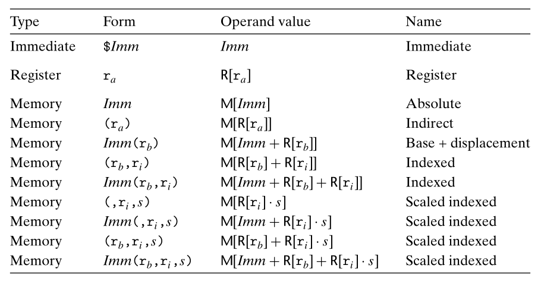

值的注意的是，对于最通用的形式 $Imm(r_b, r_i, s)$，这里 $s$ 只能取 $1$、$2$、$4$、$8$，这样设计是为了方便表示数组

#### 3. 算术和逻辑操作指令
对于 `ATT` 格式的双操作数指令，其格式为 
```C
operator S, D     /* 第一个操作数为源操作数 第二个操作数为目的操作数 */     
```

> P.S. `Intel` 格式的顺序和 `ATT` 的相反

##### 数据传送指令
数据传送指令即为 `mov` 指令，其功能即为将数据从源位置复制到目的位置，不做任何变化. 它还有两个变体 `movz` 和 `movs`，这两个指令分别对应于无符号数扩展和有符号数扩展

对于 `mov` 指令，其源操作数可以是立即数，并且不能进行从内存到内存的复制操作. 根据所移动的数据的大小在指令最后添加字符(`b`、`w`、`l`、`q`)

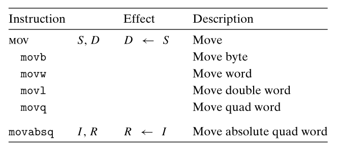

对于 `movz` 和 `movs` 指令，均为将较小的源值复制到较大的目的位置时使用. `movz` 指令把目的位置中的剩余字节填充为 0，而 `movs` 指令通过符号扩展来填充. 指令后会加两个字符，第一个指明源值的大小，第二个指定目的数的大小

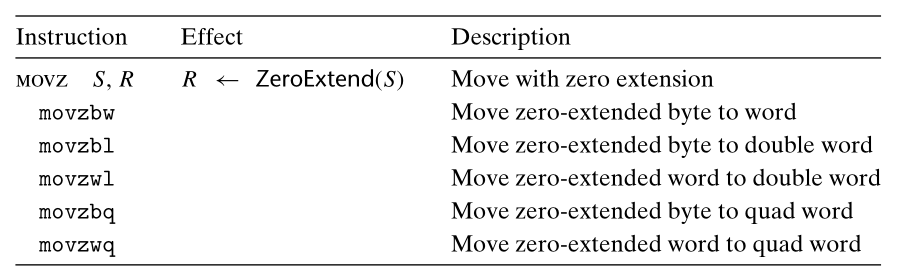
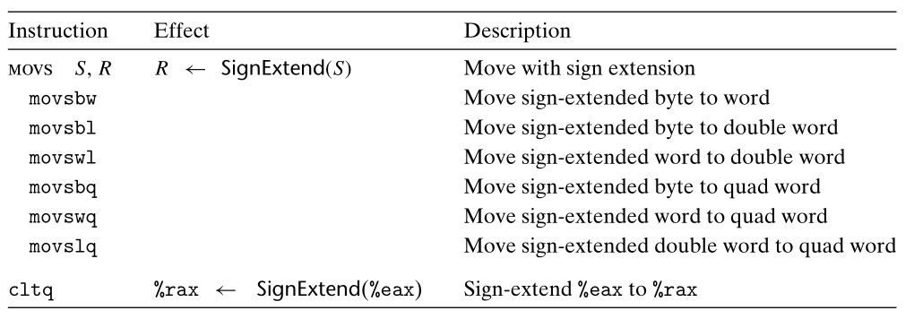

> P.S. `cltq` 指令没有操作数，它只作用于寄存器 `%eax` 和 `%rax`

对比上述两个表格，可以发现 `movz` 的表格缺少指令 `movzlq`，但是并没有这样的指令. 作为代替，它的功能由指令 `movl` 来实现. 

> P.S. 当 `movl` 指令以寄存器为目的时，它会把该寄存器的高 4 字节设置为 0

##### 入栈和出栈指令
这里的栈指的是函数栈. 值得注意的是，这个栈的生长顺序是倒着的，即从高地址向低地址增长，栈顶元素的地址是所有元素地址中最低的. 栈指针 `%rsp` 保存着栈顶元素的地址
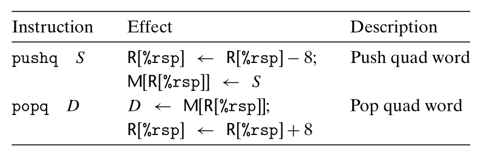

下图所示即为分别执行下面指令所得情形
```C
pushq %rax
popq %rdx  
```
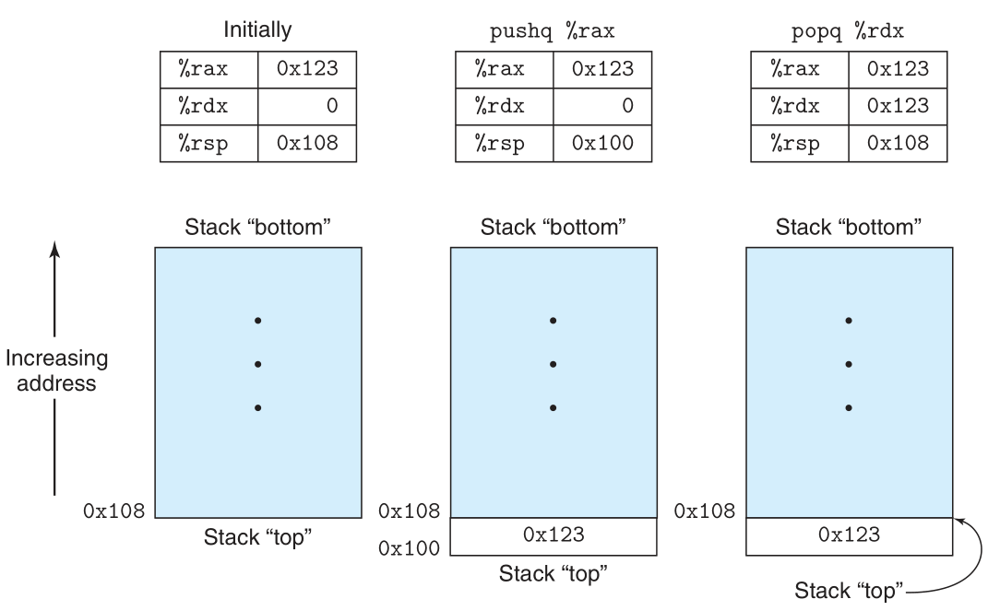

##### 算数和逻辑指令
下图列出了 `x86-64` 主要的整数和逻辑操作，给出的每个指令类都有对应于四种不同大小的数据的指令. 这些操作被分为四组：加载有效地址、一员操作、二元操作、移位

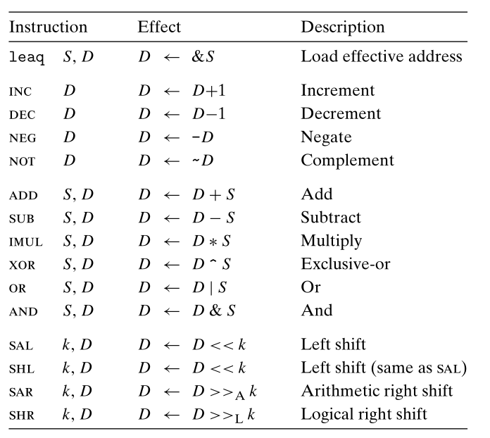

**加载有效地址**指令 `leaq` 本质上是 `movq` 指令的变形，其功能为将有效地址写入到目的操作数
```C
leaq 7(%rdx, %rdx, 4), %rax     /* %rax = 7 + 5 * %rdx */
```
需要注意的是，这个指令的目的操作数必须是一个寄存器

> P.S. 对于移位操作，移位量可以是一个立即数，或放在单字节寄存器 `%cl` 中

> P.P.S. 对于上图中的大部分指令，既可以用于无符号数计算，也可以用于补码运算，只有右移操作需要区分有符号数和无符号数

除了上述的常用的算数逻辑指令，还有一些特殊的算术操作. 正如之前所提及的，两个 64 位数相乘得到的乘积需要 128 位来表示. `x86-64` 对 128 位数的操作提供了一定的支持，如下表所示
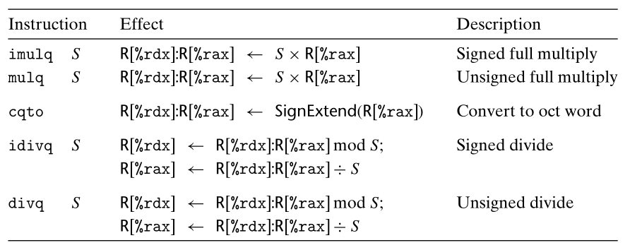

> P.S. Intel 将 16 字节的数称为 **八字 (oct word)**

上表中用 `%rdx` 和 `%rax` 联合起来表示一个 128 位的数，其中 `%rdx` 为高 64 位，`%rax` 为低 64 位，且 `S` 为一个 64 位的数