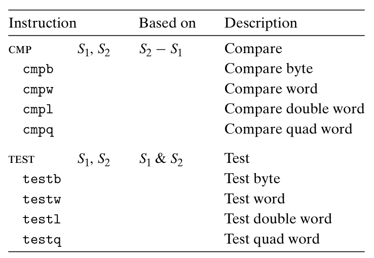
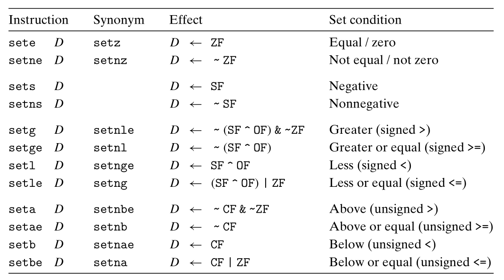
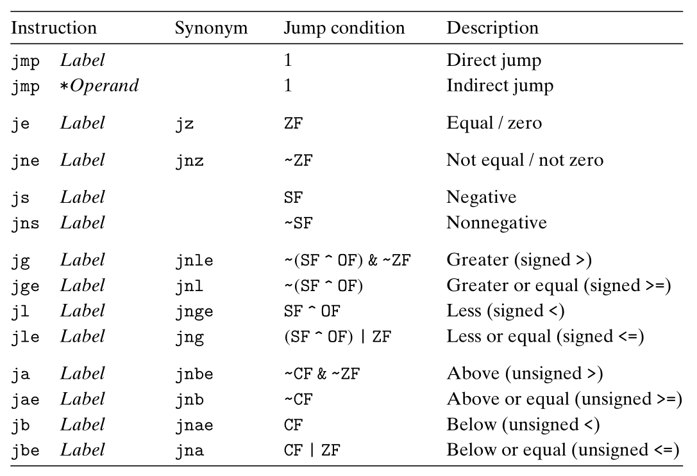
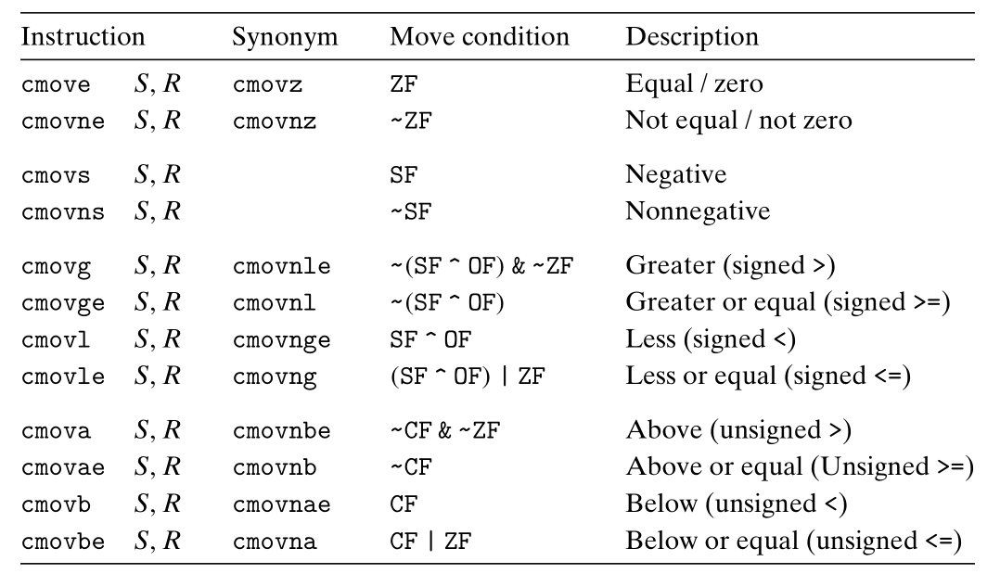

### Lecture 6 程序的机器级表示——控制流
> 之前我们只考虑了代码顺序执行的情况，但是为了减少程序的冗余、提高语言的表达能力，需要有一些语句来实现控制流。本节介绍的控制语句是根据条件码的情况来确定语句的执行顺序

#### 条件码
> `Intel` 的 `x86-64` 系列处理器中的寄存器主要为一般寄存器，即可用于存放程序运行时的临时数据，除此以外还有 3 个特殊的寄存器，分别为 `%rsp`，存放函数栈栈顶位置；`%rip`，存放 CPU 所要执行的下一条指令的地址；`psw`，即 `program status word`，程序状态字，也称为标志寄存器，用于存储程序当前的状态

> 标志寄存器中的一个有效位即为**条件码**，单个条件码标识程序的一个状态，此处只讲解条件码 `CF (carry flag)`、`ZF (zero flag)`、`SF (sign flag)`、`OF (overflow flag)`，其余条件码参见《汇编语言》

最常用的条件码的设置条件如下所示
CF: 记录进行无符号数计算时最高有效位向更高位的进位值，若溢出，则记 CF 为 1，可用来检查无符号操作的溢出
ZF: 记录进行相关操作后结果是否为 0，若为 0，则置 ZF 为 1
SF: 记录进行相关操作后结果是否为负，若为负，则置 SF 为 1，即记录结果的最高位
OF: 记录进行补码计算时是否溢出，若溢出，则置 OF 为 1

> P.S. `lea` 指令不改变任何条件码

除了上一节介绍的指令，还有两类指令专门用于设置条件码而不改变任何其他寄存器，分别为 `cmp` 和 `test`


`cmp` 指令计算结果 $S_2 - S_1$，并根据结果对条件码进行设置，不存储计算结果；`test` 指令计算结果 $S_1 \And S_2$，并根据结果对条件码进行设置

除此以外，还有一类指令用于专门访问条件，即为 `set`，该指令将一位或多位条件码的逻辑运算结果写入寄存器或内存中（1 byte）


> P.S. 如何根据已设置的条件码来推断需要比较的数字的大小关系，参见《汇编语言》

`set` 指令的一个使用例子如下
```C
int gt(long x, long y) {
    return x > y;
}
```
```C
gt:
    cmpq    %rsi, %rdi      // compare x:y
    setg    %al             // set when >
    movzbl  %al, %eax       // zero rest of %rax
    ret
```

#### 控制语句
> 在 C 语言等高级语言中的 `if-else`、`while`语句等，在汇编语言中都使用一类语句来实现，即 `jmp` 语句

在正常情况下，即指令顺序执行时，在根据 `%rip` 中的地址取出当前需要执行的指令后，`%rip` 中的值会加上当前指令的字节长度，自动跳转到下一条指令的开始地址。但是 `jmp` 语句会根据标志寄存器中的值来决定是否变更 `%rip` 的值


在上表中，除了 `jmp` 指令是无条件跳转以外，其他跳转指令都是有条件的 —— 只有当条件码满足时才会跳转。上表的 $Label$ 即为要跳转到的目的地址

> P.S. 值得注意的是上面的指令 `jmp *Operand`，这个指令为间接跳转，即跳转目的地址是从寄存器或内存位置中读出的，详见之后的 `switch-case` 语句

`jmp` 指令的示例如下所示
```C
long absdiff(long x, long y) {
    return x > y ? x - y : y - x;
}
```
```C
absdiff:
    movq    %rdi, %rax
    cmpq    %rsi, %rdi
    jle     .L2
    subq    %rsi, %rax
    ret
.L2:
    subq    %rdi, %rsi
    movq    %rsi, %rax
    ret
```

在汇编语言中，如果给出一个名字并紧跟一个冒号，则冒号前面的即为 `Label`。`Label` 的具体的地址的计算会在编译过程完成

需要注意的是，在具体的机器代码中，`jmp` 指令后跟的并不是绝对地址，而是相对地址。具体见示例，将上面例子编译后反汇编得到
```C
0000000000000000 <absdiff>:
   0:   f3 0f 1e fa             endbr64 
   4:   48 89 f8                mov    %rdi,%rax
   7:   48 39 f7                cmp    %rsi,%rdi
   a:   7e 04                   jle    10 <absdiff+0x10>
   c:   48 29 f0                sub    %rsi,%rax
   f:   c3                      retq   
  10:   48 29 fe                sub    %rdi,%rsi
  13:   48 89 f0                mov    %rsi,%rax
  16:   c3                      retq   
```

可以看到，`.s` 文件中的跳转语句
```C
    jle     .L2
```
被替换为
```C
   a:   7e 04                   jle    10 <absdiff+0x10>
```
而 `7e` 表示指令 `jle`，显然仅用 `04` 是不能表示目的绝对地址的（需要 64 位）。这里的 `04` 表示的是 `%rip` 所应加上的值，因此称为相对地址，详见《汇编语言》

大致讲解完了 `jmp` 语句，之后讲解如何使用 `jmp` 指令来实现高级语言中的控制流。

需要注意的是，这里并不直接给出对应程序的汇编代码，因为汇编代码是非常 `boring` 的，所以我们使用特殊的 C 语言结构来解释汇编语言中是如何实现 C 语言中的控制流。具体来说就是不使用 C 语言中的通常控制语句，转而使用 `goto` 语句来表示无条件跳转语句，带 `if` 的 `goto` 语句来表示有条件跳转

##### if-else 语句实现
C 语言中的 `if-else` 语句的通用形式模板如下所示
```C
if (test-expr)
    then-statement
else
    else-statement
```
对于这种形式，汇编实现通常会使用下面的形式
```C
    t = test-expr;
    if (!t) goto false;
    then-statement
    goto done;
false:
    else-statement
done:
```

值得一提的是，汇编中不只有这种实现方式，还有一种更为受限但更为高效的实现方式 —— 条件传送语句

首先需要知道跳转语句会导致程序的低效，由于当代 CPU 采用了流水线技术和预读取技术，常常会预读取几十条语句。当 CPU 在遇到跳转语句时，会进行进行分支预测，并根据预测的分支进行预读取语句，但是分支预测并不是总能对的，当分支预测判断错误时，就必须重新进行预读取，这个步骤会浪费大约 40 ~ 50 个时钟周期

一种替代的策略是使用数据的条件转移，这种方法计算一个条件操作的两种结果，然后再根据条件是否满足来从中选取一个作为结果。这样可以不使用跳转语句来实现 if-else 语句，显然会提高其效率。

条件传送语句 `cmov` 其功能为根据条件码的值来决定是否将源地址的值复制到目的地址，如下所示


使用条件传送语句的一个实例如下所示
```C
long absdiff(long x, long y) {
    long result;
    if (x > y) {
        result = x - y;
    } else {
        result = y - x;
    }
    return result;
}
```
汇编实现如下所示
```C
/* long absdiff(long x, long y)
   x in %rdi, y in %rsi */
absdiff:
	movq	%rdi, %rdx
	subq	%rsi, %rdx      // rval = x - y
	movq	%rsi, %rax
	subq	%rdi, %rax      // eval = y - x
	cmpq	%rsi, %rdi      // Compare x:y
	cmovg	%rdx, %rax      // if x > y, eval = rval
	ret                     // return eval
```

对于 C 语言中的通用条件表达式
```C
v = test-expr ? then-expr : else-expr;
```
使用条件传送指令的汇编实现通常为
```C
v = then-expr;
ve = else-expr;
t = test-expr;
if (!t) v = ve;
```

接下来讨论条件传送指令的局限性，并不是所有的条件表达式都可以用条件传送来编译，查看下面的例子
```C
/* case 1. Expensive computations */
val = Test(x) ? Handle1(x) : Handle2(x);

/* case 2. Risky computations */
val = p ? *p : 0;

/* case 3. Computations with side effects */
val = x > 0 ? x *= 7 : x += 3;
```
可以看出，出现上述 3 种情况的条件表达式不能使用条件传送指令。经验表明，只有当两个表达式都很容易计算时，才会使用条件传送指令

##### 循环实现
a. do-while 实现
do-while 语句的通用形式如下
```C
do
    body-statement
    while (test-expr);
```
其汇编实现通常如下所示
```C
loop:
    body-statement
    t = test-expr;
    if (t)  goto loop;
```

示例如下所示
```C
/* 求 n 的阶乘 */
long fact_do(long n) {
    long result = 1;
    do {
        result *= n;
        n -= 1;
    } while (n > 1);
    return result;
}
```
GCC 翻译的汇编代码如下所示
```C
/* n in %rdi, result in %rax */
fact_do:
    movl    $1, %eax
.L2:
    imulq   %rdi, %rax
    subq    $1, %rdi
    cmpq    $1, %rdi
    jg  .L2
    ret
```

b. while 实现
while 语句的通用形式如下
```C
while (test-expr)
    body-statement
```
其汇编实现通常有两种形式，其中使用 `-Og` 标签的实现方式如下所示
```C
    goto test;
loop:
    body-statement
test:
    t = test-expr;
    if (t)  goto loop;
```
可以看到，上述实现方式即为在 do-while 前增加了一个 `goto` 语句

第二种实现方式是当使用 `-O1` 标签时，GCC 所采用的实现方式，如下所示
```C
    t = test-expr;
    if (!t) goto done;
loop:
    body-statement
    t = test-expr
    if (t)  goto loop;
done:
```
> P.S. for 语句和 while 语句的实现方式类似，此处略过

##### switch-case 实现
从语法角度上来讲，switch-case 语句可以被 if-else 语句替代，但是从效率角度来讲，switch-case 语句在某些情形下更加高效。具体参考下面的示例
```C
void switch_eg(long x, long n, long *dest) {
    long val = x;

    switch (n) {
    case 100:
        val *= 13;
        break;
    case 102:
        val += 10;
        /* Fall through */
    case 103:
        val += 11;
        break;
    case 104:
    case 106:
        val *= val;
        break;
    default:
        val = 0;
    }
    *dest = val;
}
```
其汇编实现为
```C
/* .text section */
switch_eg:
    subq    $100, %rsi
    cmpq    $6, %rsi
    ja      .L8
    jmp     *.L4(,%rsi,8)
.L3:
    leaq    (%rdi,%rdi,2), %rax
    leaq    (%rdi,%rax,4), %rdi
    jmp     .L2
.L5:
    addq    $10, %rdi
.L6:
    addq    $11, %rdi
.L2:
    movq    %rdi, (%rdx)
    ret
.L7:
    imulq   %rdi, %rdi
    jmp	    .L2
.L8:
    movl    $0, %edi
    jmp     .L2
```
```C
/* .rodata section */
    .section    .rodata
    .align 8
.L4:
    .quad   .L3
    .quad   .L8
    .quad   .L5
    .quad   .L6
    .quad   .L7
    .quad   .L8
    .quad   .L7
```
由示例可以看到，switch-case 语句是通过使用一个跳转表结构来实现的，在 case 比较多的情况下，其时间复杂度为 $\Theta(1)$，但是 if-else 为 $\Theta(n)$

> P.S. 只有在 case 数量较多且比较密集时才会使用跳转表实现，否则 switch-case 语句使用 if-else 的形式实现