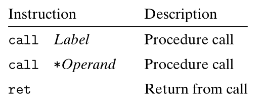
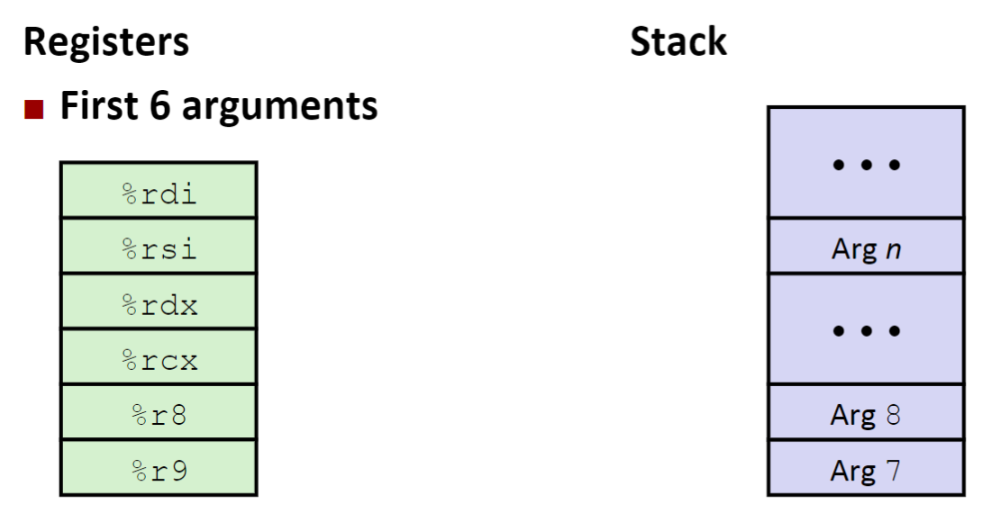
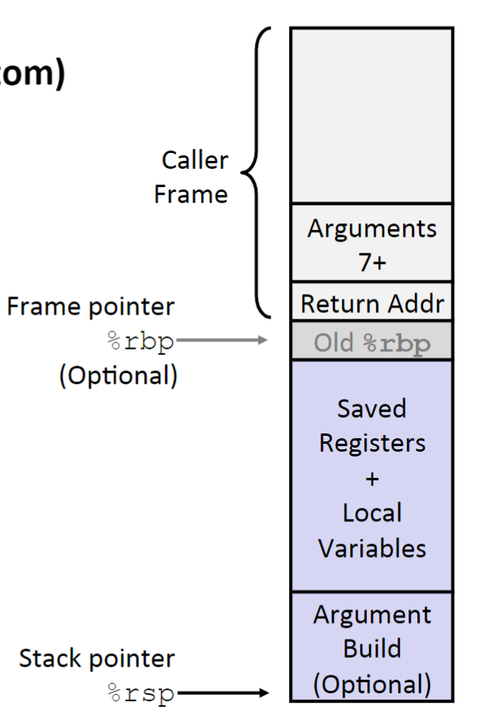
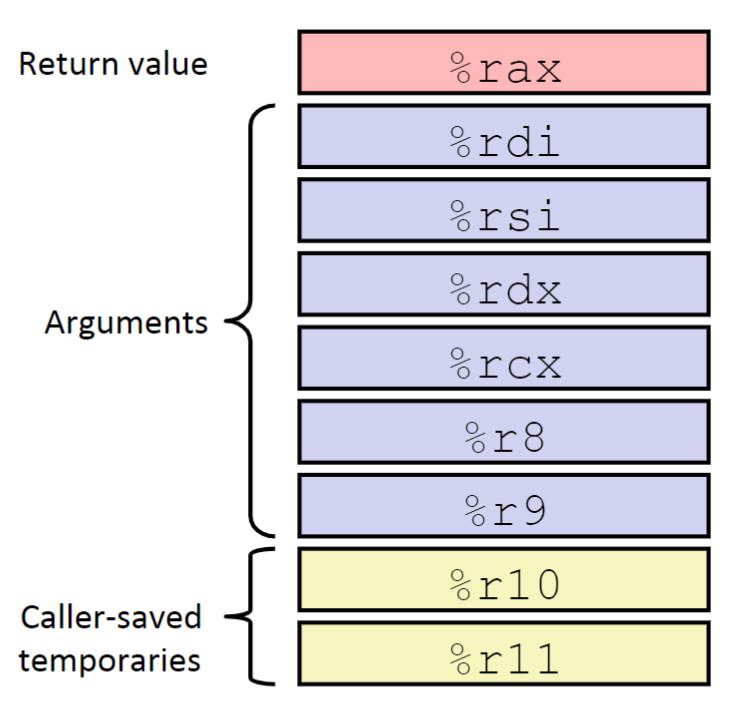
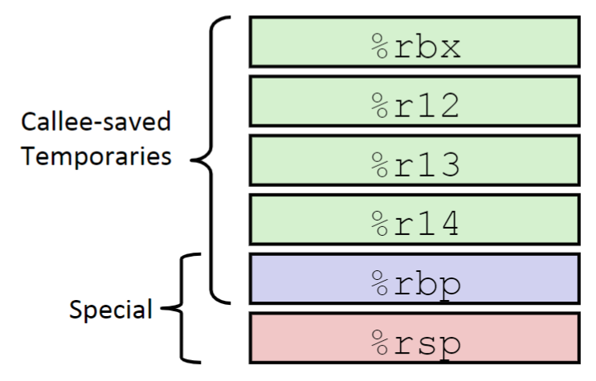

### Lecture 7 程序的机器级表示——过程
> 过程是一种威力强大的抽象技术，通过它可以为复合操作提供名字，并将其封装起来作为一个操作单元使用（SICP）

为了讨论方便，假设过程 P 调用过程 Q，Q 执行后返回 P，这些动作包含下面一个或多个机制：
1. **传递控制**：在 P 调用 Q 时，需要将 `%rip` 指向 Q 代码的起始位置，在 Q 返回时，又需要将 `%rip` 指向 P 中调用 Q 指令的后一条指令
2. **传递数据**：P 要向 Q 提供一个或多个参数，Q 要向 P 返回一个值
3. **分配和释放内存**：在 Q 执行时，可能需要为局部变量分配空间，而在返回前，又需要释放这些空间

对于 C 语言中的函数而言，上述的三个机制都需要实现

> P.S. 函数在执行过程中需要有空间来存储临时变量，这称为**函数的栈帧**。而每个函数的栈帧并不是随便存放于内存内的，而是根据函数调用的特性——后调用先释放，来将所有的栈帧放于一个栈当中，这个特殊的栈称为**函数栈**。而函数栈之前有讨论过，其栈顶指针存放于 `%rsp` 中，且由高地址向低地址生长

#### 传递控制
如之前所讨论的，传递控制需要更改 `%rip` 的值，且存储过程 Q 返回时需要执行的指令地址（一个函数在返回时不可能知道其父函数调用它的指令的地址）。为此，汇编语言专门提供了两条指令，`call` 和 `ret`，如下所示

其中，`call` 指令同时实现两个功能
1. 将函数的返回地址推入（push）当前栈帧
2. 设置 `%rip` 的值为对应 `Label` 的值

`ret` 指令也同时实现两个功能
1. 将函数的返回地址从函数栈中取出
2. 设置 `%rip` 为函数的返回地址

> P.S. `ret` 指令执行时，默认将当前 `%rsp` 指向的地址认为函数返回地址。也就是说，在函数返回前，函数栈需要回到刚进入此函数时的状态

#### 传递数据
> P.S. 和传递控制不同，传递数据和局部变量控制都是编译器手动生成的，汇编语言并没有针对于此提供什么特殊的机制

一般而言，在过程间传递数据需要遵循下面的约定
1. 若一个过程有返回值，则其返回值存放于 `%rax`
2. 若一个子过程需要参数，则前六个参数放于寄存器，之后的存放于函数栈中，具体如下所示

> P.S. 上述的寄存器只能用来传递整数或指针类型，浮点类型的参数是由另外一组单独的寄存器来传递的

> P.P.S 存放于函数栈的参数在函数的返回地址前先入栈，具体可参考教材示例，后面也会提及

#### 局部变量控制
在大多数时候，函数中的局部变量都是存储在寄存器中的。但是有些时候，局部变量必须存储在内存中，比如
1. 寄存器不足够存放所有的本地数据
2. 当要求一个变量的地址时。此时必须将其放入内存中，能够为它产生一个地址
3. 局部变量是数组或结构时

> P.S. 局部变量所存储的空间是编译器在计算函数中的所有变量后，手动设置 `%rsp` 分配的

#### 函数栈帧
如之前所讨论的，函数的返回地址、参数、局部变量都是存储在函数栈帧中的，具体结构如下所示

如图所示，由上到下，栈帧依次包括被保存的寄存器、局部变量、要调用的函数参数、要调用的函数的返回地址。并且寄存器 `%rbp` 存储栈帧底部，`%rsp` 存储栈帧顶部，不过 `%rbp` 一般不使用，通常只使用 `%rsp`，而将 `%rbp` 作为一般通用寄存器使用

> P.S. 只使用 `%rsp` 是因为只使用 `%rsp` 就足够控制整个栈帧，这是因为在大多数情况下函数栈帧是定长的（由编译器算出）。但是在一些特殊情况下，如栈帧内有一个变长数组，编译器无法提前得知将分配多少空间，此时就需要 `%rbp` 来指定栈帧底部，在函数返回前依靠 `%rbp` 将分配的空间释放

> P.P.S. 由于一些约定要求内存保持对其，所以程序经常在栈上分配比实际需求还要多的空间

#### 寄存器中的局部变量
除了上述提到的，调用过程还需要考虑寄存器分配问题。在一个过程调用另一个过程时，内存空间是新分配的，但是寄存器却是公用的，因此需要一些约定来保证被调用的过程不会覆盖原过程稍后会使用的寄存器

首先需要将寄存器分为两类，分别为调用者保存、被调用者保存

调用者保存寄存器，即此寄存器内的值需要调用者来保存，而被调用者在使用这些寄存器时会假定寄存器未被使用。因此这些寄存器在调用前后其值可能会变化，对于调用者而言，在调用函数前需要将这些寄存器内的值存储起来。调用者保存寄存器如下所示

被调用者保存寄存器，即当被调用者使用这些寄存器时，需要将其中的值先保存起来，之后再恢复。因此这些寄存器在调用前后其值不会变化。被调用者保存寄存器如下所示

> P.S. 大部分系统都对递归的最大深度进行了限制
