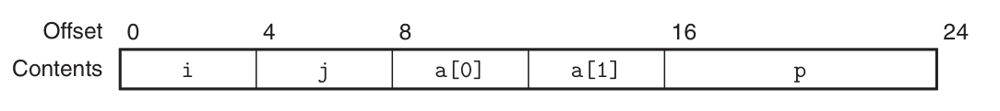
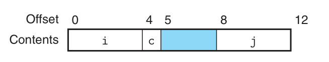
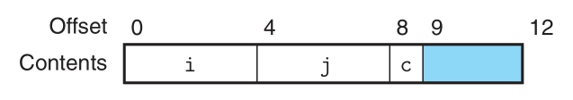
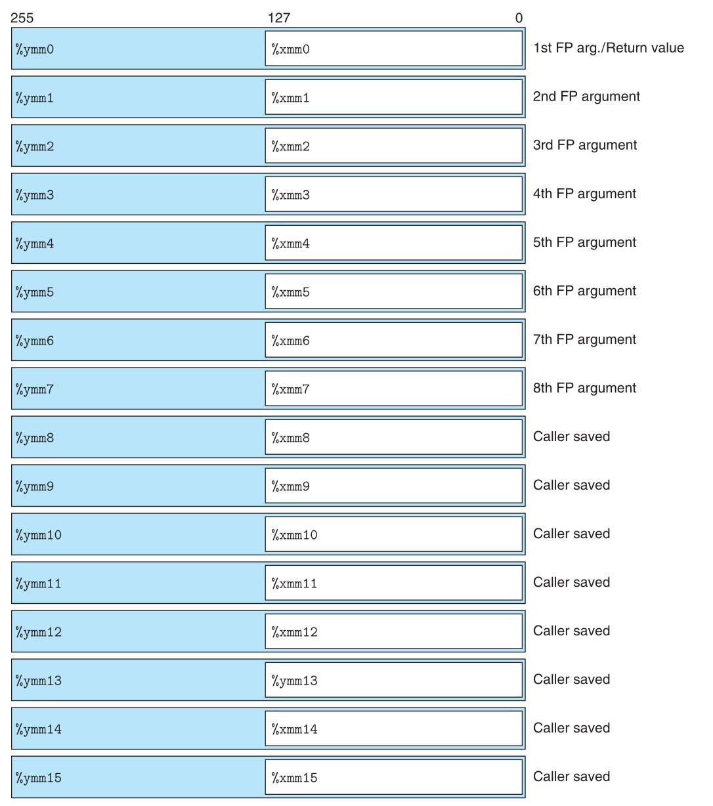
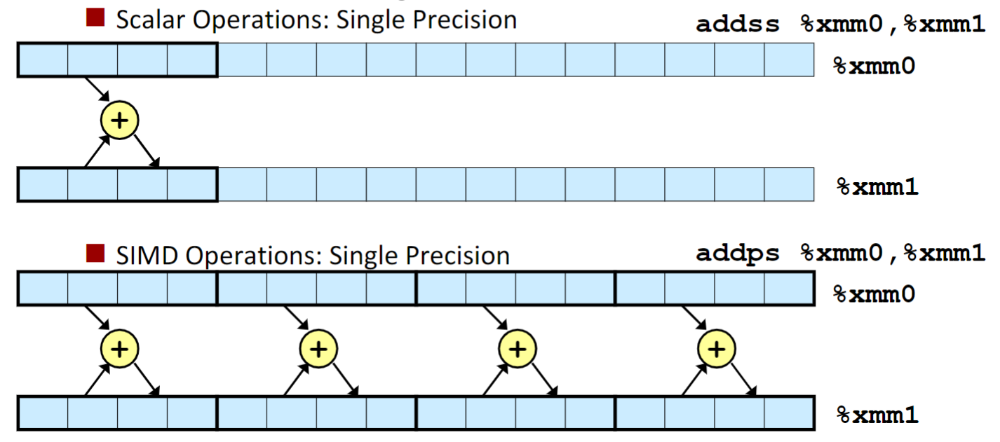

### Lecture 8 程序的机器级表示——数据
数据抽象，即将多种元数据类型复合起来，封装为一个新的数据类型。在 C 语言中，有两种数据抽象的方式，分别为数组和结构。

和函数抽象不同的是，汇编语言并没有针对数据抽象提供合适的操作，因此，C 语言中的所有数组和结构都是编译器手动进行分配和管理的

#### 数组的分配和访问
对于 C 语言中的数组，在汇编语言层面只是一块连续的内存空间

##### 一维数组
对于数组声明 `T A[C]`，编译器对其分配的内存空间大小为 `sizeof(T) * C`，且数组名 `A` 指向数组空间的开始位置，数组元素 `A[i]` 存放于位置 `A + sizeof(T) * i`

##### 指针运算
对于指针 `T * P`，C 语言允许对其进行运算，比如加法，`P + i` （其中 `i` 为整数）的值为 `P + sizeof(T) * i`

> P.S. 有关指针运算的细节可参考《C 程序设计语言》，指针除了可以进行和整数之间的加法，还可以进行指针之间的减法，指针不能进行乘法和除法

> P.P.S 数组名其实就相当于一个指针，区别在于数组名的值不能改变

##### 多维数组
多维数组其实也就是嵌套数组，如下所示
```C
typedef int row3_t[3];
row3_t A[5];        /* same as int A[5][3] */
```
可以看到，`A` 是一个二维数组，但是也可以认为 `A` 是一个有 5 个元素的数组，每个元素都是有 3 个元素的数组

对多维数组进行寻址，可以参考下面对二维数组 `A` 的寻址
```C
/* read A[x][y]
   x in %rdi, y in %rsi*/
leaq    (%rdi,%rdi,4), %rax     # 5 * x
addl    %rax, %rsi              # 5 * x + y
movl    A(,%rsi,4), %eax        # M[A + 4 * (5 * x + y)]
```
可以看出，是先将当前元素之前的元素个数计算出来，再计算要求的元素的地址

关于 `int (*x)[]` 的用法，见如下示例
```C
int (*pointer)[3];
int array[3];
pointer = &array;       /* 对数组名求地址 */
```
因此，对于上例，`**pointer` 等于 `array[0]`。但是值得注意的是，`pointer` 等于 `array`，如下所示
```C
int array[3];
int (*pointer)[3];
pointer = &array;
printf("pointer: %p, *pointer: %p, array: %p\n", pointer, *pointer, array);
printf("")
```
其输出为
```C
pointer: 0x7ffed379443c, *pointer: 0x7ffed379443c, array: 0x7ffed379443c
pointer+1: 0x7ffed3794448, *pointer+1: 0x7ffed3794440
```
可以看到，虽然其值一样，但是指针类型不同

> P.S. 当函数使用多维数组做参数时，可以设形参为 `T (*x)[C]`

##### 变长数组
历史上，C 语言只支持大小在编译时就能确定大小的多维数组。但是 ISO C99 引入了变长数组，允许数组的维度是表达式，如
```C
int A[expr1][expr2]
```
它可以作为一个局部变量，也可以作为一个函数的参数
```C
/* 局部变量 */
int n = 10;
int A[2*n+1];

/* 函数参数 */
int var_ele(int n, int a[n][n], int i, int j) {
    return a[i][j];
}
```
做函数参数时，参数 `n` 必须在参数 `a[n][n]` 之前

由于变长数组的数组长在编译时不能确定，所以多维变长数组在寻址时和定长数组会有区别，将上面函数参数的例子汇编后得到
```C
/* n in %rdi, a in %rsi, i in %rdx, j in %rcx */
imulq   %rdx, %rdi              /* n * i */
leaq    (%rsi,%rdi,4), %rax     /* a + 4*n*i */
movl    (%rax,%rcx,4), %eax     /* a + 4*n*i + 4*j */
ret
```
可以看到，在这种情况下，求偏移量会使用乘法指令，而乘法指令的用时会大得多


#### 结构的分配和访问
C 语言的 struct 声明创建一个结构，结构和数组相同，是一块连续的内存空间。编译器维护结构体内每个类型的信息，指示每个字段的字节偏移

首先来看一个示例，对于结构体
```C
struct rec {
    int i;
    int j;
    int a[2];
    int *p;
}
```
其在内存中的结构如下图所示


可以看到，内存中每个字段中的顺序是按照结构体声明的顺序来决定的。结构体访问每个字段是通过结构体的基址加上每个字段的偏移量来得到的

> P.S. `union` 和 `struct` 基本相同，区别在于 `union` 内的所有类型共占一片内存区域，因此 `union` 的大小为其最大字段的大小

##### 数据对齐
大部分的计算机系统都对基本数据的合法地址做了限制，要求数据的地址必须是某个值 $K$（通常是 2、4、8）的倍数，这称为数据的对齐原则。

> **对齐原则**是任何 $K$ 字节的基本对象的地址必须是 $K$ 的倍数

使用对齐原则是基于硬件上的一些原因，一般的说法是，对于 64 位的计算机，每次能够从主存内读取 8 `byte`，由于硬件设计的原因，计算机读取数据时开始地址必须为 8 的倍数。因此，假如一个基本对象的地址略微小于 8 的倍数（即数据分别在两个连续的 64 位的地址块中），这时计算机必须执行两次读数据操作才能将完整数据读出。为了防止这种情形，就要求基本对象必须对齐

C 中基本对象的对其原则如下所示

| K | type |
| ----- | ----- |
| 1 | char |
| 2 | short |
| 4 | int, float |
| 8 | long, double, void * |

对于数组，只要第一个元素满足对其原则，之后的元素只要紧跟第一个元素，就自然能保证每个元素都满足对其原则

对于结构体，由于每个字段的大小不同，编译器可能需要在字段之间加入空隙，来保证每个字段都满足对其原则。实例如下，对于结构体
```C
struct S1 {
    int  i;
    char c;
    int  j;
}
```
编译器实现此结构体如下所示，其中间隙用蓝色表示


除了在字段之间加入空隙，编译器也可能在结构体的末尾加入空隙，以保证结构数组中每个元素都能满足对齐要求。实例如下，对于结构体
```C
struct S2 {
    int  i;
    int  j;
    char c;
}
```
编译器实现此结构体如下所示，其中间隙用蓝色表示



#### 浮点数
由于浮点数和整数使用不同的寄存器进行访问和使用，所以有关浮点数数据的操作，需要考虑
1. 哪些寄存器用来存储和访问浮点数值
2. 对浮点数进行操作的指令
3. 向函数传递浮点数参数和从函数返回浮点数的规则
4. 对于浮点数寄存器，在函数调用过程中是调用者保存还是被调用者保存

首先是浮点数寄存器，在 `AVX` 浮点体系结构中，一共有 16 个 `YMM` 寄存器，如下图所示


> P.S. 所有的寄存器均为调用者保存

上图解决了需要考虑的问题(1)(3)(4)。而对于浮点数的操作指令，大部分指令和整数操作指令相似，只是指令不同，只需要注意一下矢量运算，如下图所示


上图所示为标量指令和矢量指令的对比，矢量指令可以让多个数据同时进行运算