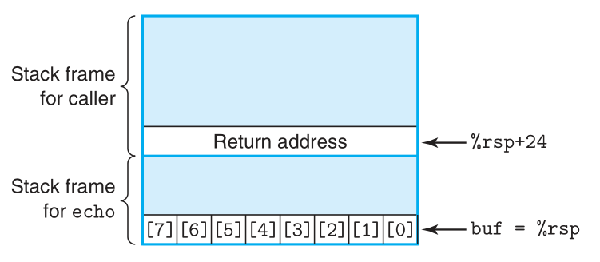

### Lecture 9 程序的机器级表示——进阶主题

#### 程序在内存中的分配
在 64 位 Linux 系统中，进程在内存中的分配如下图所示


> P.S. 目前的 64 位机器会限制只使用 47 位的地址，即最大地址即为 `0x7fffffffffff`（上图的地址是错的，截图没截全）

如上图所示，主要分为 5 个区域，分别为栈、堆、data 段、text 段、动态链接库

##### 栈
进程中的函数栈从最高位地址开始，往低位地址增长。另外，程序的函数栈有大小限制 `8 Mb`，当使用栈指针去访问一个超过 `8 Mb` 范围的地址会产生一个**段错误**。在 Linux 系统上，程序的函数栈限制可以通过下面的指令查询
```shell
ulimit -a
```

##### text section
text 段是从地址 `0x400000` 开始，往高位地址增长，其中存储的数据是从可执行文件中获取的，专门用来存储代码

##### data section
data 段是从 text 段上方开始，往高地址增长，其中存储的数据是从可执行文件中获取的，用来存储全局变量、static 变量和字符串常量

##### 堆
进程中的堆从 data 段上方开始，往高地址增长。堆一般是用来进行动态分配空间的，在 C 语言中，堆是用来存储使用 `malloc` 等函数分配的空间

##### 动态链接库区域
动态链接库区域也是用来存放代码的，不过它存储的是类似 `printf`、`malloc` 这样的库函数，库函数代码被存放在磁盘上，在程序执行之初会把他们加载到内存中对应的区域，称为**动态链接**

#### 缓冲区溢出
由于 C 语言中不对数组引用进行边界检查，且局部变量和状态信息（如保存的寄存器值和返回地址）都存放在栈中，这导致对越界的数组的写操作会破坏存储在栈中的状态信息。实例如下所示
```C
/* Implementation of library function gets() */
char *gets(char *s) {
    int c;
    char *dest = s;
    while ((c = getchar()) != '\n' && c != EOF)
        *dest++ = c;
    if (c == EOF && dest == s)
        /* No characters read */
        return NULL;
    *dest++ = '\0';     /* Terminate string */
    return s;
}

/* Read input line and write it back */
void echo() {
    char buf[8];    /* Way too small! */
    gets(buf);
    puts(buf);
}
```
可以看到，缓冲区的大小只有 8 字节长，当输入的字符超过 7 个时就会导致写越界，GCC 为 `echo` 生成的汇编代码如下所示
```C
echo:
	subq	$24, %rsp       /* Allocate 24 bytes on stack */
	movq	%rsp, %rdi
	call	gets
	movq	%rsp, %rdi
	call	puts@PLT
	addq	$24, %rsp
	ret
```
可以看到，虽然我们只申请了一个 8 字节的数组，但是 GCC 却在栈中分配了 24 字节的空隙，函数栈的结构如下所示


因此，当输入的字符超过 23 个时，就会覆写 `echo` 函数的返回地址，使得程序返回到一个错误的地址

##### 代码注入攻击
代码注入攻击则为攻击者利用程序的缓冲区溢出漏洞，来让程序执行攻击者期望的函数，具体如下所示


可以看到，攻击者在缓冲区中依次写入攻击代码、填充字段、跳转地址。攻击代码即为攻击者期望程序执行的代码，跳转地址即为攻击代码的起始地址，因此，当对应函数返回时，程序就会跳转到攻击代码的开始，从而执行攻击代码

> P.S. 蠕虫是指能够自动运行的程序，并且能够将自己复制到其他计算机上；病毒是指一段被添加到其他程序中的代码，其自己本身并不能独立运行

##### 对抗缓冲区溢出攻击
对于程序中的缓冲区漏洞，有以下几个解决方法
###### 书写没有缓冲区漏洞的代码
最直接的方法就是避免程序出现缓冲区漏洞，因此，需要在编写程序时就注意。具体来说就是检测在向数组内写入数据时数组索引值是否越界，如下面代码所示
```C
/* Read input line and write it back */
void echo() {
    char buf[8];    /* Way too small! */
    fgets(buf, 8, stdin);
    puts(buf);
}
```
相对于使用不对数组出界进行检测的函数 `gets`，使用会检测的函数 `fgets`

###### 栈随机化
当程序在启动时，但在 `main` 函数被调用之前，栈随机化机制将会在栈上分配随即大小的空间，数量级为 `1 Mb`，这使得一个程序在每次运行时局部变量的位置都会变化，如下图所示


而为了执行攻击代码，攻击者需要知道缓冲区的开始位置，但是启用栈随机化机制后，攻击者将无法提前得知缓冲区的开始位置

下面的代码可以演示栈随机化
```C
#include <stdio.h>
#include <stdlib.h>

static void show_pointer(void *p, char *descr) {
    printf("%s\t%p\t%lu\n", descr, p, (unsigned long) p);
}

int global = 0;                     /* data section */

int useless(void) { return 0; }     /* text section */

int main(void) {
    int local = 0;                  /* stack */
    void *p = malloc(100);          /* heap */

    show_pointer((void *) &local, "local");
    show_pointer((void *) p, "heap");
    show_pointer((void *) &global, "global");
    show_pointer((void *) useless, "code");
}
```

> P.S. 在 15 年的视频中，只有栈和堆中的数据的地址会变，但是在我的计算机中，四个地址都会变

###### 设置可执行位
另一种有效的机制是为内存（虚拟内存）中的每一位都增设一个可执行位，只有当字节的可执行位为有效时，该字节内的数据才可以当作指令来执行，尝试执行可执行位无效的字节会导致程序崩溃。显然，栈中的所有字节的可执行位都会被置为无效，因此，这个机制能够完全避免代码注入攻击

###### 栈破坏检测
最后一种机制也是最有效的，即为栈破坏的检测。这个机制在栈帧的局部变量底部放置一个特殊的**金丝雀值**，如下图所示


这个金丝雀值是程序在每次运行时随机产生的，攻击者没有办法简单地获取它的值。在程序恢复寄存器值和从函数返回前，程序会检测这个金丝雀值是否改变了，如果改变了，则程序会异常终止。

如果要让 GCC 采用栈破坏检测机制，需要加上选项 `-fstack-protector`，不过现在这个选项在 GCC 中是默认开启的。下图是采用了栈破坏检测机制后生成的 `echo` 的汇编代码
```C
echo:
    subq    $24, %rsp
    movq    %fs:40, %rax    # Retrieve canary
    movq    %rax, 8(%rsp)   # Store on stack
    xorl    %eax, %eax      # Zero out register

    ........

    movq    8(%rsp), %rax   # Retrieve canary
    xorq    %fs:40, %rax    # Compare to stored value
    je      .L9             # If =, goto ok
    call    __stack_chk_fail    # Stack corrupted!
.L9:
    addq    $24, %rsp       # Deallocate stack space
    ret
```
可以看到，如果金丝雀值变化，则会调用函数 `__stack_chk_fail`，使得程序异常终止。此外，指令
```C
xorl    %eax, %eax      # Zero out register
```
是为了抹掉 `%rax` 中的金丝雀值，防止 `%rax` 中的值被攻击者获取

##### 面向返回编程攻击
针对于上述的预防措施，攻击者又采用了新的攻击方式。由于内存中新设置了可执行位，所以攻击者向缓冲区中注入的代码并不能执行，因此他们选择使用程序中现有的代码，即将当前函数的返回地址设置为攻击者想要执行的地址即可。

> P.S. 这种攻击方式并没有避开**栈破坏检测**机制，且这里假设程序每次运行时 text 段和 data 段的位置不会变化

比如攻击者就可以利用下面的代码
```
4004d0:  48 0f af fe  imul %rsi,%rdi                                                 
4004d4:  48 8d 04 17  lea (%rdi,%rdx,1),%rax                                    
4004d8:  c3           retq  
```
攻击者可以将返回地址设置为 `0x4004d4`，从而完成功能 `%rdi + %rdx -> %rax`

再比如下面的代码
```
4004d9:  c7 07 d4 48 89 c7  movl  $0xc78948d4,(%rdi) 
4004df:  c3                 retq
```
其中机器码 `48 89 c7` 解释为指令
```
movq %rax, %rdi
```
因此可以将返回地址设为 `0x4004dc`，从而完成功能 `%rax->%rdi`

因此攻击者可以在缓冲区中填入一系列的返回地址，从而使程序执行一系列的指令，如下图所示


#### 联合 (Unions)
`union` 和 `struct` 基本相同，区别在于 `union` 内的所有类型共占一片内存区域，因此 `union` 的大小为其最大字段的大小

`union` 的一个有趣的示例如下所示
```C
typedef union {
    float f;
    unsigned u;
} bit_float_t;

float bit2float(unsigned u) {
    bit_float_t arg;
    arg.u = u;
    return arg.f;
}

unsigned float2bit(float f) {
    bit_float_t arg;
    arg.f = f;
    return arg.u;
}
```